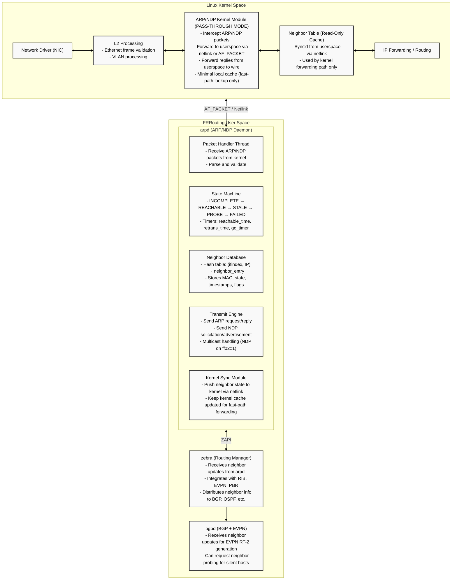
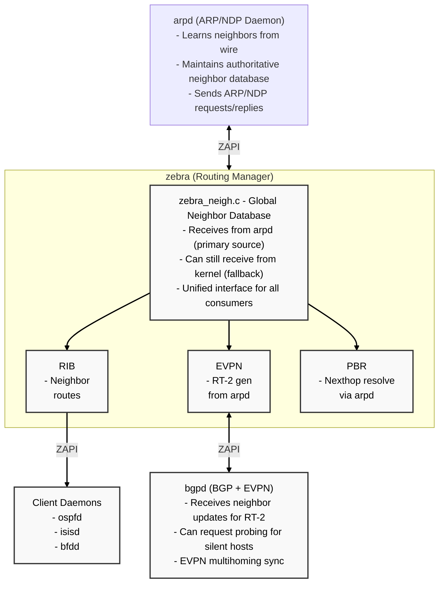

# FRRouting Userspace ARP/NDP Design

**Version**: 1.0  
**Author**: Patrice Brissette, Cisco  
**Date**: March 12, 2026  
**Status**: Design Proposal

---

## Table of Contents

1. [Overview](#overview)
2. [Motivation](#motivation)
3. [Architecture](#architecture)
4. [ARP/NDP Snooping](#arpndp-snooping)
5. [Proxy ARP](#proxy-arp)
6. [Impact Analysis](#impact-analysis)
7. [Kernel Changes Required](#kernel-changes-required)
8. [Implementation Plan](#implementation-plan)
9. [Integration with FRR Architecture](#integration-with-frr-architecture)
10. [API and Database Design](#api-and-database-design)
11. [Appendices](#appendices)
   - [Appendix A: arpd Daemon Configuration](#appendix-a-arpd-daemon-configuration)
   - [Appendix B: Kernel Modifications - Sysctl Configuration](#appendix-b-kernel-modifications-sysctl-configuration)
   - [Appendix C: Kernel Modifications - Pass-through Mode Logic](#appendix-c-kernel-modifications-pass-through-mode-logic)
   - [Appendix D: Kernel Modifications - ARP/NDP Packet Interception](#appendix-d-kernel-modifications-arpndp-packet-interception)
   - [Appendix E: Core Data Structures](#appendix-e-core-data-structures)
   - [Appendix F: ZAPI Protocol Integration](#appendix-f-zapi-protocol-integration)
   - [Appendix G: Netlink API Code](#appendix-g-netlink-api-code)
   - [Appendix H: CLI Commands](#appendix-h-cli-commands)
   - [Appendix I: ARP/NDP Snooping](#appendix-i-arpndp-snooping)
   - [Appendix J: Proxy ARP Implementation](#appendix-j-proxy-arp-implementation)

---

## Overview

### Goal
Move ARP (IPv4) and NDP (IPv6) neighbor discovery and management from the Linux kernel to a **single unified FRRouting userspace daemon** (`arpd`), with the kernel acting as a pass-through for neighbor messages.

**Key Design Decision**: Rather than separate daemons for ARP and NDP, `arpd` handles both protocols in a unified codebase with:
- Single neighbor database for both IPv4 and IPv6
- Unified state machine supporting both RFC 826 (ARP) and RFC 4861 (NDP)
- Common configuration interface and CLI commands
- Shared snooping and security enforcement logic

### Key Principles
- **Kernel becomes dumb pipe**: Forwards neighbor solicitation/advertisement packets to userspace
- **Userspace owns state**: All neighbor state, caching, and lifecycle managed in FRR
- **Performance aware**: Minimize latency for first-packet forwarding
- **Integration friendly**: Works with existing FRR daemons (zebra, BGP, EVPN)
- **Unified protocol handling**: Single daemon for both ARP and NDP (not separate processes)

### Why Single Daemon for Both ARP and NDP?

**Rationale for Unified Approach**:
1. **Identical Core Logic** (~80% code overlap):
   - State machine: INCOMPLETE → REACHABLE → STALE → PROBE → FAILED (same for both)
   - Database: Same hash table, same lookup logic, just different address families
   - Timers: Same timer infrastructure, slightly different timeout values
   - ZAPI integration: Same message types work for both protocols
   
2. **Operational Simplicity**:
   - Single daemon to start/stop/monitor
   - One configuration file
   - Unified CLI commands
   - Consistent logging and debugging
   
3. **Memory Efficiency**:
   - Shared data structures (one neighbor table, not two)
   - Single process overhead (vs. two separate processes)
   
4. **Feature Parity**:
   - Snooping works identically for ARP and NDP
   - Security policies apply uniformly
   - EVPN suppression logic is protocol-agnostic
   
5. **Precedent**:
   - Kernel already handles both in `net/core/neighbour.c` (unified)
   - Many switches use single daemon for both protocols

**Protocol-Specific Code** (~20%):
- Packet parsing: ARP header vs. ICMPv6 header
- Packet generation: ARP request/reply vs. NDP NS/NA
- Multicast: NDP uses solicited-node multicast, ARP uses broadcast

### Benefits
- **Advanced neighbor policies**: Complex state machines, filtering, rate-limiting
- **Better EVPN integration**: Unified neighbor management for overlay and underlay
- **Visibility**: Rich debugging, statistics, and monitoring
- **Flexibility**: Custom neighbor selection algorithms (anycast, load balancing)
- **Security**: Userspace DAD (Duplicate Address Detection), ARP/NDP inspection and snooping
- **ARP/NDP Snooping**: Passive learning of all neighbor traffic for security and EVPN optimization

---

## Motivation

### Current Limitations

**Linux Kernel ARP/NDP**:
- Fixed state machine - no customization
- Limited visibility (only via `ip neigh show`)
- Hard to integrate with routing protocols
- No advanced filtering or policy
- Race conditions between kernel and userspace updates

**FRR Today**:
- Reacts to kernel neighbor events (passive mode)
- Cannot influence neighbor discovery behavior
- EVPN neighbor sync relies on kernel timing
- PBR nexthop resolution depends on kernel state

### Use Cases Enabled

1. **EVPN-Aware Neighbor Discovery**: Suppress local ARP for known remote MACs
2. **Policy-Based Neighbor Management**: Rate-limit ARP, filter by MAC/IP
3. **Distributed ARP Cache**: Share neighbor state across cluster
4. **Silent Host Detection**: Probe hosts without data traffic
5. **Custom DAD**: Fast duplicate detection for high availability
6. **ARP/NDP Snooping**: Passive monitoring of all neighbor traffic for:
   - Security (ARP spoofing detection, IP-MAC binding validation)
   - EVPN RT-2 generation without active probing
   - Multi-tenant isolation (prevent cross-tenant ARP spoofing)
   - Anomaly detection (MAC flapping, duplicate IPs)
7. **ARP/ND Suppression with Snooping**: EVPN ARP suppression remains intact and interoperates seamlessly:
   - VTEP responds to ARP requests locally using EVPN-learned remote MAC/IP
   - Snooping learns local host bindings passively from broadcast ARP
   - Suppression prevents ARP flooding to remote VTEPs
   - Local and remote neighbors managed in unified database

---

## Architecture

### High-Level Design



### Data Flow

**Incoming ARP Request** (Who has 192.0.2.10?):
```
1. Packet arrives at NIC → Kernel L2 processing
2. Kernel ARP module detects ARP packet → Forward to arpd via AF_PACKET
3. arpd receives packet, parses, validates
4. arpd checks if 192.0.2.10 is local interface IP
5. arpd learns requester MAC/IP (gratuitous learning)
6. arpd generates ARP reply (MAC for 192.0.2.10)
7. arpd sends reply to kernel via AF_PACKET
8. Kernel forwards reply to wire
9. arpd notifies zebra of learned neighbor (requester)
10. zebra updates global neighbor DB, notifies bgpd if EVPN-enabled
```

**Outgoing First Packet** (Kernel needs MAC for 192.0.2.20):
```
1. Application sends packet to 192.0.2.20 → Kernel IP stack
2. Kernel routing: next-hop is 192.0.2.20 (directly connected)
3. Kernel neighbor lookup: INCOMPLETE (no MAC yet)
4. Kernel triggers NEIGHBOR_RESOLVE event → netlink to arpd
5. arpd starts neighbor resolution for 192.0.2.20
6. arpd sends ARP request "Who has 192.0.2.20?" to wire
7. arpd starts timer, transitions neighbor to INCOMPLETE state
8. Target host replies with ARP reply
9. arpd receives reply, learns MAC, transitions to REACHABLE
10. arpd pushes neighbor (IP+MAC) to kernel via netlink RTM_NEWNEIGH
11. Kernel caches neighbor, completes forwarding of original packet
12. arpd notifies zebra of new neighbor
```

### Components

#### 1. New Daemon: `arpd`

**Overview**: Single unified daemon handling both IPv4 ARP and IPv6 NDP protocols.

**Why Unified?**
- **Code Reuse**: 80% of logic is identical (state machine, timers, database, ZAPI integration)
- **Simplified Operations**: Single daemon to configure, monitor, and troubleshoot
- **Performance**: Shared data structures reduce memory footprint
- **Consistency**: Unified behavior for both protocols (e.g., snooping, suppression, security)

**Protocol Support**:
- **IPv4 ARP**: RFC 826 (Ethernet ARP), RFC 5227 (IPv4 Address Conflict Detection)
- **IPv6 NDP**: RFC 4861 (Neighbor Discovery), RFC 4862 (Stateless Address Autoconfiguration)

**Responsibilities**:
- Listen for ARP/NDP packets from kernel (AF_PACKET socket)
- Maintain authoritative neighbor database
- Implement neighbor state machine (RFC 4861 for NDP, RFC 826 for ARP)
- Send ARP/NDP requests and replies
- Handle probing and garbage collection
- Push resolved neighbors to kernel
- Notify zebra of neighbor changes
- **ARP/NDP Snooping**: Passively monitor all neighbor traffic and validate bindings
- **Security Enforcement**: Detect spoofing, validate IP-MAC bindings, enforce trust policies

**Configuration**: See [Appendix A.2](#appendix-a2-advanced-arpd-configuration) for comprehensive arpd configuration options.

#### 2. Kernel Module Changes

**New Mode: `ARP_MODE_USERSPACE`**: See [Appendix B.3](#appendix-b3-advanced-kernel-modes) for available kernel ARP/NDP modes and their behavior.

When enabled:
- Kernel stops autonomous ARP/NDP replies
- Forwards all ARP/NDP packets to userspace
- Accepts neighbor entries only from userspace (via netlink)
- Maintains read-only neighbor cache for forwarding

---

## ARP/NDP Snooping

### Overview

**ARP/NDP Snooping** is a security and optimization feature where arpd passively monitors ALL neighbor traffic (not just traffic directed to local interfaces) to:

1. **Build IP-MAC binding database**: Learn neighbor mappings from observed traffic
2. **Security validation**: Detect ARP/NDP spoofing and anomalies
3. **EVPN optimization**: Generate EVPN RT-2 routes without active probing
4. **Multi-tenant isolation**: Prevent cross-VLAN/VRF ARP spoofing

### How It Works

**Traditional Mode** (Active Discovery):
```
1. Host A needs MAC for 192.0.2.10
2. arpd sends ARP request "Who has 192.0.2.10?"
3. Host B replies "192.0.2.10 is at aa:bb:cc:dd:ee:ff"
4. arpd learns binding and installs to kernel
```

**Snooping Mode** (Passive Learning):
```
1. Host A sends ARP request "Who has 192.0.2.10?" (broadcast)
2. arpd receives copy of Host A's request → learns: 192.0.2.5 ↔ aa:aa:aa:aa:aa:aa
3. Host B sends ARP reply "192.0.2.10 is at bb:bb:bb:bb:bb:bb" (unicast to Host A)
4. arpd receives copy of Host B's reply → learns: 192.0.2.10 ↔ bb:bb:bb:bb:bb:bb
5. arpd has learned BOTH bindings without sending any packets
```

**Key Difference**: Snooping learns from observing OTHER hosts' ARP/NDP traffic, not just our own queries.

### Snooping Database

**Structure**: See [Appendix I.3](#appendix-i3-snooping-database-structure) for detailed snooping database structure.

**Key Fields**:
- IP address, MAC address, interface (port), VLAN
- Timestamp (first seen, last seen)
- Validation state: `TRUSTED`, `UNTRUSTED`, `SUSPICIOUS`, `BLOCKED`
- Counters: packets seen, conflicts detected
- Source: `LEARNED` (snooped), `STATIC` (configured), `DHCP` (DHCP snooping)

### Security Features

#### 1. ARP Spoofing Detection

**Scenario**: Attacker tries to impersonate gateway

```
1. Legitimate gateway 192.0.2.1 ↔ 00:11:22:33:44:55 (learned via snooping)
2. Attacker sends ARP: 192.0.2.1 ↔ aa:bb:cc:dd:ee:ff (different MAC for same IP)
3. arpd detects conflict: same IP, different MAC
4. arpd action (configurable):
   - Log security event
   - Drop attacker's packet
   - Rate-limit suspicious host
   - Alert via SNMP trap or syslog
```

#### 2. MAC Flapping Detection

**Scenario**: Network loop or misconfiguration causes MAC to appear on multiple ports

```
1. MAC aa:bb:cc:dd:ee:ff seen on interface eth0 (VLAN 100)
2. Same MAC seen on interface eth1 (VLAN 100) within 5 seconds
3. arpd detects MAC flapping
4. arpd action:
   - Log flapping event (potential loop)
   - Mark MAC as suspicious
   - Disable learning for this MAC temporarily
```

#### 3. Duplicate IP Detection (DAD)

**Scenario**: Two hosts claim same IP

```
1. Host A: 192.0.2.10 ↔ aa:aa:aa:aa:aa:aa (interface eth0)
2. Host B: 192.0.2.10 ↔ bb:bb:bb:bb:bb:bb (interface eth1)
3. arpd detects duplicate IP with different MACs
4. arpd action:
   - Mark both entries as SUSPICIOUS
   - Block forwarding to this IP (prevent split-brain)
   - Send gratuitous ARP to force re-negotiation
   - Alert administrator
```

### Integration with EVPN

**Problem**: Traditional EVPN requires active ARP probing to discover local MACs for RT-2 generation.

**Solution with Snooping**: Passive learning generates RT-2 immediately.

**Flow**:
```
1. Host sends ARP request on local VLAN
2. arpd snoops request → learns IP-MAC binding
3. arpd validates binding against trust database
4. arpd notifies zebra: ZEBRA_NEIGH_ADDED {ip, mac, ifindex, vlan}
5. zebra checks EVPN configuration for this VLAN
6. zebra → bgpd: ZEBRA_NEIGH_ADDED
7. bgpd generates EVPN RT-2 route {mac, ip, label, RD, RT}
8. BGP advertises RT-2 to EVPN peers

Result: RT-2 generated in <10ms without any active probing!
```

### Trust Policies

**Trust Levels**:
- **TRUSTED**: Statically configured bindings (e.g., gateway, DNS servers)
- **DHCP_LEARNED**: Bindings learned from DHCP snooping (high confidence)
- **SNOOPED**: Bindings learned from passive ARP/NDP observation
- **UNTRUSTED**: Bindings from untrusted ports (e.g., access ports)

**Policy Enforcement**: See [Appendix I.1](#appendix-i1-snooping-trust-policies) for trust policy configuration examples.

**Example Policy**:
```
arpd
  interface eth0
    arp-snooping
    arp-trust-mode untrusted        # All learned bindings are untrusted
    arp-validate source-mac          # Validate ARP sender MAC matches Ethernet src
    arp-max-rate 50 per-second      # Rate limit per host
    arp-binding-timeout 300         # Age out untrusted bindings after 5 min
  exit
  
  interface eth1
    arp-snooping
    arp-trust-mode trusted           # Trust all bindings (uplink/trunk)
  exit
  
  # Static trusted bindings
  arp-binding 192.0.2.1 00:11:22:33:44:55 trusted
  arp-binding 192.0.2.2 00:11:22:33:44:66 trusted
exit
```

### ARP/ND Suppression Interoperability

**Problem**: In EVPN networks, ARP suppression is critical to prevent unnecessary ARP flooding. But how does it work with snooping?

**Solution**: ARP suppression and ARP snooping are **complementary features** that work together seamlessly:

#### How They Work Together

**Scenario**: EVPN VXLAN network with local and remote hosts

```
VTEP1 (Local):
- Host A: 192.0.2.10 / aa:aa:aa:aa:aa:aa (local, learned via snooping)
- Host B: 192.0.2.20 / bb:bb:bb:bb:bb:bb (local, learned via snooping)

VTEP2 (Remote, learned via EVPN RT-2):
- Host C: 192.0.2.30 / cc:cc:cc:cc:cc:cc (remote)
- Host D: 192.0.2.40 / dd:dd:dd:dd:dd:dd (remote)
```

**Flow 1: Local ARP Request for Remote Host** (Suppression Active)
```
1. Host A broadcasts: "Who has 192.0.2.30?" (looking for remote Host C)
2. arpd receives ARP request
3. arpd snoops request → learns/refreshes: 192.0.2.10 ↔ aa:aa:aa:aa:aa:aa
4. arpd checks neighbor database:
   - 192.0.2.30 exists (learned from EVPN RT-2)
   - MAC: cc:cc:cc:cc:cc:cc
   - Location: REMOTE (EVPN)
5. arpd performs ARP SUPPRESSION:
   - Responds with ARP reply: "192.0.2.30 is at cc:cc:cc:cc:cc:cc"
   - Does NOT flood ARP request to VXLAN tunnel
6. Host A gets reply instantly, no VXLAN flooding!
```

**Flow 2: Local ARP Request for Local Host** (Snooping Active)
```
1. Host A broadcasts: "Who has 192.0.2.20?" (looking for local Host B)
2. arpd receives ARP request
3. arpd snoops request → learns/refreshes: 192.0.2.10 ↔ aa:aa:aa:aa:aa:aa
4. arpd checks neighbor database:
   - 192.0.2.20 might exist (if previously snooped)
   - OR might be unknown (first time)
5. arpd forwards ARP request to local network (broadcast)
6. Host B sends ARP reply: "192.0.2.20 is at bb:bb:bb:bb:bb:bb"
7. arpd snoops reply → learns: 192.0.2.20 ↔ bb:bb:bb:bb:bb:bb
8. arpd notifies zebra → bgpd generates EVPN RT-2 for Host B
9. Host A receives reply from Host B directly
```

**Flow 3: Remote Host Moves to Local** (Snooping Updates)
```
1. Host C (was remote) is now plugged into VTEP1
2. Host C sends gratuitous ARP: "192.0.2.30 is at cc:cc:cc:cc:cc:cc"
3. arpd snoops gratuitous ARP → learns: 192.0.2.30 ↔ cc:cc:cc:cc:cc:cc (LOCAL)
4. arpd detects: same IP/MAC, but now LOCAL (was REMOTE)
5. arpd updates neighbor database: 192.0.2.30 → LOCAL
6. arpd notifies zebra → bgpd:
   - Withdraws old EVPN RT-2 from VTEP2
   - Generates new EVPN RT-2 from VTEP1
7. Future ARP requests for 192.0.2.30 are now handled locally (no suppression)
```

#### Key Principles

1. **Snooping for Local Hosts**: Passively learns all local host bindings from ARP traffic
2. **Suppression for Remote Hosts**: Uses EVPN-learned remote MACs to respond locally
3. **Unified Database**: Both local (snooped) and remote (EVPN) neighbors in same database
4. **Source Tracking**: Each neighbor entry tracks source: `LOCAL_SNOOPED`, `LOCAL_PROBED`, `EVPN_REMOTE`, `STATIC`
5. **Mobility Handling**: Snooping detects host mobility when remote host appears locally

#### Configuration Example

**EVPN VTEP with ARP Suppression + Snooping**:
```
# Enable EVPN ARP suppression (in bgpd)
router bgp 65000
  address-family l2vpn evpn
    advertise-all-vni
    arp-suppress
    nd-suppress
  exit-address-family
exit

# Enable ARP snooping (in arpd)
arpd
  # Underlay interfaces (no snooping, normal mode)
  interface eth0
    arp-mode userspace
  exit
  
  # VXLAN interface (snooping enabled for local learning)
  interface vxlan100
    arp-mode userspace
    arp-snooping              # Learn local hosts passively
    arp-suppress evpn-remote  # Respond to ARP for EVPN remote hosts
    arp-trust-mode snooped    # Trust snooped bindings for RT-2 generation
  exit
  
  # Access interfaces (local hosts)
  interface eth1
    arp-mode userspace
    arp-snooping              # Learn from host traffic
    arp-trust-mode untrusted  # Validate bindings (security)
  exit
exit
```

**Neighbor Database View**:
```
# show arp database vlan 100
IP Address      MAC Address        State       Source         Interface  Age
-------------   ----------------   ---------   ------------   ---------  ----
192.0.2.10      aa:aa:aa:aa:aa:aa  REACHABLE   LOCAL_SNOOP    eth1       45s
192.0.2.20      bb:bb:bb:bb:bb:bb  REACHABLE   LOCAL_SNOOP    eth1       30s
192.0.2.30      cc:cc:cc:cc:cc:cc  REACHABLE   EVPN_REMOTE    vxlan100   120s
192.0.2.40      dd:dd:dd:dd:dd:dd  STALE       EVPN_REMOTE    vxlan100   300s
192.0.2.1       00:11:22:33:44:55  PERMANENT   STATIC         vxlan100   -
```

#### Benefits of Integration

1. **Zero ARP Flooding**: Remote hosts resolved via suppression, local hosts learned via snooping
2. **Fast RT-2 Generation**: Snooping generates RT-2 immediately when local host ARPs
3. **Host Mobility**: Seamless detection when host moves between local and remote
4. **Reduced Control Plane**: No active probing needed, all learning is passive
5. **Security**: Snooping validates local bindings, suppression prevents spoofing of remote hosts

### Configuration

**Enable Snooping**: See [Appendix I.2](#appendix-i2-snooping-configuration-commands) for comprehensive snooping configuration.

**Show Commands**:
```
show arp snooping database [vlan VLAN] [interface IFNAME]
show arp snooping statistics
show arp snooping conflicts
show arp snooping bindings [trusted|untrusted|suspicious]
```

**Example Output**:
```
# show arp snooping database vlan 100
VLAN  Interface  IP Address      MAC Address        State       Age    Pkts  Source
----  ---------  --------------  -----------------  ----------  -----  ----  ------
100   eth0       192.0.2.10      aa:bb:cc:dd:ee:ff  TRUSTED     300s   1523  STATIC
100   eth0       192.0.2.20      11:22:33:44:55:66  SNOOPED     45s    89    LEARNED
100   eth1       192.0.2.30      aa:aa:aa:aa:aa:aa  SUSPICIOUS  10s    3     CONFLICT
100   eth1       192.0.2.30      bb:bb:bb:bb:bb:bb  SUSPICIOUS  5s     2     CONFLICT
```

### Implementation Notes

**Promiscuous Mode**: Interface must be in promiscuous mode to receive all ARP/NDP traffic (not just traffic destined to local MAC).

**VLAN Awareness**: Snooping database is per-VLAN to support multi-tenant environments.

**Performance**: Minimal overhead since snooping is passive (no additional packets sent).

**Memory**: ~500 bytes per snooped entry. For 10K entries: ~5 MB.

**Scalability**: Hash table with per-VLAN buckets for fast lookups.

---

## Proxy ARP

### Overview

**Proxy ARP** is a feature where a router/gateway answers ARP requests on behalf of hosts on a different network segment. The arpd daemon implements Proxy ARP to enable:

1. **Subnet extension**: Allow hosts on different subnets to communicate as if on same L2 segment
2. **Routing transparency**: Enable routing without changing host configurations
3. **Legacy system support**: Support hosts with fixed IP configurations
4. **Mobile IP support**: Enable seamless mobility across subnets

### How Proxy ARP Works

**Traditional ARP** (Same Subnet):
```
Subnet A: 192.0.2.0/24
- Host A: 192.0.2.10 wants to reach 192.0.2.20
- Host A broadcasts: "Who has 192.0.2.20?"
- Host B replies: "192.0.2.20 is at bb:bb:bb:bb:bb:bb"
- Communication is direct (L2)
```

**Proxy ARP** (Different Subnets):
```
Subnet A: 192.0.2.0/24        Router (Proxy ARP enabled)        Subnet B: 192.0.3.0/24
- Host A: 192.0.2.10          - eth0: 192.0.2.1/24              - Host B: 192.0.3.20
                              - eth1: 192.0.3.1/24

1. Host A wants to reach 192.0.3.20 (thinks it's on same segment - misconfigured mask)
2. Host A broadcasts ARP: "Who has 192.0.3.20?" on Subnet A
3. Router receives ARP request on eth0
4. arpd checks:
   - Is 192.0.3.20 in routing table? YES (via eth1)
   - Is Proxy ARP enabled on eth0? YES
5. arpd performs PROXY ARP:
   - Responds with OWN MAC: "192.0.3.20 is at 00:11:22:33:44:55" (router's eth0 MAC)
6. Host A sends packets to 192.0.3.20 via router's MAC
7. Router routes packets to Host B on Subnet B (L3 forwarding)
8. Return traffic is proxied similarly
```

### Configuration

#### Per-Interface Proxy ARP

```bash
# Enable Proxy ARP on specific interface
interface eth0
  ip arp proxy enable
  
# Enable with IP range restrictions (security)
interface eth0
  ip arp proxy enable
  ip arp proxy-range 192.0.3.0/24  # Only proxy for this subnet
  
# IPv6 Neighbor Discovery Proxy
interface eth0
  ipv6 nd proxy enable
  ipv6 nd proxy-prefix 2001:db8:3::/64
```

#### Global Proxy ARP with VRF

```bash
# Enable Proxy ARP for specific VRF
vrf vrf-blue
  ip arp proxy enable
  ip arp proxy-vrf vrf-red  # Proxy between VRFs
```

### Proxy ARP Data Flow

**Scenario**: Host A (192.0.2.10/24) → Host B (192.0.3.20/24) via Router

```
1. Host A sends ARP request: "Who has 192.0.3.20?"
   - Broadcast on eth0 (192.0.2.0/24)

2. arpd receives ARP request on eth0:
   - Target IP: 192.0.3.20
   - Sender IP: 192.0.2.10
   - Sender MAC: aa:aa:aa:aa:aa:aa

3. arpd proxy decision logic:
   a. Is Proxy ARP enabled on eth0? → Check config
   b. Is target IP (192.0.3.20) in routing table? → Query zebra RIB
   c. Is target IP reachable via different interface? → Check routes
   d. Is target IP within allowed proxy range? → Validate against config
   e. Is there a more specific route? → Avoid proxying for local subnet
   
4. arpd proxy action (if all checks pass):
   - Lookup router's MAC for eth0 → 00:11:22:33:44:55
   - Send ARP reply to Host A:
     - Sender IP: 192.0.3.20
     - Sender MAC: 00:11:22:33:44:55 (router's MAC)
     - Target IP: 192.0.2.10
     - Target MAC: aa:aa:aa:aa:aa:aa
   
5. arpd database update:
   - Add neighbor entry: 192.0.2.10 ↔ aa:aa:aa:aa:aa:aa (learned from request)
   - Mark 192.0.3.20 as PROXIED (special state)
   
6. Host A receives reply:
   - Installs neighbor: 192.0.3.20 ↔ 00:11:22:33:44:55 (router MAC)
   - Sends data packets to router
   
7. Router forwards packets:
   - Receives on eth0 with dst_mac=00:11:22:33:44:55
   - Routes to eth1 based on IP routing
   - Performs ARP for 192.0.3.20 on eth1 (standard ARP, not proxy)
   - Forwards to Host B
```

### Proxy ARP Security and Limitations

#### Security Considerations

**Risk: ARP Spoofing via Proxy**
```
Defense: Proxy range restrictions
- Configure `ip arp proxy-range` to limit which IPs can be proxied
- Enable `ip arp proxy trust-port` to only proxy for trusted interfaces
```

**Risk: Routing Loops**
```
Defense: Route validation
- Only proxy if target is reachable via DIFFERENT interface
- Check routing metric to avoid proxying for better paths
- Disable proxy on interfaces with default routes
```

#### Limitations

1. **No proxy for local subnet**: Won't proxy for IPs on same subnet as interface
2. **Routing table dependency**: Requires valid route to target IP
3. **No proxy for connected routes**: Won't proxy for directly connected interfaces
4. **VRF isolation**: Default behavior doesn't proxy across VRFs (requires explicit config)

### Proxy ARP vs. ARP Suppression

| Feature | Proxy ARP | ARP Suppression |
|---------|-----------|-----------------|
| **Purpose** | Route traffic between subnets transparently | Reduce VXLAN flooding in EVPN |
| **Responds with** | Router's own MAC | Remote host's actual MAC |
| **Use case** | Legacy hosts with fixed configs | EVPN multitenant networks |
| **Packet flow** | Packets routed through proxy (L3) | Packets bridged directly (L2 over VXLAN) |
| **Configuration** | Per-interface or per-VRF | Per-VLAN/VNI (EVPN) |
| **Performance** | Adds routing overhead | Optimizes by avoiding flood |

**Combined Usage**: Proxy ARP and ARP Suppression can coexist:
```
- Proxy ARP: For inter-subnet communication within a site
- ARP Suppression: For intra-subnet communication across VXLAN
```

### Implementation Details

See [Appendix J](#appendix-j-proxy-arp-implementation) for complete implementation including:
- [Appendix J.1](#appendix-j1-proxy-arp-data-structures): Proxy ARP configuration and state structures
- [Appendix J.2](#appendix-j2-proxy-arp-decision-logic): Proxy decision algorithm and routing table lookup
- [Appendix J.3](#appendix-j3-proxy-arp-reply-generation): Reply packet construction and transmission
- [Appendix J.4](#appendix-j4-proxy-arp-security-validation): Security checks and range validation

---

## Impact Analysis

### Performance

**Latency Impact**:
| Scenario | Kernel-Only | Kernel→Userspace | Delta |
|----------|-------------|------------------|-------|
| ARP cache hit | 0 µs (fast-path) | 0 µs (cached in kernel) | 0 µs |
| ARP cache miss | ~1 ms (kernel ARP) | ~1.5 ms (kernel→arpd→kernel) | +500 µs |
| Bulk flows | No impact | No impact | 0 µs |

**Mitigation**: Kernel maintains read-only cache for forwarding fast-path. Only first packet per flow incurs userspace penalty.

### Compatibility

**Breaking Changes**:
- Requires kernel patch (new netlink attributes, sysctl)
- Applications using `AF_PACKET` to bypass IP stack (raw sockets) - unchanged
- DPDK/XDP - unchanged (bypass kernel entirely)

**Backward Compatibility**:
- Default mode remains kernel-managed ARP/NDP
- Per-interface opt-in via sysctl
- Existing FRR deployments unaffected

### Resource Usage

**Memory**:
- arpd process: ~50 MB base + 200 bytes per neighbor entry
- Kernel neighbor cache: Reduced (becomes read-only cache)

**CPU**:
- arpd packet handler: 1 thread per interface (pinnable to CPU)
- State machine timer: 1 thread for all interfaces
- Negligible CPU for steady-state (only on neighbor state changes)

---

## Kernel Changes Required

### 1. Netlink Extensions

**New Netlink Attribute** (`rtnetlink.h`): See [Appendix G.2](#appendix-g2-netlink-message-definitions) for new netlink attributes and message types supporting userspace neighbor management.

**Modified Behavior**:
- `RTM_NEWNEIGH` from userspace with `NTF_USERSPACE` flag → install to kernel cache
- `RTM_DELNEIGH` from userspace → remove from kernel cache
- `RTM_NEIGH_RESOLVE` from kernel → request userspace to resolve IP

### 2. Sysctl Configuration

**New Sysctl Knobs**: See [Appendix B.4](#appendix-b4-sysctl-configuration-options) for complete sysctl parameters supporting per-interface ARP/NDP mode configuration.

### 3. Kernel Neighbor Table Modifications

**File**: `net/core/neighbour.c`

**Changes**: See [Appendix C.1](#appendix-c1-neighbor-resolution-pass-through) for implementation of pass-through logic that delegates neighbor resolution to userspace and forwards packets appropriately.

### 4. ARP/NDP Packet Interception

**File**: `net/ipv4/arp.c`, `net/ipv6/ndisc.c`

**Changes**: See [Appendix D.1](#appendix-d1-arp-packet-interception) and [Appendix D.2](#appendix-d2-ndp-packet-interception) for ARP and NDP packet interception logic that forwards packets to userspace when interfaces are configured for userspace mode.

### 5. Kernel Patch Summary

**Files to Modify**:
- `include/uapi/linux/neighbour.h` - New flags and message types
- `include/net/ndisc.h` - Userspace mode definitions
- `include/linux/inetdevice.h` - ARP userspace mode flag
- `net/core/neighbour.c` - Resolve logic, userspace forwarding
- `net/ipv4/arp.c` - ARP packet interception
- `net/ipv6/ndisc.c` - NDP packet interception
- `net/ipv4/devinet.c` - Sysctl registration
- `net/ipv6/addrconf.c` - Sysctl registration

**Estimated Size**: ~800 lines of code across 8 files

---

## Implementation Plan

### Phase 1: Kernel Foundation (4 weeks)

**Week 1-2: Kernel Patch Development**
- [ ] Add sysctl knobs for arp_mode and ndisc_mode
- [ ] Implement packet forwarding to userspace (netlink + AF_PACKET)
- [ ] Add RTM_NEIGH_RESOLVE message type
- [ ] Test kernel module in isolation

**Week 3-4: Kernel Testing**
- [ ] Unit tests for packet forwarding
- [ ] Selftests for sysctl behavior
- [ ] Performance benchmarks (latency, throughput)
- [ ] Submit kernel patch to netdev mailing list

**Deliverables**:
- Kernel patch series (v1)
- Test suite
- Documentation (kernel/Documentation/networking/arp-userspace.rst)

### Phase 2: arpd Daemon Development (6 weeks)

**Note**: Single daemon with unified codebase for both ARP (IPv4) and NDP (IPv6). Protocol-specific logic is isolated in packet parsing/generation; all other components (database, state machine, timers, ZAPI) are protocol-agnostic.

**Week 1-2: Core Infrastructure**
- [ ] Create `arpd/` directory in FRR tree
- [ ] Setup daemon skeleton (main loop, signal handling, daemonize)
- [ ] Implement AF_PACKET socket handling (receive ARP/NDP)
- [ ] Parse ARP/NDP packets (Ethernet → ARP/ICMPv6) with protocol detection

**Week 3-4: Neighbor Database and State Machine**
- [ ] Define neighbor entry structure (IP, MAC, state, timers) - **unified for IPv4/IPv6**
- [ ] Implement hash table for neighbor storage - **protocol-agnostic**
- [ ] Implement RFC 4861 NDP state machine (INCOMPLETE → REACHABLE → STALE → PROBE → FAILED)
- [ ] Implement ARP analog state machine (same states, different timers)
- [ ] Timer management (reachable_time, retrans_timer) - **shared infrastructure**

**Week 5-6: Packet Transmission and Kernel Sync**
- [ ] ARP request/reply generation and transmission (IPv4)
- [ ] NDP solicitation/advertisement generation and transmission (IPv6)
- [ ] Multicast handling for NDP (ff02::1, ff02::1:ff00:0/104)
- [ ] Netlink RTM_NEWNEIGH/DELNEIGH to push state to kernel - **family-agnostic**
- [ ] Handle RTM_NEIGH_RESOLVE requests from kernel - **works for both ARP and NDP**

**Deliverables**:
- `arpd` binary with core functionality for both ARP and NDP
- Unit tests for state machine (both protocols)
- Basic CLI commands (`show arp`, `show ipv6 neighbors`)

### Phase 3: FRR Integration (4 weeks)

**Week 1-2: ZAPI Protocol Extension**
- [ ] Define new ZAPI message types:
  - Reuse existing `ZEBRA_NEIGH_ADDED` (arpd → zebra)
  - Reuse existing `ZEBRA_NEIGH_REMOVED` (arpd → zebra)
  - `ZEBRA_NEIGH_PROBE_REQUEST` (zebra → arpd)
- [ ] Implement ZAPI client in arpd
- [ ] Implement ZAPI handler in zebra (see [Appendix F.3](#appendix-f3-zebra-zapi-handler) - must preserve ns_id, neigh_state, pbr_rule_list)
- [ ] Update zebra neighbor database from arpd

**Week 3-4: Zebra Integration**
- [ ] Route arpd neighbor updates to existing zebra_neigh module
- [ ] Maintain backward compatibility with kernel-sourced neighbors
- [ ] Update PBR neighbor tracking to use arpd neighbors
- [ ] Update EVPN neighbor handling
- [ ] Test with BGP EVPN RT-2 generation

**Deliverables**:
- ZAPI protocol specification
- Integrated arpd + zebra
- End-to-end tests (arpd learns neighbor → zebra → BGP advertises RT-2)

### Phase 4: Advanced Features (4 weeks)

**Week 1-2: Configuration and CLI**
- [ ] VTY commands for arpd configuration
  - `arp timeout <seconds>`
  - `arp retries <count>`
  - `arp-suppress evpn-remote`
- [ ] Show commands
  - `show arp [interface IFNAME] [vrf VRFNAME]`
  - `show ndp [interface IFNAME] [vrf VRFNAME]`
  - `show arp statistics`
- [ ] Debug commands
  - `debug arp packets`
  - `debug arp state-machine`

**Week 2-3: Policy and Filtering**
- [ ] ARP rate limiting (per-interface, per-IP)
- [ ] MAC/IP filtering (allow/deny lists)
- [ ] EVPN-aware suppression (don't ARP for remote MACs)
- [ ] Proxy ARP/NDP support

**Week 4: Documentation**
- [ ] User guide (`doc/user/arpd.rst`)
- [ ] Developer guide (`doc/developer/arpd-internals.rst`)
- [ ] Configuration examples
- [ ] Troubleshooting guide

**Deliverables**:
- Feature-complete arpd daemon
- Comprehensive documentation
- Example configurations

### Phase 5: Testing and Hardening (3 weeks)

**Week 1: Functional Testing**
- [ ] Topology tests (topotests) for basic ARP/NDP
- [ ] EVPN integration tests
- [ ] PBR integration tests
- [ ] VRF and multi-interface tests
- [ ] Failover scenarios (arpd restart, kernel fallback)

**Week 2: Performance Testing**
- [ ] Latency benchmarks (first packet, cache hit)
- [ ] Throughput tests (bulk flows, many neighbors)
- [ ] Scale tests (10K, 100K neighbors)
- [ ] CPU and memory profiling

**Week 3: Hardening**
- [ ] Fuzzing (ARP/NDP packet handling)
- [ ] Security review (input validation, DoS protection)
- [ ] Memory leak detection (valgrind, ASAN)
- [ ] Code review and static analysis

**Deliverables**:
- Test suite (80%+ code coverage)
- Performance report

### Phase 6: Deployment and Rollout (2 weeks)

**Week 1: Production Readiness**
- [ ] Package arpd in FRR release (deb, rpm)
- [ ] Systemd service file
- [ ] Default configuration file
- [ ] Migration guide (kernel ARP → arpd)

**Week 2: Documentation and Training**
- [ ] Release notes
- [ ] Community presentation (FRR dev meeting)

**Total Timeline**: ~23 weeks (~6 months)

---

## Integration with FRR Architecture

### Interaction with Existing Components

The diagram below shows how arpd integrates with zebra and other FRR components:



### ZAPI Message Flow

**Neighbor Learning** (arpd → zebra → consumers):
```
1. arpd learns neighbor via ARP reply
2. arpd → zebra: ZEBRA_NEIGH_ADDED {ifindex, IP, MAC, state}
3. zebra updates global neighbor DB
4. zebra → bgpd: ZEBRA_NEIGH_ADDED (if EVPN enabled)
5. bgpd generates EVPN RT-2 route
```

**Neighbor Probing** (consumer → zebra → arpd):
```
1. bgpd needs to probe silent host (192.0.2.10)
2. bgpd → zebra: ZEBRA_NEIGH_PROBE_REQUEST {ifindex, IP}
3. zebra → arpd: ZEBRA_NEIGH_PROBE_REQUEST
4. arpd sends ARP request "Who has 192.0.2.10?"
5. Response flows back via normal learning path
```

**EVPN Multihoming Sync** (bgpd → zebra → arpd):
```
1. bgpd receives EVPN RT-2 MAC/IP route from remote PE
   - Route contains: MAC, IP, VNI, Remote VTEP IP, ESI
2. bgpd → zebra: ZEBRA_NEIGH_ADDED {ifindex, IP, MAC, state=REMOTE, flags=NTF_EXT_LEARNED}
3. zebra updates global neighbor DB with source=EVPN_REMOTE
4. zebra → arpd: ZEBRA_NEIGH_INSTALL {ifindex, IP, MAC, vni, remote_vtep, esi}
5. arpd installs remote neighbor entry:
   - Sets state=REACHABLE, source=NEIGH_SOURCE_EVPN_REMOTE
   - Enables ARP suppression: respond locally to ARP requests for remote MAC/IP
   - No kernel sync (remote neighbors stay in userspace only)
6. Local ARP request for remote MAC → arpd responds without VXLAN flooding
```

**EVPN Multihoming MAC Mobility**:
```
1. MAC moves from remote PE to local (detected via local ARP/NDP learning)
2. arpd detects conflict: local learning vs. existing EVPN_REMOTE entry
3. arpd → zebra: ZEBRA_NEIGH_ADDED {IP, MAC, state=REACHABLE, source=LOCAL, 
                                     flags=NTF_EXT_MANAGED|NTF_OVERRIDE}
4. zebra updates neighbor: EVPN_REMOTE → LOCAL (higher priority)
5. zebra → bgpd: ZEBRA_NEIGH_ADDED with NTF_OVERRIDE
6. bgpd withdraws remote RT-2, advertises new local RT-2 with higher sequence number
```

### Coexistence with Kernel-Sourced Neighbors

**Hybrid Mode**: Some interfaces use arpd, others use kernel ARP

**zebra_neigh.c** discriminates based on source - See [Appendix E.1](#appendix-e1-zebra-neighbor-entry-structure) for the zebra neighbor entry structure that tracks source (kernel vs. arpd vs. EVPN).

**Priority**: `LOCAL (ARPD) > EVPN_REMOTE > KERNEL > STATIC`
- Local learning always wins (MAC mobility, locally attached hosts)
- EVPN remote entries used for ARP suppression when no local entry exists
- Kernel/Static entries are fallback only

---

## API and Database Design

### arpd Neighbor Database

**Data Structure**: See [Appendix E.2](#appendix-e2-arpd-neighbor-database-structures) for the complete arpd neighbor entry, hash table, and per-interface configuration structures.

### ZAPI Protocol Extension

**New Message Types** (in `lib/zclient.h`): See [Appendix F.1](#appendix-f1-zapi-message-types) for new ZAPI message types supporting arpd ↔ zebra communication.

### arpd → Kernel Sync API

**Netlink Operations**: See [Appendix G.1](#appendix-g1-netlink-neighbor-operations) for netlink API functions that push neighbor state to kernel and handle kernel resolve requests.

### arpd → zebra API

**ZAPI Operations**: 
- **arpd side** (in `arpd/arpd_zebra.c`): See [Appendix F.2](#appendix-f2-arpd-zapi-implementation) for ZAPI functions that send neighbor updates to zebra and handle probe requests.
- **zebra side** (in `zebra/zebra_zapi.c`): See [Appendix F.3](#appendix-f3-zebra-zapi-handler) for ZAPI handler that processes neighbor updates from arpd while preserving PBR functionality.

### CLI Commands

See [Appendix H](#appendix-h-cli-commands) for comprehensive CLI command reference including:
- [Appendix H.1](#appendix-h1-configuration-commands): Configuration commands
- [Appendix H.2](#appendix-h2-show-commands): Show commands
- [Appendix H.3](#appendix-h3-operational-commands): Operational commands

---

## Summary

### Key Takeaways

1. **Kernel becomes dumb pipe**: Forwards ARP/NDP to userspace, maintains read-only cache
2. **arpd owns state**: Authoritative neighbor database, state machine, policy
3. **Integration-first**: Works seamlessly with zebra, BGP, EVPN, PBR
4. **Performance-aware**: Kernel cache ensures fast-path forwarding, ~500µs penalty for first packet
5. **Incremental deployment**: Per-interface opt-in, backward compatible

### Next Steps

1. **Prototype kernel patch** (2 weeks) - Validate forwarding and netlink design
2. **arpd skeleton** (1 week) - Basic daemon structure, packet I/O
3. **Proof-of-concept** (2 weeks) - End-to-end ARP learning and kernel sync
4. **Community feedback** - Present at FRR dev meeting, gather input
5. **Full implementation** - Follow 6-month plan outlined above

### Success Metrics

- **Latency**: < 2ms for first-packet resolution (vs. 1ms kernel-only)
- **Scale**: Support 100K neighbors per instance
- **Reliability**: 99.99% uptime, graceful failover to kernel
- **Adoption**: 20% of FRR users enable arpd in production within 1 year

---

---

## Appendices

### Appendix A: arpd Daemon Configuration

#### Appendix A.1: Basic arpd Configuration

**arpd daemon configuration**:
```
arpd
  interface eth0
    arp-mode userspace
  exit
exit
```

#### Appendix A.2: Advanced arpd Configuration

**arpd configuration with all options**:
```
arpd config:
  interface eth0
    arp-timeout 60
    arp-retries 3
    arp-rate-limit 100 per-second
    arp-suppress remote-evpn-macs
  exit
```

---

### Appendix B: Kernel Modifications - Sysctl Configuration

#### Appendix B.1: Sysctl Configuration

**Kernel configuration** (enable userspace mode on interface):
```bash
# Enable userspace ARP on eth0
sysctl -w net.ipv4.conf.eth0.arp_mode=2

# Enable userspace NDP on eth0
sysctl -w net.ipv6.conf.eth0.ndisc_mode=2
```

**Example**: Hybrid mode (kernel ARP on eth0, userspace on eth1)
```bash
# eth0: kernel ARP (default)
sysctl -w net.ipv4.conf.eth0.arp_mode=0

# eth1: userspace ARP
sysctl -w net.ipv4.conf.eth1.arp_mode=2
```

#### Appendix B.2: Kernel Data Structure Modifications

**File**: `include/linux/inetdevice.h`, `include/net/ndisc.h`

```c
// IPv4: Add arp_mode to struct in_device
struct in_device {
    // ... existing fields ...
    int arp_mode;  // 0=kernel, 1=hybrid, 2=userspace
};

// IPv6: Add ndisc_mode to struct inet6_dev
struct inet6_dev {
    // ... existing fields ...
    int ndisc_mode;  // 0=kernel, 1=hybrid, 2=userspace
};

// Helper macros
#define IN_DEV_ARP_USERSPACE(in_dev) \
    ((in_dev) && (in_dev)->arp_mode == 2)
#define IN6_DEV_NDISC_USERSPACE(idev) \
    ((idev) && (idev)->ndisc_mode == 2)
```

#### Appendix B.3: Advanced Kernel Modes

**Per-interface ARP/NDP operating modes**:
```bash
/proc/sys/net/ipv4/conf/eth0/arp_mode = 2  # 0=kernel, 1=hybrid, 2=userspace
/proc/sys/net/ipv6/conf/eth0/ndisc_mode = 2
```

- **Mode 0 (kernel)**: Traditional kernel ARP/NDP processing (default)
- **Mode 1 (hybrid)**: Kernel handles ARP/NDP but notifies userspace
- **Mode 2 (userspace)**: All ARP/NDP forwarded to userspace

#### Appendix B.4: Sysctl Configuration Options

**Complete sysctl parameter list**:
```bash
# Per-interface ARP mode
/proc/sys/net/ipv4/conf/<interface>/arp_mode
  0 = kernel (default)
  1 = hybrid (kernel handles, notify userspace)
  2 = userspace (kernel forwards to userspace)

# Per-interface NDP mode
/proc/sys/net/ipv6/conf/<interface>/ndisc_mode
  0 = kernel (default)
  1 = hybrid
  2 = userspace

# Forward ARP/NDP packets to userspace
/proc/sys/net/ipv4/conf/<interface>/arp_forward_userspace
  0 = no (default)
  1 = yes (forward to AF_PACKET/netlink)
```

---

### Appendix C: Kernel Modifications - Pass-through Mode Logic

#### Appendix C.1: Neighbor Resolution Pass-through

**File**: `net/core/neighbour.c`

```c
// Check if interface is in userspace mode
static inline bool neigh_is_userspace_managed(struct net_device *dev)
{
    struct in_device *in_dev = __in_dev_get_rcu(dev);
    return in_dev && IN_DEV_ARP_USERSPACE(in_dev);
}

// Modified neigh_resolve_output() - trigger resolve request
int neigh_resolve_output(struct neighbour *neigh, struct sk_buff *skb)
{
    if (neigh_is_userspace_managed(neigh->dev)) {
        // Don't send ARP from kernel
        // Send RTM_NEIGH_RESOLVE to userspace
        neigh_send_resolve_request(neigh);
        
        // Queue packet until resolved
        __skb_queue_tail(&neigh->arp_queue, skb);
        return 0;
    }
    
    // Normal kernel path
    return __neigh_resolve_output(neigh, skb);
}

// Forward ARP/NDP packet to userspace
static void neigh_forward_to_userspace(struct sk_buff *skb, 
                                       struct net_device *dev)
{
    struct nlmsghdr *nlh;
    struct sk_buff *nl_skb;
    
    // Create netlink packet with ARP/NDP data
    nl_skb = nlmsg_new(NLMSG_DEFAULT_SIZE, GFP_ATOMIC);
    nlh = nlmsg_put(nl_skb, 0, 0, RTM_NEWNEIGH, sizeof(struct ndmsg), 0);
    
    // Attach original packet data
    nla_put(nl_skb, NDA_DATA, skb->len, skb->data);
    
    // Send to userspace listener
    rtnl_notify(nl_skb, dev_net(dev), 0, RTNLGRP_NEIGH, NULL, GFP_ATOMIC);
}
```

---

### Appendix D: Kernel Modifications - ARP/NDP Packet Interception

#### Appendix D.1: ARP Packet Interception

**File**: `net/ipv4/arp.c`

```c
// In arp_process() - intercept ARP packets
static int arp_process(struct sk_buff *skb)
{
    struct net_device *dev = skb->dev;
    struct in_device *in_dev = __in_dev_get_rcu(dev);
    
    if (in_dev && IN_DEV_ARP_USERSPACE(in_dev)) {
        // Forward to userspace, don't process locally
        neigh_forward_to_userspace(skb, dev);
        kfree_skb(skb);
        return 0;
    }
    
    // Normal kernel ARP processing
    ...
}
```

#### Appendix D.2: NDP Packet Interception

**File**: `net/ipv6/ndisc.c`

```c
// In ndisc_rcv() - intercept NDP packets
int ndisc_rcv(struct sk_buff *skb)
{
    struct net_device *dev = skb->dev;
    struct inet6_dev *idev = __in6_dev_get(dev);
    
    if (IN6_DEV_NDISC_USERSPACE(idev)) {
        // Forward to userspace
        neigh_forward_to_userspace(skb, dev);
        consume_skb(skb);
        return 0;
    }
    
    // Normal kernel NDP processing
    ...
}
```

---

### Appendix E: Core Data Structures

#### Appendix E.1: Zebra Neighbor Entry Structure

**File**: `zebra/zebra_neigh.h`

**Proposed extension** to existing structure (preserve all existing fields):

```c
struct zebra_neigh_ent {
    // Existing fields (DO NOT REMOVE - required for PBR)
    ns_id_t ns_id;                // Namespace ID
    ifindex_t ifindex;            // Interface index
    struct ipaddr ip;             // IPv4 or IPv6 address
    struct ethaddr mac;           // MAC address
    uint16_t neigh_state;         // State from kernel (NUD_REACHABLE, etc.)
    uint32_t flags;               // Existing flags (ZEBRA_NEIGH_ENT_ACTIVE)
    RB_ENTRY(zebra_neigh_ent) rb_node;  // RB tree linkage
    struct list *pbr_rule_list;   // PBR rules referencing this neighbor
    
    // New fields for arpd integration (to be added)
    vrf_id_t vrf_id;              // VRF for multi-VRF/EVPN support
    enum neigh_source {
        NEIGH_SOURCE_KERNEL,      // Learned from kernel (legacy)
        NEIGH_SOURCE_ARPD,        // Learned from arpd (local learning)
        NEIGH_SOURCE_EVPN_REMOTE, // EVPN RT-2 from remote VTEP
        NEIGH_SOURCE_STATIC,      // Static configuration
    } source;
};
```

#### Appendix E.2: arpd Neighbor Database Structures

**File**: `arpd/arpd_neighbor.h`

**Note**: Single unified structure supports both IPv4 (ARP) and IPv6 (NDP) neighbors.

```c
// Main neighbor entry - unified for both ARP (IPv4) and NDP (IPv6)
struct arpd_neighbor {
    // Key fields
    ifindex_t ifindex;              // Interface index
    vrf_id_t vrf_id;                // VRF ID (for multi-VRF/EVPN)
    int family;                     // AF_INET (ARP) or AF_INET6 (NDP)
    union {
        struct in_addr ipv4;        // IPv4 address (for ARP)
        struct in6_addr ipv6;       // IPv6 address (for NDP)
    } ip;
    
    // Learned fields
    struct ethaddr mac;              // MAC address (resolved)
    uint16_t vlan_id;                // VLAN ID (if tagged)
    
    // State
    enum neigh_state {
        NEIGH_INCOMPLETE,            // ARP/NDP request sent, waiting
        NEIGH_REACHABLE,             // Recently confirmed reachable
        NEIGH_STALE,                 // Unconfirmed, still usable
        NEIGH_PROBE,                 // Actively probing
        NEIGH_FAILED,                // Resolution failed
        NEIGH_PERMANENT,             // Static entry
    } state;
    
    // Source tracking (for ARP suppression + snooping integration)
    enum neigh_source {
        NEIGH_SOURCE_UNKNOWN,        // Unknown source
        NEIGH_SOURCE_STATIC,         // Static configuration
        NEIGH_SOURCE_LOCAL_PROBED,   // Active ARP/NDP probe (arpd initiated)
        NEIGH_SOURCE_LOCAL_SNOOPED,  // Passive snooping (observed traffic)
        NEIGH_SOURCE_EVPN_REMOTE,    // EVPN RT-2 route (remote VTEP)
        NEIGH_SOURCE_KERNEL,         // Learned from kernel (legacy)
    } source;
    
    // Timers
    struct event *reachable_timer;   // Transition to STALE
    struct event *probe_timer;       // Send probe
    struct event *gc_timer;          // Garbage collection
    
    // Counters
    uint32_t probes_sent;            // # of ARP/NDP requests sent
    uint32_t probes_max;             // Max probes before FAILED
    time_t created;                  // Entry creation time
    time_t last_updated;             // Last state change
    time_t last_confirmed;           // Last reachability confirmation
    
    // Flags
    uint32_t flags;
#define ARPD_NEIGH_STATIC       (1 << 0)  // Static entry
#define ARPD_NEIGH_ROUTER       (1 << 1)  // Router (NDP)
#define ARPD_NEIGH_PROXY        (1 << 2)  // Proxy ARP/NDP
#define ARPD_NEIGH_LOCAL        (1 << 3)  // Local interface address
#define ARPD_NEIGH_EVPN_SUPPRESS (1 << 4) // Suppress (known remote)
    
    // Linked list for queued packets (INCOMPLETE state)
    struct list *packet_queue;
    
    // Hash table linkage
    struct arpd_neighbor *next;
};

// Hash table: (ifindex, IP) → neighbor entry
struct arpd_neighbor_table {
    struct arpd_neighbor **buckets;
    uint32_t size;                   // Hash table size (power of 2)
    uint32_t count;                  // # of entries
    struct event *gc_timer;          // Periodic GC
};

// Per-interface configuration
struct arpd_interface {
    ifindex_t ifindex;
    char name[IFNAMSIZ];
    struct ethaddr hwaddr;           // Interface MAC
    
    // Configuration
    uint32_t arp_timeout;            // Reachable → Stale timeout (sec)
    uint32_t arp_retries;            // Max probe attempts
    uint32_t arp_rate_limit;         // Max ARP/sec
    bool arp_evpn_suppress;          // Suppress for EVPN remote MACs
    bool proxy_arp;                  // Enable proxy ARP
    
    // Statistics
    uint64_t arp_requests_sent;
    uint64_t arp_replies_sent;
    uint64_t arp_requests_recv;
    uint64_t arp_replies_recv;
    uint64_t ndp_solicitations_sent;
    uint64_t ndp_advertisements_sent;
    uint64_t ndp_solicitations_recv;
    uint64_t ndp_advertisements_recv;
    uint64_t rate_limited;           // # packets dropped due to rate limit
    
    // Pointer to interface-specific neighbor table
    struct arpd_neighbor_table *neigh_table;
};
```

---

### Appendix F: ZAPI Protocol Integration

#### Appendix F.1: ZAPI Message Types

**File**: `lib/zclient.h`

```c
enum zebra_message_types {
    // ... existing messages ...
    
    // Reuse existing types (already defined at lines 222-223):
    ZEBRA_NEIGH_ADDED,              // arpd → zebra: new neighbor learned
    ZEBRA_NEIGH_REMOVED,            // arpd → zebra: neighbor deleted
    
    // New types to be added:
    ZEBRA_NEIGH_UPDATED,            // arpd → zebra: neighbor state changed
    ZEBRA_NEIGH_PROBE_REQUEST,      // zebra → arpd: probe this IP
    ZEBRA_NEIGH_FLUSH_REQUEST,      // zebra → arpd: flush interface
};

// Message structure: ZEBRA_NEIGH_ADDED
struct zapi_neigh_add {
    vrf_id_t vrf_id;                 // VRF ID (for multi-VRF/EVPN)
    ifindex_t ifindex;
    struct ipaddr ip;                // IPv4 or IPv6
    struct ethaddr mac;
    uint8_t state;                   // NEIGH_REACHABLE, etc.
    uint32_t flags;                  // ROUTER, PROXY, etc.
};

// Message structure: ZEBRA_NEIGH_PROBE_REQUEST
struct zapi_neigh_probe {
    vrf_id_t vrf_id;                 // VRF ID (for multi-VRF/EVPN)
    ifindex_t ifindex;
    struct ipaddr ip;
    uint32_t flags;                  // PROBE_FORCE, etc.
};
```

#### Appendix F.2: arpd ZAPI Implementation

**File**: `arpd/arpd_zebra.c`

```c
// Send neighbor add to zebra
int arpd_zebra_neigh_add(struct arpd_neighbor *neigh)
{
    struct stream *s;
    
    s = zclient->obuf;
    stream_reset(s);
    
    // Use neighbor's VRF instead of hard-coded VRF_DEFAULT
    zclient_create_header(s, ZEBRA_NEIGH_ADDED, neigh->vrf_id);
    stream_putl(s, neigh->vrf_id);
    stream_putl(s, neigh->ifindex);
    stream_put_ipaddr(s, &neigh->ip);
    stream_put(s, &neigh->mac, ETH_ALEN);
    stream_putc(s, neigh->state);
    stream_putl(s, neigh->flags);
    
    stream_putw_at(s, 0, stream_get_endp(s));
    
    return zclient_send_message(zclient);
}

// Handle probe request from zebra
static int arpd_zebra_neigh_probe(ZAPI_HANDLER_ARGS)
{
    struct stream *s = zclient->ibuf;
    vrf_id_t vrf_id;
    ifindex_t ifindex;
    struct ipaddr ip;
    uint32_t flags;
    
    STREAM_GETL(s, vrf_id);
    STREAM_GETL(s, ifindex);
    STREAM_GET_IPADDR(s, &ip);
    STREAM_GETL(s, flags);
    
    // Trigger ARP/NDP probe
    arpd_neigh_probe(vrf_id, ifindex, &ip, flags);
    
    return 0;
stream_failure:
    return -1;
}
```

#### Appendix F.3: Zebra ZAPI Handler

**File**: `zebra/zebra_zapi.c`

**Important**: Handler must preserve all existing zebra_neigh_ent fields to maintain PBR functionality.

```c
// Handle ZEBRA_NEIGH_ADDED from arpd
static int zebra_neigh_handle_add(ZAPI_CALLBACK_ARGS)
{
    struct stream *s = msg;
    vrf_id_t vrf_id;
    ifindex_t ifindex;
    struct ipaddr ip;
    struct ethaddr mac;
    uint8_t state;
    uint32_t flags;
    struct interface *ifp;
    ns_id_t ns_id;
    uint16_t neigh_state;
    
    // Decode ZAPI message
    STREAM_GETL(s, vrf_id);
    STREAM_GETL(s, ifindex);
    STREAM_GET_IPADDR(s, &ip);
    STREAM_GET(s, &mac, ETH_ALEN);
    STREAM_GETC(s, state);
    STREAM_GETL(s, flags);
    
    // Get interface and derive namespace ID (needed for pbr_rule_list)
    ifp = if_lookup_by_index(ifindex, vrf_id);
    if (!ifp) {
        zlog_warn("ZEBRA_NEIGH_ADDED: unknown interface %u in VRF %u",
                  ifindex, vrf_id);
        return 0;
    }
    ns_id = ifp->vrf->ns_id;
    
    // Convert arpd state to kernel neigh_state (preserve existing format)
    neigh_state = arpd_state_to_nud(state);
    
    // Call existing zebra_neigh_add() to maintain PBR integration
    // This function manages pbr_rule_list and all other neighbor tracking
    zebra_neigh_add(ns_id, ifp, &ip, &mac, neigh_state);
    
    return 0;
stream_failure:
    zlog_err("Failed to decode ZEBRA_NEIGH_ADDED message");
    return -1;
}

// Helper: Convert arpd state to kernel NUD state
static uint16_t arpd_state_to_nud(uint8_t arpd_state)
{
    switch (arpd_state) {
    case NEIGH_REACHABLE:
        return NUD_REACHABLE;
    case NEIGH_STALE:
        return NUD_STALE;
    case NEIGH_PROBE:
        return NUD_PROBE;
    case NEIGH_INCOMPLETE:
        return NUD_INCOMPLETE;
    case NEIGH_FAILED:
        return NUD_FAILED;
    case NEIGH_PERMANENT:
        return NUD_PERMANENT;
    default:
        return NUD_NONE;
    }
}
```

**Note**: The existing `zebra_neigh_add()` function (in `zebra/zebra_neigh.c`) already handles:
- Creating/updating `zebra_neigh_ent` with all required fields (ns_id, neigh_state, pbr_rule_list)
- Maintaining PBR rule references via `pbr_rule_list`
- Notifying other consumers (bgpd, EVPN, etc.)

By reusing this function, we preserve all existing functionality while adding arpd as a new neighbor source.

---

### Appendix G: Netlink API Code

#### Appendix G.1: Netlink Neighbor Operations

**File**: `arpd/arpd_kernel.c`

```c
// Push neighbor to kernel (for forwarding fast-path)
int arpd_kernel_neigh_add(struct arpd_neighbor *neigh)
{
    struct {
        struct nlmsghdr n;
        struct ndmsg ndm;
        char buf[256];
    } req;
    
    memset(&req, 0, sizeof(req));
    req.n.nlmsg_len = NLMSG_LENGTH(sizeof(struct ndmsg));
    req.n.nlmsg_flags = NLM_F_REQUEST | NLM_F_CREATE | NLM_F_REPLACE;
    req.n.nlmsg_type = RTM_NEWNEIGH;
    
    req.ndm.ndm_family = neigh->family;
    req.ndm.ndm_ifindex = neigh->ifindex;
    req.ndm.ndm_state = neigh_state_to_nud(neigh->state);
    req.ndm.ndm_flags = NTF_USERSPACE;  // Mark as userspace-managed
    
    // Add attributes
    addattr_l(&req.n, sizeof(req), NDA_DST, &neigh->ip, 
              (neigh->family == AF_INET) ? 4 : 16);
    addattr_l(&req.n, sizeof(req), NDA_LLADDR, &neigh->mac, ETH_ALEN);
    
    // Send to kernel
    return rtnl_talk(&req.n);
}

// Remove neighbor from kernel cache
int arpd_kernel_neigh_del(struct arpd_neighbor *neigh)
{
    // Similar to add, but RTM_DELNEIGH
    ...
}

// Handle kernel resolve request
void arpd_handle_kernel_resolve(struct nlmsghdr *nlh)
{
    struct ndmsg_resolve *resolve = NLMSG_DATA(nlh);
    struct ipaddr ip;
    
    // Extract IP to resolve
    ip.ipa_type = resolve->ndm_family;
    memcpy(&ip.ip, resolve->ip_addr, 
           (resolve->ndm_family == AF_INET) ? 4 : 16);
    
    // Trigger neighbor resolution
    arpd_neigh_resolve(resolve->ifindex, &ip);
}
```

#### Appendix G.2: Netlink Message Definitions

**File**: `include/uapi/linux/neighbour.h`

```c
// New flag to indicate userspace-managed neighbor
#define NTF_USERSPACE  0x100

// New netlink message for neighbor resolve request
enum {
    RTM_NEIGH_RESOLVE = 120,  // Kernel → Userspace: resolve this IP
};

// Netlink message structure
struct ndmsg_resolve {
    __u8  ndm_family;   // AF_INET or AF_INET6
    __u32 ifindex;      // Interface index
    __u8  ip_addr[16];  // IP address to resolve (IPv4/IPv6)
    __u32 flags;        // Optional flags (urgent, etc.)
};
```

---

### Appendix H: CLI Commands

#### Appendix H.1: Configuration Commands

```
arpd
  interface eth0
    arp timeout 60                   # REACHABLE → STALE (seconds)
    arp retries 3                    # Max probes before FAILED
    arp rate-limit 100               # Max 100 ARP/sec
    arp-suppress evpn-remote         # Don't ARP for EVPN remote MACs
    proxy-arp                        # Enable proxy ARP
  exit
  
  debug arp packets                  # Debug ARP packet processing
  debug arp state-machine            # Debug state transitions
  debug arp kernel                   # Debug kernel sync
exit
```

#### Appendix H.2: Show Commands

```
show arp [interface IFNAME] [vrf VRFNAME] [json]
show arp 192.0.2.10
show arp interface eth0
show arp statistics
show arp summary

show ipv6 neighbors [interface IFNAME] [vrf VRFNAME] [json]
show ipv6 neighbors 2001:db8::1
show ipv6 neighbors interface eth0
show ipv6 neighbors statistics
```

#### Appendix H.3: Operational Commands

```
clear arp                            # Clear all dynamic ARP entries
clear arp interface eth0             # Clear per-interface
clear arp 192.0.2.10                 # Clear specific entry

clear ipv6 neighbors                 # Clear all dynamic NDP entries
clear ipv6 neighbors interface eth0
clear ipv6 neighbors 2001:db8::1

arp probe 192.0.2.10 interface eth0  # Force ARP probe
ipv6 neighbor probe 2001:db8::1 interface eth0
```

---

### Appendix I: ARP/NDP Snooping

#### Appendix I.1: Snooping Trust Policies

**Trust policy configuration**:
```
arpd
  interface eth0
    arp-snooping
    arp-trust-mode untrusted        # All learned bindings are untrusted
    arp-validate source-mac          # Validate ARP sender MAC matches Ethernet src
    arp-validate target-mac          # Validate ARP target MAC in reply
    arp-max-rate 50 per-second      # Rate limit per host
    arp-binding-timeout 300         # Age out untrusted bindings after 5 min
    arp-conflict-action log-only    # log | drop | rate-limit | block
  exit
  
  interface eth1
    arp-snooping
    arp-trust-mode trusted           # Trust all bindings (uplink/trunk)
    arp-validate disabled            # No validation on trusted port
  exit
  
  # Static trusted bindings (override learned)
  arp-binding 192.0.2.1 00:11:22:33:44:55 vlan 100 trusted
  arp-binding 192.0.2.2 00:11:22:33:44:66 vlan 100 trusted
  
  # DHCP snooping integration
  dhcp-snooping vlan 100-200
  dhcp-trust interface eth1         # Trust DHCP server on uplink
  
  # Security policies
  arp-inspection vlan 100-200        # Enable Dynamic ARP Inspection (DAI)
  arp-inspection validate src-mac dst-mac ip
  arp-flap-detection threshold 5 window 10  # 5 flaps in 10 sec = suspicious
  
  debug arp snooping packets
  debug arp snooping security
exit
```

#### Appendix I.2: Snooping Configuration Commands

**Per-Interface Configuration**:
```
interface eth0
  arp-snooping                       # Enable snooping on interface
  arp-trust-mode {trusted|untrusted} # Trust level for this port
  arp-validate {disabled|source-mac|target-mac|ip|all}  # Validation checks
  arp-max-rate RATE [per-second|per-minute]  # Rate limit per host
  arp-binding-timeout SECONDS        # Timeout for untrusted bindings
  arp-conflict-action {log-only|drop|rate-limit|block-ip}
exit
```

**Global Configuration**:
```
arpd
  # Static bindings (highest priority)
  arp-binding IPADDR MACADDR [vlan VLAN] [trusted|untrusted]
  no arp-binding IPADDR              # Remove static binding
  
  # DHCP snooping integration
  dhcp-snooping vlan VLAN-LIST       # Enable DHCP snooping on VLANs
  dhcp-trust interface IFNAME        # Mark interface as DHCP server port
  
  # Dynamic ARP Inspection (DAI)
  arp-inspection vlan VLAN-LIST      # Enable DAI on VLANs
  arp-inspection validate {src-mac|dst-mac|ip}  # Validation types
  arp-inspection log-buffer entries ENTRIES interval SECONDS
  
  # MAC flapping detection
  arp-flap-detection threshold COUNT window SECONDS
  arp-flap-action {log|disable-port|disable-mac}
  
  # Duplicate IP detection
  arp-duplicate-ip-detection
  arp-duplicate-ip-action {log|block|gratuitous-arp}
exit
```

**Show Commands**:
```
# Show snooping database
show arp snooping database [vlan VLAN] [interface IFNAME] [json]
show arp snooping bindings [trusted|untrusted|suspicious|blocked]
show arp snooping statistics [interface IFNAME]
show arp snooping conflicts
show arp snooping flapping

# Show DHCP snooping
show dhcp snooping binding [vlan VLAN] [mac MACADDR]
show dhcp snooping statistics

# Show DAI
show arp inspection interfaces
show arp inspection statistics vlan VLAN
show arp inspection log
```

**Clear Commands**:
```
clear arp snooping database [vlan VLAN] [interface IFNAME]
clear arp snooping statistics
clear arp snooping conflicts
clear arp inspection statistics
clear arp inspection log
```

#### Appendix I.3: Snooping Database Structure

**File**: `arpd/arpd_snooping.h`

```c
// Snooping entry (separate from active neighbor entry)
struct arpd_snoop_entry {
    // Key
    ifindex_t ifindex;              // Interface where seen
    uint16_t vlan_id;               // VLAN ID
    struct ipaddr ip;               // IP address
    
    // Learned data
    struct ethaddr mac;             // MAC address
    
    // Metadata
    enum snoop_state {
        SNOOP_TRUSTED,              // Statically configured or DHCP
        SNOOP_SNOOPED,              // Learned via snooping
        SNOOP_SUSPICIOUS,           // Flagged by anomaly detection
        SNOOP_BLOCKED,              // Administratively blocked
    } state;
    
    enum snoop_source {
        SNOOP_SOURCE_STATIC,        // Manual configuration
        SNOOP_SOURCE_DHCP,          // DHCP snooping
        SNOOP_SOURCE_LEARNED,       // Passive ARP/NDP observation
    } source;
    
    // Timestamps
    time_t first_seen;              // First time observed
    time_t last_seen;               // Last time observed
    time_t last_validated;          // Last validation check
    
    // Counters
    uint64_t packets_seen;          // # packets observed
    uint32_t conflicts_detected;    // # times IP-MAC mismatch detected
    uint32_t validation_failures;   // # validation check failures
    
    // Security flags
    uint32_t flags;
#define SNOOP_FLAG_TRUSTED          (1 << 0)  // Trusted entry
#define SNOOP_FLAG_STATIC           (1 << 1)  // Static binding
#define SNOOP_FLAG_DHCP             (1 << 2)  // From DHCP snooping
#define SNOOP_FLAG_CONFLICT         (1 << 3)  // Conflicting binding detected
#define SNOOP_FLAG_FLAPPING         (1 << 4)  // MAC flapping detected
#define SNOOP_FLAG_DUPLICATE_IP     (1 << 5)  // Duplicate IP detected
#define SNOOP_FLAG_RATE_LIMITED     (1 << 6)  // Currently rate limited
#define SNOOP_FLAG_EXPIRED          (1 << 7)  // Entry expired (aging)
    
    // Timeout
    uint32_t timeout;               // Seconds until expiry (0 = never)
    struct event *age_timer;        // Aging timer
    
    // Flapping detection
    struct flap_history {
        ifindex_t ifindex;          // Interface where MAC was seen
        time_t timestamp;           // When the flap occurred
    } flap_history[MAX_FLAP_HISTORY];
    uint32_t flap_count;            // # flaps in detection window
    
    // Hash table linkage
    struct arpd_snoop_entry *next;
};

// Snooping database (hash table per VLAN)
struct arpd_snoop_table {
    uint16_t vlan_id;               // VLAN ID
    struct arpd_snoop_entry **buckets;
    uint32_t size;                  // Hash table size
    uint32_t count;                 // # entries
    
    // Per-VLAN configuration
    bool snooping_enabled;          // Snooping enabled for this VLAN
    bool inspection_enabled;        // DAI enabled for this VLAN
    enum trust_mode default_trust;  // Default trust for new entries
    
    // Statistics
    uint64_t packets_processed;     // # ARP/NDP packets processed
    uint64_t entries_learned;       // # entries learned
    uint64_t conflicts_detected;    // # conflicts detected
    uint64_t packets_dropped;       // # packets dropped (security)
    
    // Linked list of all VLAN snooping tables
    struct arpd_snoop_table *next;
};

// Global snooping manager
struct arpd_snoop_manager {
    struct arpd_snoop_table *vlan_tables;  // List of per-VLAN tables
    
    // Global configuration
    bool dhcp_snooping_enabled;     // DHCP snooping enabled
    bool duplicate_ip_detection;    // Duplicate IP detection enabled
    
    // Flapping detection
    uint32_t flap_threshold;        // # flaps to trigger alert
    uint32_t flap_window;           // Time window (seconds)
    
    // Rate limiting
    uint32_t default_max_rate;      // Default rate limit (pps)
    
    // Global statistics
    uint64_t total_entries;         // Total entries across all VLANs
    uint64_t total_conflicts;       // Total conflicts detected
    uint64_t security_events;       // # security events logged
};
```

#### Appendix I.4: Snooping Packet Processing

**File**: `arpd/arpd_snooping.c`

```c
// Process snooped ARP packet
int arpd_snoop_process_arp(struct arpd_interface *aif, 
                           struct sk_buff *skb,
                           struct ether_arp *arp)
{
    struct arpd_snoop_entry *entry;
    struct ipaddr sender_ip, target_ip;
    struct ethaddr sender_mac, target_mac;
    uint16_t vlan_id;
    bool is_request, is_reply;
    
    // Check if snooping enabled on this interface
    if (!aif->snooping_enabled)
        return 0;
    
    // Extract ARP fields
    sender_ip.ipa_type = IPADDR_V4;
    memcpy(&sender_ip.ipaddr_v4, arp->arp_spa, 4);
    memcpy(&sender_mac, arp->arp_sha, ETH_ALEN);
    
    target_ip.ipa_type = IPADDR_V4;
    memcpy(&target_ip.ipaddr_v4, arp->arp_tpa, 4);
    memcpy(&target_mac, arp->arp_tha, ETH_ALEN);
    
    vlan_id = skb->vlan_tci & VLAN_VID_MASK;
    is_request = (ntohs(arp->ar_op) == ARPOP_REQUEST);
    is_reply = (ntohs(arp->ar_op) == ARPOP_REPLY);
    
    // Always learn sender IP-MAC binding
    entry = arpd_snoop_lookup_or_create(vlan_id, aif->ifindex, &sender_ip);
    if (entry) {
        // Validate binding
        if (!arpd_snoop_validate_binding(entry, &sender_mac, aif)) {
            // Conflict detected!
            arpd_snoop_handle_conflict(entry, &sender_mac, aif);
            aif->stats.snoop_conflicts++;
            
            // Drop packet if DAI enabled
            if (aif->inspection_enabled) {
                arpd_log_security_event("DAI: Dropped ARP from %pI4 (MAC conflict)",
                                        &sender_ip);
                return -1;  // Drop
            }
        }
        
        // Update entry
        arpd_snoop_update_entry(entry, &sender_mac, aif);
    }
    
    // If ARP reply, also learn target IP-MAC binding
    if (is_reply) {
        entry = arpd_snoop_lookup_or_create(vlan_id, aif->ifindex, &target_ip);
        if (entry) {
            if (!arpd_snoop_validate_binding(entry, &target_mac, aif)) {
                arpd_snoop_handle_conflict(entry, &target_mac, aif);
                aif->stats.snoop_conflicts++;
                
                if (aif->inspection_enabled)
                    return -1;  // Drop
            }
            arpd_snoop_update_entry(entry, &target_mac, aif);
        }
    }
    
    // Rate limiting check
    if (arpd_snoop_rate_limit_exceeded(aif, &sender_ip)) {
        arpd_log_security_event("Rate limit exceeded for %pI4 on %s",
                                &sender_ip, aif->name);
        return -1;  // Drop
    }
    
    // If this is a new trusted binding, notify zebra for EVPN
    if (entry && entry->state == SNOOP_TRUSTED) {
        arpd_zebra_neigh_add_from_snoop(entry);
    }
    
    return 0;  // Accept
}

// Validate IP-MAC binding
static bool arpd_snoop_validate_binding(struct arpd_snoop_entry *entry,
                                        struct ethaddr *mac,
                                        struct arpd_interface *aif)
{
    // If first time seeing this IP, always accept
    if (entry->packets_seen == 0)
        return true;
    
    // Check if MAC matches existing binding
    if (memcmp(&entry->mac, mac, ETH_ALEN) != 0) {
        // MAC mismatch - possible spoofing or mobility
        
        // If entry is TRUSTED, don't allow override
        if (entry->state == SNOOP_TRUSTED) {
            entry->conflicts_detected++;
            return false;  // Validation failed
        }
        
        // If mobility is allowed, update MAC
        if (aif->allow_mac_move) {
            // Check for MAC flapping
            if (arpd_snoop_check_flapping(entry, aif->ifindex)) {
                entry->state = SNOOP_SUSPICIOUS;
                entry->flags |= SNOOP_FLAG_FLAPPING;
                arpd_log_security_event("MAC flapping detected: %pI4 %pM on %s",
                                        &entry->ip, mac, aif->name);
                return false;
            }
            // Allow MAC move
            return true;
        }
        
        // MAC mobility not allowed - reject
        return false;
    }
    
    return true;  // MAC matches, validation passed
}

// Handle binding conflict
static void arpd_snoop_handle_conflict(struct arpd_snoop_entry *entry,
                                       struct ethaddr *new_mac,
                                       struct arpd_interface *aif)
{
    char ip_str[INET6_ADDRSTRLEN];
    char old_mac_str[ETH_ALEN * 3];
    char new_mac_str[ETH_ALEN * 3];
    
    ipaddr2str(&entry->ip, ip_str, sizeof(ip_str));
    snprintf(old_mac_str, sizeof(old_mac_str), "%02x:%02x:%02x:%02x:%02x:%02x",
             entry->mac.octet[0], entry->mac.octet[1], entry->mac.octet[2],
             entry->mac.octet[3], entry->mac.octet[4], entry->mac.octet[5]);
    snprintf(new_mac_str, sizeof(new_mac_str), "%02x:%02x:%02x:%02x:%02x:%02x",
             new_mac->octet[0], new_mac->octet[1], new_mac->octet[2],
             new_mac->octet[3], new_mac->octet[4], new_mac->octet[5]);
    
    // Log security event
    zlog_warn("ARP SPOOFING DETECTED: IP %s claims MAC %s (expected %s) on %s VLAN %d",
              ip_str, new_mac_str, old_mac_str, aif->name, entry->vlan_id);
    
    // Increment conflict counter
    entry->conflicts_detected++;
    entry->flags |= SNOOP_FLAG_CONFLICT;
    
    // Take action based on policy
    switch (aif->conflict_action) {
    case CONFLICT_ACTION_LOG_ONLY:
        // Already logged, do nothing
        break;
        
    case CONFLICT_ACTION_DROP:
        // Packet will be dropped by caller
        break;
        
    case CONFLICT_ACTION_RATE_LIMIT:
        // Add to rate limit list
        arpd_snoop_rate_limit_add(&entry->ip, aif);
        entry->flags |= SNOOP_FLAG_RATE_LIMITED;
        break;
        
    case CONFLICT_ACTION_BLOCK_IP:
        // Block this IP entirely
        entry->state = SNOOP_BLOCKED;
        break;
    }
    
    // Send SNMP trap or syslog alert
    arpd_send_security_alert(ALERT_ARP_SPOOFING, entry, aif);
}
```

#### Appendix I.5: ARP Suppression with Snooping Integration

**File**: `arpd/arpd_suppression.c`

```c
// Process incoming ARP request with suppression logic
int arpd_process_arp_request(struct arpd_interface *aif,
                             struct sk_buff *skb,
                             struct ether_arp *arp)
{
    struct arpd_neighbor *neigh;
    struct ipaddr target_ip, sender_ip;
    struct ethaddr sender_mac;
    bool suppress = false;
    
    // Extract sender info (always snoop sender)
    sender_ip.ipa_type = IPADDR_V4;
    memcpy(&sender_ip.ipaddr_v4, arp->arp_spa, 4);
    memcpy(&sender_mac, arp->arp_sha, ETH_ALEN);
    
    // Extract target IP (what they're looking for)
    target_ip.ipa_type = IPADDR_V4;
    memcpy(&target_ip.ipaddr_v4, arp->arp_tpa, 4);
    
    // STEP 1: Snoop sender information
    if (aif->snooping_enabled) {
        arpd_snoop_learn(aif, &sender_ip, &sender_mac, skb->vlan_tci);
    }
    
    // STEP 2: Check if target IP should be suppressed
    neigh = arpd_neighbor_lookup(&target_ip, aif->ifindex);
    if (neigh) {
        // Found entry - check if we should suppress
        suppress = arpd_should_suppress(neigh, aif);
    }
    
    // STEP 3: Handle based on suppression decision
    if (suppress) {
        // ARP SUPPRESSION: Respond locally
        arpd_send_arp_reply(aif, 
                           &target_ip,           // Who has
                           &neigh->mac,          // Is at (our known MAC)
                           &sender_ip,           // Send to (requester IP)
                           &sender_mac);         // Send to (requester MAC)
        
        // Update statistics
        aif->stats.arp_suppressed++;
        neigh->stats.suppression_responses++;
        
        // Log if debug enabled
        if (arpd_debug_suppression) {
            zlog_debug("ARP SUPPRESSED: %pI4 is at %pM (source: %s) on %s",
                      &target_ip, &neigh->mac,
                      neigh_source_str(neigh->source), aif->name);
        }
        
        return 0;  // Suppressed - don't forward
    } else {
        // NO SUPPRESSION: Forward to network
        // This allows normal ARP resolution for:
        // - Unknown hosts (not in our database)
        // - Local hosts (let them respond themselves)
        // - Hosts with source != EVPN_REMOTE
        
        if (arpd_debug_packets) {
            zlog_debug("ARP FORWARDED: Who has %pI4? from %pM on %s",
                      &target_ip, &sender_mac, aif->name);
        }
        
        return 1;  // Forward to network
    }
}

// Determine if ARP should be suppressed
static bool arpd_should_suppress(struct arpd_neighbor *neigh,
                                 struct arpd_interface *aif)
{
    // Check if suppression is enabled
    if (!aif->arp_suppress_enabled)
        return false;
    
    // Check neighbor state
    if (neigh->state == NEIGH_INCOMPLETE || neigh->state == NEIGH_FAILED)
        return false;  // Don't suppress if we don't have valid info
    
    // Check neighbor source - only suppress certain sources
    switch (neigh->source) {
    case NEIGH_SOURCE_EVPN_REMOTE:
        // EVPN remote hosts: ALWAYS suppress
        // This prevents ARP flooding over VXLAN
        return true;
        
    case NEIGH_SOURCE_STATIC:
        // Static entries: suppress if configured
        return aif->arp_suppress_static;
        
    case NEIGH_SOURCE_LOCAL_SNOOPED:
    case NEIGH_SOURCE_LOCAL_PROBED:
        // Local hosts: DON'T suppress (let them respond themselves)
        // Exception: if configured to proxy for local hosts
        return aif->arp_proxy_local;
        
    case NEIGH_SOURCE_KERNEL:
    case NEIGH_SOURCE_UNKNOWN:
    default:
        // Unknown/kernel: don't suppress
        return false;
    }
}

// Handle EVPN remote neighbor add (from zebra)
int arpd_handle_evpn_neigh_add(struct ipaddr *ip,
                               struct ethaddr *mac,
                               ifindex_t ifindex,
                               uint16_t vlan_id)
{
    struct arpd_neighbor *neigh;
    struct arpd_interface *aif;
    
    aif = arpd_interface_lookup(ifindex);
    if (!aif)
        return -1;
    
    // Lookup or create neighbor entry
    neigh = arpd_neighbor_lookup_or_create(ip, ifindex);
    if (!neigh)
        return -1;
    
    // Check if this is a mobility event
    if (neigh->source == NEIGH_SOURCE_LOCAL_SNOOPED) {
        // Host moved from local to remote!
        zlog_info("MOBILITY: %pI4 moved from LOCAL to REMOTE",
                  ip);
        
        // Update statistics
        aif->stats.mobility_events++;
    }
    
    // Update neighbor entry
    memcpy(&neigh->mac, mac, ETH_ALEN);
    neigh->vlan_id = vlan_id;
    neigh->source = NEIGH_SOURCE_EVPN_REMOTE;
    neigh->state = NEIGH_REACHABLE;
    neigh->last_updated = time(NULL);
    
    // Push to kernel for fast-path forwarding
    arpd_kernel_neigh_add(neigh);
    
    // Now this neighbor will trigger ARP suppression
    zlog_debug("EVPN neighbor added: %pI4 %pM on %s (will suppress)",
              ip, mac, aif->name);
    
    return 0;
}

// Handle EVPN remote neighbor delete (from zebra)
int arpd_handle_evpn_neigh_del(struct ipaddr *ip,
                               ifindex_t ifindex)
{
    struct arpd_neighbor *neigh;
    struct arpd_interface *aif;
    
    aif = arpd_interface_lookup(ifindex);
    if (!aif)
        return -1;
    
    neigh = arpd_neighbor_lookup(ip, ifindex);
    if (!neigh)
        return 0;  // Already gone
    
    // Only delete if source is EVPN_REMOTE
    if (neigh->source != NEIGH_SOURCE_EVPN_REMOTE) {
        // Host might have moved to local - don't delete
        zlog_debug("EVPN delete ignored: %pI4 is now LOCAL", ip);
        return 0;
    }
    
    // Remove from kernel
    arpd_kernel_neigh_del(neigh);
    
    // Remove from our database
    arpd_neighbor_delete(neigh);
    
    zlog_debug("EVPN neighbor deleted: %pI4 on %s",
              ip, aif->name);
    
    return 0;
}

// Process gratuitous ARP (host announcing itself)
// This handles host mobility: remote→local
int arpd_process_gratuitous_arp(struct arpd_interface *aif,
                                struct sk_buff *skb,
                                struct ether_arp *arp)
{
    struct arpd_neighbor *neigh;
    struct ipaddr ip;
    struct ethaddr mac;
    bool mobility_event = false;
    
    // Extract IP and MAC
    ip.ipa_type = IPADDR_V4;
    memcpy(&ip.ipaddr_v4, arp->arp_spa, 4);
    memcpy(&mac, arp->arp_sha, ETH_ALEN);
    
    // Look up existing entry
    neigh = arpd_neighbor_lookup(&ip, aif->ifindex);
    
    if (neigh && neigh->source == NEIGH_SOURCE_EVPN_REMOTE) {
        // MOBILITY: Host moved from remote VTEP to local!
        zlog_info("MOBILITY DETECTED: %pI4 %pM: REMOTE→LOCAL on %s",
                 &ip, &mac, aif->name);
        
        mobility_event = true;
        aif->stats.mobility_events++;
        
        // Notify zebra to update EVPN routes
        // This will:
        // 1. Withdraw old RT-2 from remote VTEP
        // 2. Generate new RT-2 from local VTEP
        arpd_zebra_neigh_local_add(neigh);
    }
    
    // Update or create entry as LOCAL_SNOOPED
    if (!neigh) {
        neigh = arpd_neighbor_create(&ip, aif->ifindex);
    }
    
    memcpy(&neigh->mac, &mac, ETH_ALEN);
    neigh->source = NEIGH_SOURCE_LOCAL_SNOOPED;
    neigh->state = NEIGH_REACHABLE;
    neigh->last_updated = time(NULL);
    
    // Snoop this gratuitous ARP
    if (aif->snooping_enabled) {
        arpd_snoop_learn(aif, &ip, &mac, skb->vlan_tci);
    }
    
    // Push to kernel
    arpd_kernel_neigh_add(neigh);
    
    return 0;
}
```

---

**End of Document**

For questions or feedback, contact: frr-dev@lists.frrouting.org
