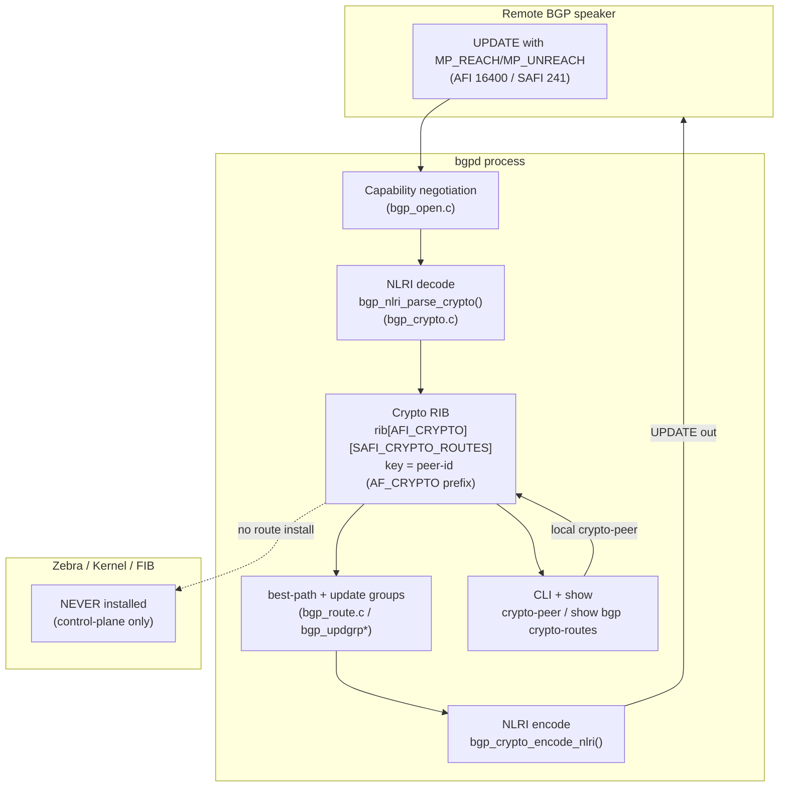

# BGP crypto-routes implementation plan

## Overview 

BGP normally carries **reachability information** — "to reach network X, send
traffic to me." `crypto-routes` reuses the exact same BGP machinery to carry a
different payload: **public crypto metadata** about a device (its algorithm,
certificate id, public-key id, capabilities, and trust level).

Think of it as a new *channel* on the BGP radio. The radio (the TCP session,
UPDATE messages, best-path selection, the RIB) is unchanged; only the *content*
of that one channel is new. Nothing crypto-related is ever pushed to the kernel
or the forwarding table — it is a pure control-plane distribution system.

### A 30-second glossary

| Term | Meaning in this document |
|------|--------------------------|
| **AFI** | Address Family Identifier — the "family" of data (IPv4, IPv6, ... and now Crypto). |
| **SAFI** | Subsequent AFI — the sub-type within a family (unicast, ... and now crypto-routes). |
| **MP-BGP** | Multiprotocol BGP — the capability that lets BGP carry non-IPv4 families. |
| **NLRI** | Network Layer Reachability Information — the advertised object inside an UPDATE. |
| **RIB** | Routing Information Base — bgpd's in-memory table of routes for one AFI/SAFI. |
| **peer-id** | The key/name of one crypto object (this is **not** the BGP neighbor). |
| **MP_REACH / MP_UNREACH** | UPDATE attributes used to advertise / withdraw a non-IPv4 NLRI. |

## Goal

Add an experimental MP-BGP address family named `crypto-routes` inside the
existing `bgpd` process. It distributes public crypto metadata between BGP
speakers. It does not install anything into Zebra, the kernel, or the FIB.

## What the feature carries

One crypto route represents one crypto peer object. The key for the route is
the `peer-id`; the data carried with it is:

- algorithm
- certificate-id
- public-key-id
- capabilities
- trust-level
- protocol version

No private keys are advertised.

### Data model (important — avoids a common confusion)

- A crypto route is **locally originated**: a router advertises **its own**
  crypto identity to its neighbors, exactly like a router originates its own
  loopback prefix. In `show bgp crypto-routes` a local route shows
  `Source: Static announcement`.
- `peer-id` is the **name of the crypto object** (the route key). It is **not**
  the BGP neighbor address. On R2, `crypto-peer r2 ...` advertises the object
  `r2`; when R1 receives it, R1 lists `peer-id r2` with `Source: <R2's address>`.
- The BGP neighbor (e.g. `10.1.1.1`) is only the **transport** that carries the
  object; the `peer-id` is the **payload key**.

## New identifiers

- Internal AFI: `AFI_CRYPTO`
- Internal SAFI: `SAFI_CRYPTO_ROUTES`
- Internal BGP AF index: `BGP_AF_CRYPTO_ROUTES`
- Prefix/table family: `AF_CRYPTO`
- CLI node: `BGP_CRYPTO_ROUTES_NODE`
- Lab wire AFI: `16400`
- Lab wire SAFI: `241`

The wire values are experimental. They must be replaced with assigned values
before interoperable production use.

## Architecture at a glance

crypto-routes plugs into bgpd like any other address family, but its RIB is a
dead-end toward the kernel: routes stop at the BGP table and are never handed to
Zebra.



## Where the code lives (file map)

| File | Responsibility |
|------|----------------|
| `lib/zebra.h` | `AFI_CRYPTO`, `SAFI_CRYPTO_ROUTES` enum values. |
| `lib/iana_afi.h` | Map internal AFI/SAFI to/from on-the-wire values (16400 / 241). |
| `lib/prefix.[ch]` | `AF_CRYPTO` prefix storage (variable-length peer-id key). |
| `lib/table.c` | Treat `AF_CRYPTO` keys like flowspec (unique-mode table). |
| `lib/command.h` | `BGP_CRYPTO_ROUTES_NODE` CLI node. |
| `bgpd/bgp_crypto.[ch]` | The feature: RIB add/delete, NLRI encode/decode, CLI + show. |
| `bgpd/bgp_open.c` | Advertise/negotiate the MP capability. |
| `bgpd/bgp_attr.c` | MP_REACH/MP_UNREACH hooks (zero nexthop, NLRI size). |
| `bgpd/bgp_packet.c` | Dispatch received NLRI to `bgp_nlri_parse_crypto()`. |
| `bgpd/bgp_route.[ch]` | Per-path crypto metadata (`bgp_path_info_extra_crypto`). |
| `bgpd/bgp_vty.c` | Node struct, `address-family crypto-routes`, installs. |
| `bgpd/bgp_zebra.c` | Skip the Zebra announce for this SAFI (no FIB). |
| `vtysh/vtysh.c` | **Mirror** the node in the integrated shell (see vtysh section). |

## Packet behavior

crypto-routes uses normal BGP packets:

- BGP OPEN advertises the MP capability for AFI `16400`, SAFI `241`.
- BGP UPDATE uses MP_REACH_NLRI to advertise a crypto object.
- BGP UPDATE uses MP_UNREACH_NLRI to withdraw a crypto object.
- MP_REACH carries a zero-length nexthop because crypto-routes has no
  forwarding nexthop.

The NLRI is length-prefixed so the decoder can skip malformed or unknown
future data safely.

## NLRI format

Each crypto NLRI is:

```text
2 bytes  NLRI length
2 bytes  version
1 byte   route type
1 byte   peer-id length
N bytes  peer-id
TLVs     algorithm, certificate-id, public-key-id, capabilities, trust-level
```

For withdraws, only the peer-id is needed.

## CLI

Configuration is under router BGP address-family mode:

```text
router bgp 65001
 address-family crypto-routes
  neighbor 192.0.2.2 activate
  crypto-peer r1-key algorithm rsa-2048 certificate-id cert-r1 public-key-id key-r1 capabilities sign,verify trust-level 80
 exit-address-family
```

Show commands:

```text
show bgp crypto-routes
show bgp crypto-routes detail
show bgp crypto-routes peer PEER_ID
show bgp crypto-routes summary
```

JSON output is available for the show commands.

## Advertisement rules

A crypto route is advertised when a local `crypto-peer` is configured or
updated. It is sent only when all of these are true:

- the neighbor is activated under `address-family crypto-routes`
- both BGP speakers negotiated the crypto-routes MP capability
- the route exists in the crypto-routes BGP RIB

The route is not request-based. BGP advertisements follow the normal BGP
model: the owner advertises its current state.

## Withdraw rules

A crypto route is withdrawn when:

- `no crypto-peer PEER_ID` removes the local object
- the BGP session goes down and the learned path is removed
- the BGP instance is cleaned up
- the address family is deactivated for that neighbor

Withdraws are sent as MP_UNREACH_NLRI.

## vtysh integration

`vtysh` is the integrated shell. It keeps its **own** copy of every CLI node and
command and simply forwards typed commands to the right daemon. A new bgpd node
therefore has to be registered **twice** — once in bgpd and once in vtysh.

In `vtysh/vtysh.c` you must:

1. Define a `struct cmd_node bgp_crypto_routes_node` (parent `BGP_NODE`).
2. Add a `DEFUNSH` for `address-family crypto-routes`. The help-string count
   **must** equal the token count (2 tokens -> 2 help strings).
3. `install_node(&bgp_crypto_routes_node)` in `vtysh_init`.
4. `install_element(BGP_NODE, &address_family_crypto_routes_cmd)` plus the
   `exit`/`quit`/`end`/`exit-address-family` elements on the node.
5. Add `BGP_CRYPTO_ROUTES_NODE` to the `exit_address_family` node check.

(Show commands and `crypto-peer` are auto-extracted into vtysh from the bgpd
`DEFUN`s, so they only need to exist in bgpd — but the **node** must be
registered in vtysh for them to be reachable.)

## New-CLI-node checklist (bgpd side)

Every new config node needs all of these, or config commands on it fail with
`% [BGP] Unknown command`:

- `install_node(&bgp_crypto_routes_node)`
- `install_default(BGP_CRYPTO_ROUTES_NODE)`  — installs `end`/`exit`/`quit`/`list`
- `install_element(BGP_NODE, &address_family_crypto_routes_cmd)`
- `install_element(BGP_CRYPTO_ROUTES_NODE, &exit_address_family_cmd)`
- the feature commands (`crypto-peer`, `neighbor activate`, show commands)

## Build and deploy notes

- Inserting values into `enum node_type` (`lib/command.h`) and `afi_t`/`safi_t`
  (`lib/zebra.h`) **shifts the numeric value of every later enum member**. Every
  object file that uses those enums must be recompiled, so always do a **clean
  rebuild** of libfrr + all daemons + vtysh:

  ```
  make clean && make && sudo make install
  ```

  A stale object file compiled against the old enum produces the classic
  "command accepted by vtysh but rejected by bgpd" symptom, because bgpd and the
  library disagree on the node/AFI number.
- `vtysh` is a fresh binary every run; long-running daemons (`bgpd`, `zebra`)
  must be explicitly **restarted** after install (`systemctl restart frr`).

## Before and after behavior

Before this change:

- FRR has no crypto-routes AFI/SAFI.
- BGP cannot negotiate this family.
- `address-family crypto-routes` and `crypto-peer` do not exist.
- There is no BGP table for crypto metadata.

After this change:

- bgpd can negotiate crypto-routes by MP capability.
- bgpd can store crypto metadata in a dedicated BGP table.
- bgpd can advertise, update, and withdraw crypto metadata through UPDATEs.
- Zebra and the kernel never receive crypto-routes.
- Existing IPv4/IPv6 unicast behavior should continue unchanged.

## Memory and CPU expectation

Memory grows only when the feature is used. Each crypto object creates:

- one BGP route node with an `AF_CRYPTO` peer-id key
- one BGP path
- one small `bgp_path_info_extra_crypto` structure
- normal BGP attribute references

CPU grows with the number of configured crypto objects and activated
crypto-routes neighbors. The work is similar to advertising a small control
plane route. There is no nexthop tracking, no Zebra install, and no kernel
programming.

## Implementation phases

1. Add AFI/SAFI enums and wire mappings (`lib/zebra.h`, `lib/iana_afi.h`).
2. Add `AF_CRYPTO` prefix storage for peer-id keys (`lib/prefix.*`, `lib/table.c`).
3. Add the BGP AF index and `BGP_CRYPTO_ROUTES_NODE` CLI node (`lib/command.h`).
4. Add `bgp_crypto.c` and `bgp_crypto.h`.
5. Add CLI commands and show commands (bgpd side).
6. Register the node in **vtysh** (`install_node`, DEFUNSH entry,
   `install_default`, `exit_address_family`) — see the vtysh section.
7. Add MP_REACH/MP_UNREACH encode/decode hooks (`bgp_attr.c`, `bgp_packet.c`).
8. Add Zebra and graceful-restart no-FIB skips (`bgp_zebra.c`).
9. Add developer docs and topotest coverage.

## Verification and acceptance criteria

The feature is only "working" when a route travels between two **isolated**
routers. Validate in this order (skipping a step hides the real problem):

1. **Session up** — `show bgp summary` shows the neighbor `Established`
   (a number under `State/PfxRcd`), not `Active`/`Connect`.
2. **Family negotiated** — `show bgp neighbor <ip>` lists the crypto-routes
   address family as *advertised and received*.
3. **Local origination** — on the origin, `show bgp crypto-routes summary`
   shows `Local crypto routes: 1`.
4. **Propagation** — on the receiver, `show bgp crypto-routes summary` shows
   `Remote crypto routes: 1`, and `show bgp crypto-routes` lists the object with
   `Source: <origin address>`.
5. **Withdraw** — `no crypto-peer <id>` removes it from the receiver.
6. **No FIB** — `show ip route` / Zebra shows nothing for crypto-routes.

Expected origin output:

```text
show bgp crypto-routes summary
Total crypto routes: 1
Local crypto routes: 1
Remote crypto routes: 0
```

Expected receiver output after propagation:

```text
Total crypto routes: 2
Local crypto routes: 1
Remote crypto routes: 1
```

## Test environment prerequisites

BGP needs a real session, which a "two daemons on one host" setup cannot provide
(only one bgpd can own TCP/179, and interfaces show as `pseudo`/down). Validation
therefore requires **network isolation**:

- Each router in its **own network namespace** (or container / VM) with its own
  real `eth0` (a veth pair) and its own port 179; or
- The FRR **topotest** harness (`tests/topotests/bgp_crypto_routes/`), which
  builds this isolation automatically and must run **as root** against the
  installed FRR binaries:

  ```
  sudo python3 -m pytest -s -v bgp_crypto_routes/test_bgp_crypto_routes.py
  ```

Symptoms that mean the *environment* (not the code) is wrong: `Active` session
state, `MsgRcvd 0`, `Interface eth0 is down ... pseudo interface`, while ICMP
ping still works.

## Limitations in v1

- Experimental lab-only wire values.
- No PKI validation.
- No private key distribution.
- No route-map policy specific to crypto metadata.
- No AddPath support for crypto-routes.
- eBGP export happens only when the eBGP neighbor is explicitly activated for
  crypto-routes.
