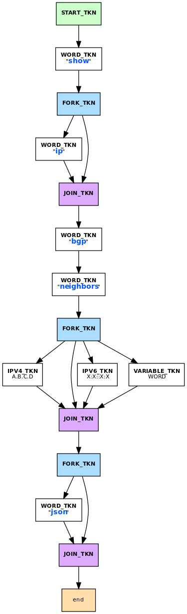

.. _command-line-interface:

Command Line Interface
======================

FRR features a flexible modal command line interface. Often when adding new
features or modifying existing code it is necessary to create or modify CLI
commands. FRR has a powerful internal CLI system that does most of the heavy
lifting for you.

Modes
-----
FRR's CLI is organized by modes. Each mode is associated with some set of
functionality, e.g. EVPN, or some underlying object such as an interface. Each
mode contains a set of commands that control the associated functionality or
object. Users move between the modes by entering a command, which is usually
different for each source and destination mode.

A summary of the modes is given in the following figure.

.. graphviz:: ../figures/nodes.dot

.. seealso:: :ref:`cli-data-structures`

Walkup
^^^^^^
FRR exhibits, for historical reasons, a peculiar behavior called 'walkup'.
Suppose a user is in ``OSPF_NODE``, which contains only OSPF-specific commands,
and enters the following command: ::

   ip route 192.168.100.0/24 10.0.2.2

This command is not defined in ``OSPF_NODE``, so the matcher will fail to match
the command in that node. The matcher will then check "parent" nodes of
``OSPF_NODE``. In this case the direct parent of ``OSPF_NODE`` is
``CONFIG_NODE``, so the current node switches to ``CONFIG_NODE`` and the command
is tried in that node. Since static route commands are defined in
``CONFIG_NODE`` the command succeeds. The procedure of attempting to execute
unmatched commands by sequentially "walking up" to parent nodes only happens in
children (direct and indirect) below ``CONFIG_NODE`` and stops at
``CONFIG_NODE``.

Unfortunately, the internal representation of the various modes is not actually
a graph. Instead, there is an array. The parent-child relationships are not
explicitly defined in any datastructure but instead are hard-coded into the
specific commands that switch nodes. For walkup, there is a function that takes
a node and returns the parent of the node. This interface causes all manner of
insidious problems, even for experienced developers, and needs to be fixed at
some point in the future.

Defining Commands
-----------------
All definitions for the CLI system are exposed in ``lib/command.h``. In this
header there are a set of macros used to define commands. These macros are
collectively referred to as "DEFUNs", because of their syntax:

::

    DEFUN(command_name,
          command_name_cmd,
          "example command FOO...",
          "Examples\n"
          "CLI command\n"
          "Argument\n")
    {
        // ...command handler...
    }

DEFUNs generally take four arguments which are expanded into the appropriate
constructs for hooking into the CLI. In order these are:

- **Function name** - the name of the handler function for the command
- **Command name** - the identifier of the ``struct cmd_element`` for the
  command. By convention this should be the function name with ``_cmd``
  appended.
- **Command definition** - an expression in FRR's CLI grammar that defines the
  form of the command and its arguments, if any
- **Doc string** - a newline-delimited string that documents each element in
  the command definition

In the above example, ``command_name`` is the function name,
``command_name_cmd`` is the command name, ``"example..."`` is the definition and
the last argument is the doc string. The block following the macro is the body
of the handler function, details on which are presented later in this section.

In order to make the command show up to the user it must be installed into the
CLI graph. To do this, call:

``install_element(NODE, &command_name_cmd);``

This will install the command into the specified CLI node. Usually these calls
are grouped together in a CLI initialization function for a set of commands, and
the DEFUNs themselves are grouped into the same source file to avoid cluttering
the codebase.  The names of these files follow the form ``*_vty.[ch]`` by
convention. Please do not scatter individual CLI commands in the middle of
source files; instead expose the necessary functions in a header and place the
command definition in a ``*_vty.[ch]`` file.

Definition Grammar
^^^^^^^^^^^^^^^^^^
FRR uses its own grammar for defining CLI commands. The grammar draws from
syntax commonly seen in \*nix manpages and should be fairly intuitive. The
parser is implemented in Bison and the lexer in Flex. These may be found in
``lib/command_lex.l`` and ``lib/command_parse.y``, respectively.

    **ProTip**: if you define a new command and find that the parser is
    throwing syntax or other errors, the parser is the last place you want
    to look. Bison is very stable and if it detects a syntax error, 99% of
    the time it will be a syntax error in your definition.

The formal grammar in BNF is given below. This is the grammar implemented in the
Bison parser. At runtime, the Bison parser reads all of the CLI strings and
builds a combined directed graph that is used to match and interpret user input.

Human-friendly explanations of how to use this grammar are given a bit later in
this section alongside information on the :ref:`cli-data-structures` constructed
by the parser.

.. productionlist::
   command: `cmd_token_seq`
          : `cmd_token_seq` `placeholder_token` "..."
   cmd_token_seq: *empty*
                : `cmd_token_seq` `cmd_token`
   cmd_token: `simple_token`
            : `selector`
   simple_token: `literal_token`
               : `placeholder_token`
   literal_token: WORD `varname_token`
   varname_token: "$" WORD
   placeholder_token: `placeholder_token_real` `varname_token`
   placeholder_token_real: IPV4
                         : IPV4_PREFIX
                         : IPV6
                         : IPV6_PREFIX
                         : VARIABLE
                         : RANGE
                         : MAC
                         : MAC_PREFIX
   selector: "<" `selector_seq_seq` ">" `varname_token`
           : "{" `selector_seq_seq` "}" `varname_token`
           : "[" `selector_seq_seq` "]" `varname_token`
   selector_seq_seq: `selector_seq_seq` "|" `selector_token_seq`
                   : `selector_token_seq`
   selector_token_seq: `selector_token_seq` `selector_token`
                     : `selector_token`
   selector_token: `selector`
                 : `simple_token`

Tokens
^^^^^^
The various capitalized tokens in the BNF above are in fact themselves
placeholders, but not defined as such in the formal grammar; the grammar
provides the structure, and the tokens are actually more like a type system for
the strings you write in your CLI definitions. A CLI definition string is broken
apart and each piece is assigned a type by the lexer based on a set of regular
expressions. The parser uses the type information to verify the string and
determine the structure of the CLI graph; additional metadata (such as the raw
text of each token) is encoded into the graph as it is constructed by the
parser, but this is merely a dumb copy job.

Here is a brief summary of the various token types along with examples.

+-----------------+-----------------+-------------------------------------------------------------+
| Token type      | Syntax          | Description                                                 |
+=================+=================+=============================================================+
| ``WORD``        | ``show ip bgp`` | Matches itself. In the given example every token is a WORD. |
+-----------------+-----------------+-------------------------------------------------------------+
| ``IPV4``        | ``A.B.C.D``     | Matches an IPv4 address.                                    |
+-----------------+-----------------+-------------------------------------------------------------+
| ``IPV6``        | ``X:X::X:X``    | Matches an IPv6 address.                                    |
+-----------------+-----------------+-------------------------------------------------------------+
| ``IPV4_PREFIX`` | ``A.B.C.D/M``   | Matches an IPv4 prefix in CIDR notation.                    |
+-----------------+-----------------+-------------------------------------------------------------+
| ``IPV6_PREFIX`` | ``X:X::X:X/M``  | Matches an IPv6 prefix in CIDR notation.                    |
+-----------------+-----------------+-------------------------------------------------------------+
| ``MAC``         | ``M:A:C``       | Matches a 48-bit mac address.                               |
+-----------------+-----------------+-------------------------------------------------------------+
| ``MAC_PREFIX``  | ``M:A:C/M``     | Matches a 48-bit mac address with a mask.                   |
+-----------------+-----------------+-------------------------------------------------------------+
| ``VARIABLE``    | ``FOOBAR``      | Matches anything.                                           |
+-----------------+-----------------+-------------------------------------------------------------+
| ``RANGE``       | ``(X-Y)``       | Matches numbers in the range X..Y inclusive.                |
+-----------------+-----------------+-------------------------------------------------------------+

When presented with user input, the parser will search over all defined
commands in the current context to find a match. It is aware of the various
types of user input and has a ranking system to help disambiguate commands. For
instance, suppose the following commands are defined in the user's current
context:

::

   example command FOO
   example command (22-49)
   example command A.B.C.D/X

The following table demonstrates the matcher's choice for a selection of
possible user input.

+---------------------------------+---------------------------+--------------------------------------------------------------------------------------------------------------+
| Input                           | Matched command           | Reason                                                                                                       |
+=================================+===========================+==============================================================================================================+
| ``example command eLi7eH4xx0r`` | example command FOO       | ``eLi7eH4xx0r`` is not an integer or IPv4 prefix,                                                            |
|                                 |                           | but FOO is a variable and matches all input.                                                                 |
+---------------------------------+---------------------------+--------------------------------------------------------------------------------------------------------------+
| ``example command 42``          | example command (22-49)   | ``42`` is not an IPv4 prefix. It does match both                                                             |
|                                 |                           | ``(22-49)`` and ``FOO``, but RANGE tokens are more specific and have a higher priority than VARIABLE tokens. |
+---------------------------------+---------------------------+--------------------------------------------------------------------------------------------------------------+
| ``example command 10.3.3.0/24`` | example command A.B.C.D/X | The user entered an IPv4 prefix, which is best matched by the last command.                                  |
+---------------------------------+---------------------------+--------------------------------------------------------------------------------------------------------------+

Rules
^^^^^
There are also constructs which allow optional tokens, mutual exclusion,
one-or-more selection and repetition.

-  ``<angle|brackets>`` -- Contain sequences of tokens separated by pipes and
   provide mutual exclusion. User input matches at most one option.
-  ``[square brackets]`` -- Contains sequences of tokens that can be omitted.
   ``[<a|b>]`` can be shortened to ``[a|b]``.
-  ``{curly|braces}`` -- similar to angle brackets, but instead of mutual
   exclusion, curly braces indicate that one or more of the pipe-separated
   sequences may be provided in any order.
-  ``VARIADICS...`` -- Any token which accepts input (anything except WORD)
   which occurs as the last token of a line may be followed by an ellipsis,
   which indicates that input matching the token may be repeated an unlimited
   number of times.
-  ``$name`` -- Specify a variable name for the preceding token. See
   "Variable Names" below.

Some general notes:

-  Options are allowed at the beginning of the command. The developer is
   entreated to use these extremely sparingly. They are most useful for
   implementing the 'no' form of configuration commands. Please think carefully
   before using them for anything else. There is usually a better solution, even
   if it is just separating out the command definition into separate ones.
-  The developer should judiciously apply separation of concerns when defining
   commands. CLI definitions for two unrelated or vaguely related commands or
   configuration items should be defined in separate commands. Clarity is
   preferred over LOC (within reason).
-  The maximum number of space-separated tokens that can be entered is
   presently limited to 256. Please keep this limit in mind when
   implementing new CLI.

Variable Names
^^^^^^^^^^^^^^
The parser tries to fill the "varname" field on each token. This can happen
either manually or automatically. Manual specifications work by appending
``$name`` after the input specifier:

::

   foo bar$cmd WORD$name A.B.C.D$ip

Note that you can also assign variable names to fixed input tokens, this can be
useful if multiple commands share code. You can also use "$name" after a
multiple-choice option:

::

   foo bar <A.B.C.D|X:X::X:X>$addr [optionA|optionB]$mode

The variable name is in this case assigned to the last token in each of the
branches.

Automatic assignment of variable names works by applying the following rules:

-  manual names always have priority
-  a ``[no]`` at the beginning receives ``no`` as varname on the ``no`` token
-  ``VARIABLE`` tokens whose text is not ``WORD`` or ``NAME`` receive a cleaned
   lowercase version of the token text as varname, e.g. ``ROUTE-MAP`` becomes
   ``route_map``.
-  other variable tokens (i.e. everything except "fixed") receive the text of
   the preceding fixed token as varname, if one can be found.  E.g.
   ``ip route A.B.C.D/M INTERFACE`` assigns "route" to the ``A.B.C.D/M`` token.

These rules should make it possible to avoid manual varname assignment in 90% of
the cases.

Doc Strings
^^^^^^^^^^^
Each token in a command definition should be documented with a brief doc string
that informs a user of the meaning and/or purpose of the subsequent command
tree. These strings are provided as the last parameter to DEFUN macros,
concatenated together and separated by an escaped newline (``\n``). These are
best explained by example.

::

   DEFUN (config_terminal,
          config_terminal_cmd,
          "configure terminal",
          "Configuration from vty interface\n"
          "Configuration terminal\n")

The last parameter is split into two lines for readability. Two newline
delimited doc strings are present, one for each token in the command. The second
string documents the functionality of the ``terminal`` command in the
``configure`` subtree.

Note that the first string, for ``configure`` does not contain documentation for
'terminal'. This is because the CLI is best envisioned as a tree, with tokens
defining branches. An imaginary ``start`` token is the root of every command in
a CLI node. Each subsequent written token descends into a subtree, so the
documentation for that token ideally summarizes all the functionality contained
in the subtree.

A consequence of this structure is that the developer must be careful to use the
same doc strings when defining multiple commands that are part of the same tree.
Commands which share prefixes must share the same doc strings for those
prefixes. On startup the parser will generate warnings if it notices
inconsistent doc strings. Behavior is undefined; the same token may show up
twice in completions, with different doc strings, or it may show up once with a
random doc string. Parser warnings should be heeded and fixed to avoid confusing
users.

The number of doc strings provided must be equal to the amount of tokens present
in the command definition, read left to right, ignoring any special constructs.

In the examples below, each arrowed token needs a doc string.

::

   "show ip bgp"
    ^    ^  ^

   "command <foo|bar> [example]"
    ^        ^   ^     ^

DEFPY
^^^^^
``DEFPY(...)`` is an enhanced version of ``DEFUN()`` which is preprocessed by
:file:`python/clidef.py`. The python script parses the command definition
string, extracts variable names and types, and generates a C wrapper function
that parses the variables and passes them on. This means that in the CLI
function body, you will receive additional parameters with appropriate types.

This is best explained by an example. Invoking ``DEFPY`` like this:

.. code-block:: c

   DEFPY(func, func_cmd, "[no] foo bar A.B.C.D (0-99)$num", "...help...")

defines the handler function like this:

.. code-block:: c

   func(self, vty, argc, argv,  /* standard CLI arguments */
        const char *no,         /* unparsed "no" */
        struct in_addr bar,     /* parsed IP address */
        const char *bar_str,    /* unparsed IP address */
        long num,               /* parsed num */
        const char *num_str)    /* unparsed num */

Note that as documented in the previous section, ``bar`` is automatically
applied as variable name for ``A.B.C.D``. The Python script then detects this as
an IP address argument and generates code to parse it into a ``struct in_addr``,
passing it in ``bar``. The raw value is passed in ``bar_str``. The range/number
argument works in the same way with the explicitly given variable name.

Type rules
""""""""""

+----------------------------+--------------------------------+--------------------------+
| Token(s)                   | Type                           | Value if omitted by user |
+============================+================================+==========================+
| ``A.B.C.D``                | ``struct in_addr``             | ``0.0.0.0``              |
+----------------------------+--------------------------------+--------------------------+
| ``X:X::X:X``               | ``struct in6_addr``            | ``::``                   |
+----------------------------+--------------------------------+--------------------------+
| ``A.B.C.D + X:X::X:X``     | ``const union sockunion *``    | ``NULL``                 |
+----------------------------+--------------------------------+--------------------------+
| ``A.B.C.D/M``              | ``const struct prefix_ipv4 *`` | ``NULL``                 |
+----------------------------+--------------------------------+--------------------------+
| ``X:X::X:X/M``             | ``const struct prefix_ipv6 *`` | ``NULL``                 |
+----------------------------+--------------------------------+--------------------------+
| ``A.B.C.D/M + X:X::X:X/M`` | ``const struct prefix *``      | ``NULL``                 |
+----------------------------+--------------------------------+--------------------------+
| ``(0-9)``                  | ``long``                       | ``0``                    |
+----------------------------+--------------------------------+--------------------------+
| ``VARIABLE``               | ``const char *``               | ``NULL``                 |
+----------------------------+--------------------------------+--------------------------+
| ``word``                   | ``const char *``               | ``NULL``                 |
+----------------------------+--------------------------------+--------------------------+
| *all other*                | ``const char *``               | ``NULL``                 |
+----------------------------+--------------------------------+--------------------------+

Note the following details:

-  Not all parameters are pointers, some are passed as values.
-  When the type is not ``const char *``, there will be an extra ``_str``
   argument with type ``const char *``.
-  You can give a variable name not only to ``VARIABLE`` tokens but also to
   ``word`` tokens (e.g. constant words). This is useful if some parts of a
   command are optional. The type will be ``const char *``.
-  ``[no]`` will be passed as ``const char *no``.
-  Pointers will be ``NULL`` when the argument is optional and the user did not
   use it.
-  If a parameter is not a pointer, but is optional and the user didn't use it,
   the default value will be passed. Check the ``_str`` argument if you need to
   determine whether the parameter was omitted.
-  If the definition contains multiple parameters with the same variable name,
   they will be collapsed into a single function parameter. The python code will
   detect if the types are compatible (i.e. IPv4 + IPv6 variants) and choose a
   corresponding C type.
-  The standard DEFUN parameters (``self, vty, argc, argv``) are still present
   and can be used. A DEFUN can simply be **edited into a DEFPY without further
   changes and it will still work**; this allows easy forward migration.
-  A file may contain both ``DEFUN`` and ``DEFPY`` statements.

Getting a parameter dump
""""""""""""""""""""""""
The clidef.py script can be called to get a list of DEFUNs/DEFPYs with the
parameter name/type list:

::

   lib/clippy python/clidef.py --all-defun --show lib/plist.c > /dev/null

The generated code is printed to stdout, the info dump to stderr. The
``--all-defun`` argument will make it process DEFUN blocks as well as DEFPYs,
which is useful prior to converting some DEFUNs. **The dump does not list the
``_str`` arguments** to keep the output shorter.

Note that the ``clidef.py`` script cannot be run with python directly, it needs
to be run with *clippy* since the latter makes the CLI parser available.

Include & Makefile requirements
"""""""""""""""""""""""""""""""
A source file that uses DEFPY needs to include the ``*_clippy.c`` file **before
all DEFPY statements**:

.. code-block:: c

   /* GPL header */
   #include ...
   ...
   #ifndef VTYSH_EXTRACT_PL
   #include "daemon/filename_clippy.c"
   #endif

   DEFPY(...)
   DEFPY(...)

   install_element(...)

This dependency needs to be marked in ``Makefile.am`` or ``subdir.am``: (there
is no ordering requirement)

.. code-block:: make

   include ../common.am

   # ...

   # if linked into a LTLIBRARY (.la/.so):
   filename.lo: filename_clippy.c

   # if linked into an executable or static library (.a):
   filename.o: filename_clippy.c

Handlers
^^^^^^^^
The block that follows a CLI definition is executed when a user enters input
that matches the definition. Its function signature looks like this:

.. code-block:: c

   int (*func) (const struct cmd_element *, struct vty *, int, struct cmd_token *[]);

The first argument is the command definition struct. The last argument is an
ordered array of tokens that correspond to the path taken through the graph, and
the argument just prior to that is the length of the array.

The arrangement of the token array has changed from Quagga's CLI implementation.
In the old system, missing arguments were padded with ``NULL`` so that the same
parts of a command would show up at the same indices regardless of what was
entered. The new system does not perform such padding and therefore it is
generally *incorrect* to assume consistent indices in this array. As a simple
example:

Command definition:

::

   command [foo] <bar|baz>

User enters:

::

   command foo bar

Array:

::

   [0] -> command
   [1] -> foo
   [2] -> bar

User enters:

::

   command baz

Array:

::

   [0] -> command
   [1] -> baz

.. _cli-data-structures:

Data Structures
---------------
On startup, the CLI parser sequentially parses each command string definition
and constructs a directed graph with each token forming a node. This graph is
the basis of the entire CLI system. It is used to match user input in order to
generate command completions and match commands to functions.

There is one graph per CLI node (not the same as a graph node in the CLI graph).
The CLI node struct keeps a reference to its graph (see :file:`lib/command.h`).

While most of the graph maintains the form of a tree, special constructs
outlined in the Rules section introduce some quirks. ``<>``, ``[]`` and ``{}``
form self-contained 'subgraphs'. Each subgraph is a tree except that all of the
'leaves' actually share a child node. This helps with minimizing graph size and
debugging.

As a working example, here is the graph of the following command: ::

   show [ip] bgp neighbors [<A.B.C.D|X:X::X:X|WORD>] [json]

   Graph of example CLI command

``FORK`` and ``JOIN`` nodes are plumbing nodes that don't correspond to user
input. They're necessary in order to deduplicate these constructs where
applicable.

Options follow the same form, except that there is an edge from the ``FORK``
node to the ``JOIN`` node. Since all of the subgraphs in the example command are
optional, all of them have this edge.

Keywords follow the same form, except that there is an edge from ``JOIN`` to
``FORK``. Because of this the CLI graph cannot be called acyclic. There is
special logic in the input matching code that keeps a stack of paths already
taken through the node in order to disallow following the same path more than
once.

Variadics are a bit special; they have an edge back to themselves, which allows
repeating the same input indefinitely.

The leaves of the graph are nodes that have no out edges. These nodes are
special; their data section does not contain a token, as most nodes do, or
``NULL``, as in ``FORK``/``JOIN`` nodes, but instead has a pointer to a
``cmd_element``.  All paths through the graph that terminate on a leaf are
guaranteed to be defined by that command. When a user enters a complete command,
the command matcher tokenizes the input and executes a DFS on the CLI graph. If
it is simultaneously able to exhaust all input (one input token per graph node),
and then find exactly one leaf connected to the last node it reaches, then the
input has matched the corresponding command and the command is executed. If it
finds more than one node, then the command is ambiguous (more on this in
deduplication). If it cannot exhaust all input, the command is unknown. If it
exhausts all input but does not find an edge node, the command is incomplete.

The parser uses an incremental strategy to build the CLI graph for a node. Each
command is parsed into its own graph, and then this graph is merged into the
overall graph. During this merge step, the parser makes a best-effort attempt to
remove duplicate nodes. If it finds a node in the overall graph that is equal to
a node in the corresponding position in the command graph, it will intelligently
merge the properties from the node in the command graph into the
already-existing node. Subgraphs are also checked for isomorphism and merged
where possible. The definition of whether two nodes are 'equal' is based on the
equality of some set of token properties; read the parser source for the most
up-to-date definition of equality.

When the parser is unable to deduplicate some complicated constructs, this can
result in two identical paths through separate parts of the graph. If this
occurs and the user enters input that matches these paths, they will receive an
'ambiguous command' error and will be unable to execute the command. Most of the
time the parser can detect and warn about duplicate commands, but it will not
always be able to do this.  Hence care should be taken before defining a new
command to ensure it is not defined elsewhere.

struct cmd\_token
^^^^^^^^^^^^^^^^^

.. code-block:: c

   /* Command token struct. */
   struct cmd_token
   {
           enum cmd_token_type type; // token type
           uint8_t attr;             // token attributes
           bool allowrepeat;         // matcher can match token repetitively?

           char *text;               // token text
           char *desc;               // token description
           long long min, max;       // for ranges
           char *arg;                // user input that matches this token
           char *varname;            // variable name
   };

This struct is used in the CLI graph to match input against. It is also used to
pass user input to command handler functions, as it is frequently useful for
handlers to have access to that information. When a command is matched, the
sequence of ``cmd_tokens`` that form the matching path are duplicated and placed
in order into ``*argv[]``. Before this happens the ``->arg`` field is set to
point at the snippet of user input that matched it.

For most nontrivial commands the handler function will need to determine which
of the possible matching inputs was entered. Previously this was done by looking
at the first few characters of input. This is now considered an anti-pattern and
should be avoided. Instead, the ``->type`` or ``->text`` fields for this logic.
The ``->type`` field can be used when the possible inputs differ in type. When
the possible types are the same, use the ``->text`` field. This field has the
full text of the corresponding token in the definition string and using it makes
for much more readable code. An example is helpful.

Command definition:

::

   command <(1-10)|foo|BAR>

In this example, the user may enter any one of:
- an integer between 1 and 10
- "foo"
- anything at all

If the user enters "command f", then:

::

   argv[1]->type == WORD_TKN
   argv[1]->arg  == "f"
   argv[1]->text == "foo"

Range tokens have some special treatment; a token with ``->type == RANGE_TKN``
will have the ``->min`` and ``->max`` fields set to the bounding values of the
range.

struct cmd\_element
^^^^^^^^^^^^^^^^^^^

.. code-block:: c

   struct cmd_node {
           /* Node index. */
           enum node_type node;

           /* Prompt character at vty interface. */
           const char *prompt;

           /* Is this node's configuration goes to vtysh ? */
           int vtysh;

           /* Node's configuration write function */
           int (*func)(struct vty *);

           /* Node's command graph */
           struct graph *cmdgraph;

           /* Vector of this node's command list. */
           vector cmd_vector;

           /* Hashed index of command node list, for de-dupping primarily */
           struct hash *cmd_hash;
   };

This struct corresponds to a CLI mode. The last three fields are most relevant
here.

cmdgraph
   This is a pointer to the command graph that was described in the first part
   of this section. It is the datastructure used for matching user input to
   commands.

cmd_vector
   This is a list of all the ``struct cmd_element`` defined in the mode.

cmd_hash
   This is a hash table of all the ``struct cmd_element`` defined in the mode.
   When ``install_element`` is called, it checks that the element it is given is
   not already present in the hash table as a safeguard against duplicate calls
   resulting in a command being defined twice, which renders the command
   ambiguous.

All ``struct cmd_node`` are themselves held in a static vector defined in
:file:`lib/command.c` that defines the global CLI space.

Command Abbreviation & Matching Priority
----------------------------------------
It is possible for users to elide parts of tokens when the CLI matcher does not
need them to make an unambiguous match. This is best explained by example.

Command definitions:

::

   command dog cow
   command dog crow

User input:

::

   c d c         -> ambiguous command
   c d co        -> match "command dog cow"

The parser will look ahead and attempt to disambiguate the input based on tokens
later on in the input string.

Command definitions:

::

   show ip bgp A.B.C.D
   show ipv6 bgp X:X::X:X

User enters:

::

   s i b 4.3.2.1         -> match "show ip bgp A.B.C.D"
   s i b ::e0            -> match "show ipv6 bgp X:X::X:X"

Reading left to right, both of these commands would be ambiguous since 'i' does
not explicitly select either 'ip' or 'ipv6'. However, since the user later
provides a token that matches only one of the commands (an IPv4 or IPv6 address)
the parser is able to look ahead and select the appropriate command. This has
some implications for parsing the ``*argv[]`` that is passed to the command
handler.

Now consider a command definition such as:

::

   command <foo|VAR>

'foo' only matches the string 'foo', but 'VAR' matches any input, including
'foo'. Who wins? In situations like this the matcher will always choose the
'better' match, so 'foo' will win.

Consider also:

::

   show <ip|ipv6> foo

User input:

::

   show ip foo

``ip`` partially matches ``ipv6`` but exactly matches ``ip``, so ``ip`` will
win.

Inspection & Debugging
----------------------

Permutations
^^^^^^^^^^^^
It is sometimes useful to check all the possible combinations of input that
would match an arbitrary definition string. There is a tool in
:file:`tools/permutations` that reads CLI definition strings on ``stdin`` and
prints out all matching input permutations. It also dumps a text representation
of the graph, which is more useful for debugging than anything else. It looks
like this:

.. code-block:: shell

   $ ./permutations "show [ip] bgp [<view|vrf> WORD]"

   show ip bgp view WORD
   show ip bgp vrf WORD
   show ip bgp
   show bgp view WORD
   show bgp vrf WORD
   show bgp

This functionality is also built into VTY/VTYSH; :clicmd:`list permutations`
will list all possible matching input permutations in the current CLI node.

Graph Inspection
^^^^^^^^^^^^^^^^
When in the Telnet or VTYSH console, :clicmd:`show cli graph` will dump the
entire command space of the current mode in the DOT graph language. This can be
fed into one of the various GraphViz layout engines, such as ``dot``,
``neato``, etc.

For example, to generate an image of the entire command space for the top-level
mode (``ENABLE_NODE``):

.. code-block:: shell

   sudo vtysh -c 'show cli graph' | dot -Tjpg -Grankdir=LR > graph.jpg

To do the same for the BGP mode:

.. code-block:: shell

   sudo vtysh -c 'conf t' -c 'router bgp' -c 'show cli graph' | dot -Tjpg -Grankdir=LR > bgpgraph.jpg

This information is very helpful when debugging command resolution, tracking
down duplicate / ambiguous commands, and debugging patches to the CLI graph
builder.
