..
.. SPDX-License-Identifier: GPL-2.0-or-later
..
.. June 19 2023, Christian Hopps <chopps@labn.net>
..
.. Copyright (c) 2023, LabN Consulting, L.L.C.
..

.. _mgmtd_dev:

MGMTD Development
=================

Overview
--------

``mgmtd`` (Management Daemon) is a new centralized management daemon for FRR.

Previously, ``vtysh`` was the only centralized management service provided.
Internally ``vtysh`` connects to each daemon and sends CLI commands (both
configuration and operational state queries) over a socket connection. This
service only supports CLI which is no longer sufficient.

An important next step was made with the addition of YANG support. A YANG
infrastructure was added through a new development called *northbound*. This
*northbound* interface added the capability of daemons to be configured and
queried using YANG models. However, this interface was per daemon and not
centralized, which is not sufficient.

``mgmtd`` harnesses this new *northbound* interface to provide a centralized
interface for all daemons. It utilizes the daemons YANG models to interact with
each daemon. ``mgmtd`` currently provides the CLI interface for each daemon that
has been converted to it, but in the future RESTCONF and NETCONF servers can
easily be added as *front-ends* to mgmtd to support those protocols as well.

Conversion Status
^^^^^^^^^^^^^^^^^

Fully Converted To MGMTD
""""""""""""""""""""""""

- lib/affinitymap
- lib/distribute
- lib/filter
- lib/if
- lib/if_rmap
- lib/keychain
- lib/log_vty
- lib/routemap
- lib/vrf
- ripd
- ripngd
- staticd
- zebra

Converted To Northbound
"""""""""""""""""""""""
- bfdd
- pathd
- pbrd
- pimd

Converted To Northbound With Issues
"""""""""""""""""""""""""""""""""""
- eigrp
- isisd

Unconverted
"""""""""""
- babel
- bgpd
- ldpd
- lib/event
- lib/nexthop_group
- lib/zlog_5424_cli
- nhrpd
- ospfd
- ospf6d
- pceplib
- qdb
- sharpd
- vrrpd

Converting A Daemon to MGMTD
----------------------------

A daemon must first be transitioned to the new :ref:`northbound` interface if that
has not already been done (see :ref:`nb-retrofit` for how to do this). Once this
is done a few simple steps are all that is required move the daemon over to
``mgmtd`` control.

Overview of Changes
^^^^^^^^^^^^^^^^^^^

Adding support for a *northbound* converted daemon involves very little work. It
requires enabling *frontend* (CLI and YANG) and *backend* (YANG) support.
``mgmtd`` was designed to keep this as simple as possible.

Front-End Interface:

#. Add YANG module file to ``mgmtd/subdir.am`` (e.g., ``yang/frr-staticd.yang.c``).

#. Add CLI handler file[s] to ``mgmtd/subdir.am``. The `subdir.am` variable to
   use is indicated in the next 2 steps.

   #. [if needed] Exclude (:code:`#ifndef`) non-configuration CLI handlers from
      CLI source file (e.g., inside :file:`staticd/static_vty.c`) and add the
      file to :code:`nodist_mgmtd_libmgmt_be_nb_la_SOURCES` in
      :file:`mgmtd/subdir.am`.

   #. [otherwise] Remove CLI handler file from _SOURCES variable in the daemon
      :file:`subdir.am` file (e.g in :file:`staticd/subdir.am`) and add to
      :code:`mgmtd_libmgmtd_a_SOURCES` in :file:`mgmtd/subdir.am`.

#. In order to have mgmtd try and load existing per-daemon config files, add
   the daemon to the :code:`mgmt_daemons` array in :file:`lib/vty.c`. With the
   official release of the mgmtd code FRR is no longer supporting per daemon log
   files but it will take a while before all of the topotest is converted.

#. In the daemon's :code:`struct frr_daemon_info` (i.e., inside it's
   :code:`FRR_DAEMON_INFO()`) set the `.flags` bit `FRR_NO_SPLIT_CONFIG`. This
   will keep the daemon from trying to read it's per-daemon config file as mgmtd
   will now be doing this.

#. Add the daemon's YANG module description[s] into the array
   :code:`mgmt_yang_modules` defined in :file:`mgmtd/mgmt_main.c` (see
   :ref:`mgmtd-config-write`). Make sure that all YANG modules that the daemon
   uses are present in the mgmtd list. To find this list look in the daemon's
   equivalent yang module array variable.

#. Initialize the CLI handlers inside :code:`mgmt_vty_init` in :file:`mgmtd/mgmt_vty.c`.

#. Direct ``vtysh`` to send CLI commands to ``mgmtd`` by modifying
   ``vtysh/vtysh.h``. At the top of this file each daemon has a bit
   ``#define``'d (e.g., ``#define VTYSH_STATICD 0x08000``) below this there are
   groupings, replace all the uses of the daemons bit with ``VTYSH_MGMTD``
   instead so that the CLI commands get properly routed to ``mgmtd`` rather than
   the daemon now.

 #. Remove initialization (and installation) of library CLI routines. These will
    correspond with the VTYSH removals from the last step i.e.,:

    - change access_list_init() to access_list_init_new(false) and remove from
      VTYSH_ACL_CONFIG (leave in VTYSH_ACL_SHOW).
    - remove if_cmd_init_default() => remove from VTYSH_INTERFACE_SUBSET
    - remove if_cmd_init() => remove from VTYSH_INTERFACE_SUBSET
    - change route_map_init() to route_map_init_new(false) and remove from
      VTYSH_ROUTE_MAP_CONFIG (leave in VTYSH_ROUTE_MAP_SHOW).
    - remove vrf_cmd_init(NULL)  => remove from VTYSH_INTERFACE_SUBSET

Back-End Interface:

#. In the daemon's main file initialize the BE client library. You add a global
   `struct mgmt_be_client *mgmt_be_client` near the daemons `event_loop *master`
   variable. Then where the daemon used to initialize it's CLI/VTY code replace
   that with the client initialization by calling `mgmt_be_client_create`.
   Likewise in the daemon's sigint cleanup code, operational walks should be
   canceled with a call to `nb_oper_cancel_all_walks`, and then the BE client
   should be destroyed with a call to `mgmt_be_client_destroy` and to be safe
   NULL out the global `mgmt_be_client` variable.

   One argument to mgmt_be_client_create is `struct mgmt_be_client_cbs *cbs`.
   This structure should contain the arrays of XPATH prefixes that the backend
   client supports for it's config, oper-state, and RPCs. Additionally, an array
   of notify XPATH prefixes can be passed to indicate interest in being notified of
   changes in oper-state from other backends on those paths, as well as standard
   YANG notifications (again passing their XPATHs).

   NOTE: make sure to include your library supported XPATHs prefixes as well
   (e.g., "/frr-interface:lib"). A good way to figure these paths out are to
   look in each of the YANG modules that the daemon uses and include each of
   their paths in the appropriate array.

#. In ``python/xref2vtysh.py`` add ``VTYSH_xxxD`` (for client xxx) to
   ``lib/mgmt_be_client.c`` entry in the ``daemon_falgs`` dictionary.

Add YANG and CLI into MGMTD
^^^^^^^^^^^^^^^^^^^^^^^^^^^^

As an example here is the addition made to ``mgmtd/subdir.am`` for adding
``staticd`` support.

.. code-block:: make

    if STATICD
    nodist_mgmtd_mgmtd_SOURCES += \
        yang/frr-staticd.yang.c \
        yang/frr-bfdd.yang.c \
        # end
    nodist_mgmtd_libmgmt_be_nb_la_SOURCES += staticd/static_vty.c
    endif

An here is the addition to the modules array in ``mgmtd/mgmt_main.c``:

.. code-block:: c

    #ifdef HAVE_STATICD
    extern const struct frr_yang_module_info frr_staticd_info;
    #endif

    static const struct frr_yang_module_info *const mgmt_yang_modules[] = {
           &frr_filter_info,
           ...
    #ifdef HAVE_STATICD
           &frr_staticd_info,
    #endif
    }

CLI Config and Show Handlers
^^^^^^^^^^^^^^^^^^^^^^^^^^^^

The daemon's CLI handlers for configuration (which having been converted to the
:ref:`northbound` now simply generate YANG changes) will be linked directly into
``mgmtd``.

If the debug and legacy operational CLI commands are kept in files separate from the
daemon's configuration CLI commands then no extra work is required. Otherwise some
CPP #ifndef's will be required.

``mgmtd`` supports both config and operational state. However, many
daemons have not had their operational state CLI commands converted over to the
new YANG based methods. If that is the case and if both types of CLI handlers
are present in a single file (e.g. a ``xxx_vty.c`` or ``xxx_cli.c`` file) then
:code:`#ifndef` will need to be used to exclude the non-config CLI handlers from
``mgmtd``. The same goes for unconverted *debug* CLI handlers. For example:

.. code-block:: c

  DEFPY(daemon_one_config, daemon_one_config_cmd,
        "daemon one [optional-arg]"
        ...
  {
        ...
  }

  #ifndef INCLUDE_MGMTD_CMDDEFS_ONLY
  DEFPY(daemon_show_oper, daemon_show_oper_cmd,
        "show daemon oper [all]"
        ...
  {
        ...
  }
  #endif /* ifndef INCLUDE_MGMTD_CMDDEFS_ONLY */

  void daemon_vty_init(void)
  {
	install_element(CONFIG_NODE, &daemon_one_config_cmd);
        ...

  #ifndef INCLUDE_MGMTD_CMDDEFS_ONLY
          install_element(ENABLE_NODE, &daemon_show_oper_cmd);
  #endif /* ifndef INCLUDE_MGMTD_CMDDEFS_ONLY */

  }

.. _mgmtd-config-write:

CLI Config Write Handlers (:code:`cli_show`)
^^^^^^^^^^^^^^^^^^^^^^^^^^^^^^^^^^^^^^^^^^^^

To support writing out the CLI configuration file the northbound API defines a
2 callbacks (:code:`cli_show` and :code:`cli_show_end`). Pointers to these
callbacks used to live side-by-side in a daemons :code:`struct frr_yang_module_info`,
with the daemons back-end configuration and operational state callbacks
(normally in a file named `<daemon>_nb.c`).

However, these 2 functionalities need to be split up now. The *frontend* config
writing callbacks (:code:`cli_show`) should now be linked into ``mgmtd`` while
the *backend* config and oper-state callbacks (e.g., :code:`create`,
:code:`modify`, etc) should continue to be linked into the daemon.

So you will need to define 2 :code:`struct frr_yang_module_info` arrays.

#. The existing array remains in the same place in the daemon, but with all the
   :code:`cli_show` handlers removed.

#. The removed :code:`cli_show` handlers should be added to a new
   :code:`struct frr_yang_module_info` array. This second array should be
   included in the same file that includes that actual function pointed to by
   the the :code:`cli_show` callbacks (i.e., the file is compiled into
   ``mgmtd``).

   This new :code:`struct frr_yang_module_info` array is the one to be included
   in mgmtd in `mgmt_yang_modules` inside ``mgmtd/mgmt_main.c``.

Back-End Client Connection
^^^^^^^^^^^^^^^^^^^^^^^^^^

In order for your daemon to communicate with mgmtd you need to initialize the
backend client library. You normally do this where you used to initialize your
CLI/VTY code.

.. code-block:: c

    ...
    struct event_loop *master;

    static struct mgmt_be_client *mgmt_be_client;

    static struct mgmt_be_client_cbs ripd_be_client_data = {
        /* more on this below */
    };
    ...

    int main(int argc, char **argv)
    {
        ...
        rip_init();
	rip_if_init();
	mgmt_be_client = mgmt_be_client_create("ripd", &ripd_be_client_data, 0, master);

Likewise the client should be cleaned up in the daemon cleanup routine.

.. code-block:: c

    /* SIGINT handler. */
    static void sigint(void)
    {
            zlog_notice("Terminating on signal");
            ...
            nb_oper_cancel_all_walks();
            mgmt_be_client_destroy(mgmt_be_client);
            mgmt_be_client = NULL;

Back-End XPATH mappings
^^^^^^^^^^^^^^^^^^^^^^^

In order for ``mgmtd`` to direct YANG modeled data to (and from) your daemon you
need to pass these XPATH prefixes to ``mgmtd`` when creating your be client.
These XPATHs determine which YANG modeled data (e.g., config changes) get sent
over the *back-end* client connection to and from your daemon. There are 4
arrays to possibly initialize in the `struct mgmt_be_client_cbs *cbs` passed to
``mgmt_be_client_create``: configuration, operational, notification, and RPC.
These in turn get sent in the ``SUBSCRIBE`` message sent to ``mgmtd`` after
connecting.

NOTE: the notif array, is a slightly different from the other 3 types (config,
oper and rpc) in that it maps xpaths the back-end client wishes to *receive*
notifications for, not the ones it may generate. Normally a back-end client is
generating notifications; however, mgmtd supports back-end clients also
"subscribing" to receive these notifications as well from other back-end clients
through notif_xpath maps.

Back-End XPATH Example
""""""""""""""""""""""

Below are the XPATH prefixes for ``ripd`` as well the initialization of it's
``cbs`` argument.

.. code-block:: c

    static const char *const ripd_config_xpaths[] = {
	"/frr-filter:lib",
	"/frr-host:host",
	"/frr-logging:logging",
	"/frr-interface:lib/interface",
	"/frr-ripd:ripd",
	"/frr-route-map:lib",
	"/frr-vrf:lib",
	"/ietf-key-chain:key-chains",
    };
    static const char *const ripd_oper_xpaths[] = {
	"/frr-backend:clients",
	"/frr-ripd:ripd",
	"/ietf-key-chain:key-chains",
    };
    static const char *const ripd_rpc_xpaths[] = {
	"/frr-ripd",
	"/frr-logging",
    };

    struct mgmt_be_client_cbs ripd_be_client_data = {
	.config_xpaths = ripd_config_xpaths,
	.nconfig_xpaths = array_size(ripd_config_xpaths),
	.oper_xpaths = ripd_oper_xpaths,
	.noper_xpaths = array_size(ripd_oper_xpaths),
	.rpc_xpaths = ripd_rpc_xpaths,
	.nrpc_xpaths = array_size(ripd_rpc_xpaths),
    };
    ...

    int main(int argc, char **argv)
    {
        ...
	mgmt_be_client = mgmt_be_client_create("ripd", &ripd_be_client_data,
                                               0, master);

NOTE: there are no current back-end daemons that wish to receive oper-state
change from other back-end so the notif array is empty.

MGMTD Internals
---------------

This section will describe the internal functioning of ``mgmtd``, for now a
couple diagrams are included to aide in source code perusal.

The client side of a CLI configuration change

.. figure:: ../figures/cli-change-client.svg
   :align: center

The server (mgmtd) side of a CLI configuration change

.. figure:: ../figures/cli-change-mgmtd.svg
   :align: center

The client and server sides of oper-state query

Config datastore cleanup for non-implict commits (i.e., file reads currently)

.. figure:: ../figures/datastores.svg
   :align: center
