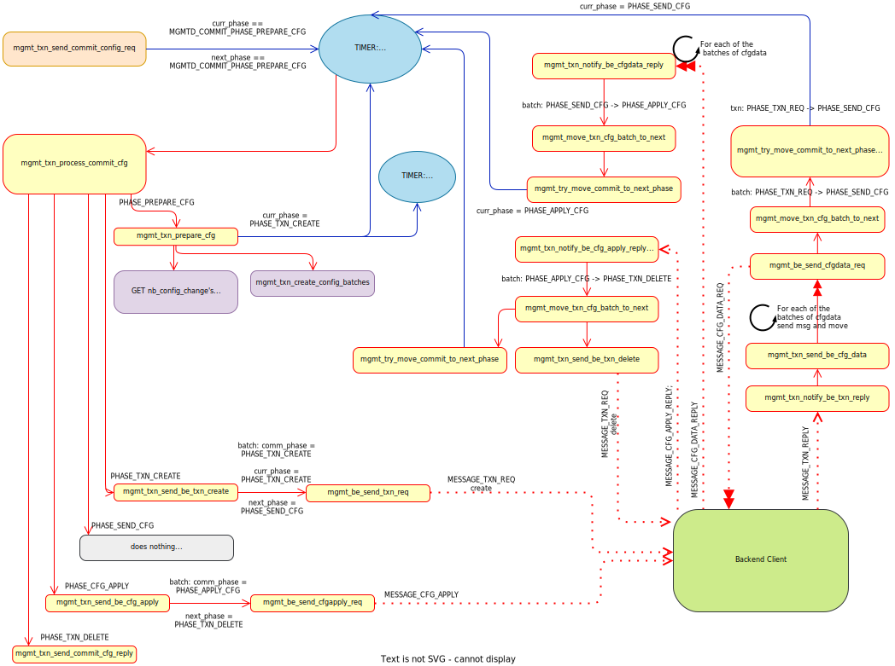

..
.. SPDX-License-Identifier: GPL-2.0-or-later
..
.. June 19 2023, Christian Hopps <chopps@labn.net>
..
.. Copyright (c) 2023, LabN Consulting, L.L.C.
..

.. _mgmtd_dev:

MGMTD Development
=================

Overview
^^^^^^^^

``mgmtd`` (Management Daemon) is a new centralized management daemon for FRR.

Previously, ``vtysh`` was the only centralized management service provided.
Internally ``vtysh`` connects to each daemon and sends CLI commands (both
configuration and operational state queries) over a socket connection. This
service only supports CLI which is no longer sufficient.

An important next step was made with the addition of YANG support. A YANG
infrastructure was added through a new development called *northbound*. This
*northbound* interface added the capability of daemons to be configured and
queried using YANG models. However, this interface was per daemon and not
centralized, which is not sufficient.

``mgmtd`` harnesses this new *northbound* interface to provide a centralized
interface for all daemons. It utilizes the daemons YANG models to interact with
each daemon. ``mgmtd`` currently provides the CLI interface for each daemon that
has been converted to it, but in the future RESTCONF and NETCONF servers can
easily be added as *front-ends* to mgmtd to support those protocols as well.

Converting A Daemon to MGMTD
^^^^^^^^^^^^^^^^^^^^^^^^^^^^

A daemon must first be transitioned to the new *northbound* interface if that
has not already been done (see `this northbound conversion documentation
<https://github.com/opensourcerouting/frr/wiki/Retrofitting-Configuration-Commands>`_
for how to do this). Once this is done a few simple steps are all that is
required move the daemon over to ``mgmtd`` control.

Overview of Changes
-------------------

Adding support for a *northbound* converted daemon involves very little work. It
requires enabling *frontend* (CLI and YANG) and *backend* (YANG) support.
``mgmtd`` was designed to keep this as simple as possible.

Front-End Interface:

1. Add YANG module file to ``mgmtd/subdir.am`` (e.g., ``yang/frr-staticd.c``)
2. Add YANG module description into array defined in ``mgmtd/mgmt_main.c``
3. Add CLI handler file[s] to ``mgmtd/subdir.am`` (e.g., ``staticd/static_vty.c``)
4. [if needed] Exclude (#ifndef) non-configuration CLI handlers from CLI source
   file (e.g., inside ``staticd/static_vty.c``)

Back-End Interface:

5. Add XPATHs mappings to a couple arrays to direct ``mgmtd`` at your daemon in
   ``mgmtd/mgmt_be_adapter.c``

Add YANG and CLI into MGMTD
---------------------------

As an example here is the addition made to ``mgmtd/subdir.am`` for adding
``staticd`` support.

.. code-block:: make

   if STATICD
   nodist_mgmtd_mgmtd_SOURCES += \
        yang/frr-staticd.yang.c \
        yang/frr-bfdd.yang.c \
        # end
   nodist_mgmtd_libmgmt_be_nb_la_SOURCES += staticd/static_vty.c
   endif

An here is the addition to the modules array in ``mgmtd/mgmt_main.c``:

.. code-block:: c

   static const struct frr_yang_module_info *const mgmt_yang_modules[] = {
           &frr_filter_info,
           ...
   #ifdef HAVE_STATICD
           &(struct frr_yang_module_info){.name = "frr-staticd",
				         .ignore_cbs = true},
   #endif
   }

CLI Handlers
------------

The daemon's CLI handlers for configuration (which having been converted to
*northbound* now simply generate YANG changes) will be linked directly into
``mgmtd``.

If the operational and debug CLI commands are kept in files separate from the
daemon's configuration CLI commands then no extra work is required. Otherwise some
CPP #ifndef's will be required.

Currently ``mgmtd`` supports configuration CLI but not operational
state so if both types of CLI handlers are present in a single file (e.g. a
``xxx_vty.c`` or ``xxx_cli.c`` file ) then #ifndef will be used to exclude these
non-configuration CLI handlers from ``mgmtd``. The same goes for *debug* CLI
handlers. For example:

.. code-block:: c

  DEFPY(daemon_one_config, daemon_one_config_cmd,
        "daemon one [optional-arg]"
        ...
  {
        ...
  }

  #ifndef INCLUDE_MGMTD_CMDDEFS_ONLY
  DEFPY(daemon_show_oepr, daemon_show_oepr_cmd,
        "show daemon oper [all]"
        ...
  {
        ...
  }
  #endif /* ifndef INCLUDE_MGMTD_CMDDEFS_ONLY */

  void daemon_vty_init(void)
  {
	install_element(CONFIG_NODE, &daemon_one_config_cmd);
        ...

  #ifndef INCLUDE_MGMTD_CMDDEFS_ONLY
          install_element(ENABLE_NODE, &daemon_show_oper_cmd);
  #endif /* ifndef INCLUDE_MGMTD_CMDDEFS_ONLY */

  }

Add Back-End XPATH mappings
---------------------------

In order for ``mgmtd`` to direct configuration to your daemon you need to add
some XPATH mappings to ``mgmtd/mgmt_be_adapter.c``. These XPATHs determine which
configuration changes get sent over the *back-end* interface to your daemon.

Below are the strings added for staticd support:

.. code-block:: c

   static const struct mgmt_be_xpath_map_init mgmt_xpath_map_init[] = {
       {
           .xpath_regexp = "/frr-vrf:lib/*",
           .subscr_info =
               {
   #if HAVE_STATICD
                   [MGMTD_BE_CLIENT_ID_STATICD] =
                       MGMT_SUBSCR_VALIDATE_CFG |
                       MGMT_SUBSCR_NOTIFY_CFG,
   #endif
               },
       },
       ...
       {
           .xpath_regexp =
               "/frr-routing:routing/control-plane-protocols/control-plane-protocol/frr-staticd:staticd/*",
           .subscr_info =
               {
   #if HAVE_STATICD
                   [MGMTD_BE_CLIENT_ID_STATICD] =
                       MGMT_SUBSCR_VALIDATE_CFG |
                       MGMT_SUBSCR_NOTIFY_CFG,
   #endif
               },
       },
   };

   #if HAVE_STATICD
   static struct mgmt_be_client_xpath staticd_xpaths[] = {
       {
           .xpath = "/frr-vrf:lib/*",
           .subscribed = MGMT_SUBSCR_VALIDATE_CFG | MGMT_SUBSCR_NOTIFY_CFG,
       },
       ...
       {
           .xpath =
               "/frr-routing:routing/control-plane-protocols/control-plane-protocol/frr-staticd:staticd/*",
           .subscribed = MGMT_SUBSCR_VALIDATE_CFG | MGMT_SUBSCR_NOTIFY_CFG,
       },
   };
   #endif

   static struct mgmt_be_client_xpath_map
       mgmt_client_xpaths[MGMTD_BE_CLIENT_ID_MAX] = {
   #ifdef HAVE_STATICD
           [MGMTD_BE_CLIENT_ID_STATICD] = {staticd_xpaths,
                           array_size(staticd_xpaths)},
   #endif
   };

MGMTD Internals
^^^^^^^^^^^^^^^

This section will describe the internal functioning of ``mgmtd``, for now a
couple diagrams are included to aide in source code perusal.

The client side of a CLI change

The server (mgmtd) side of a CLI change

