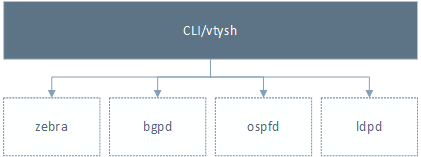
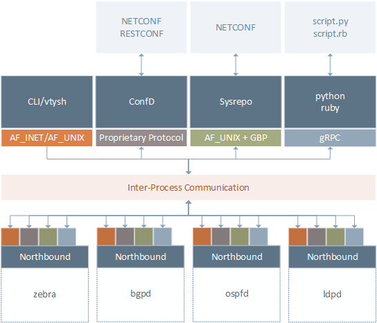
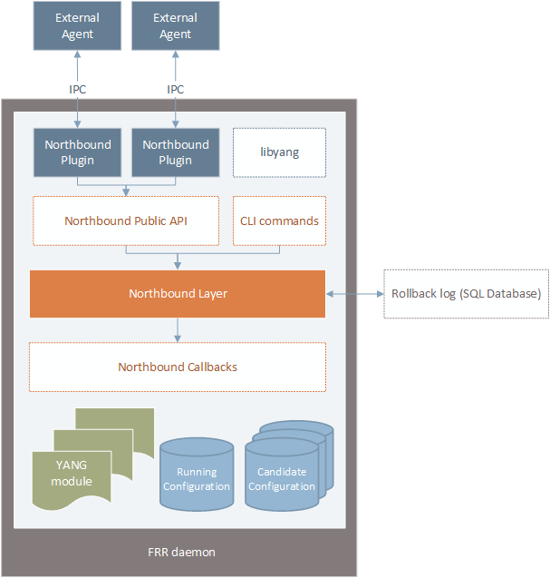
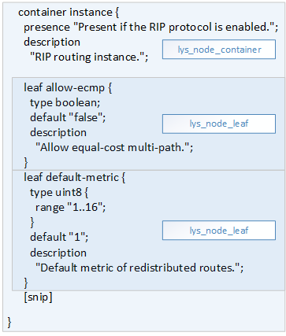
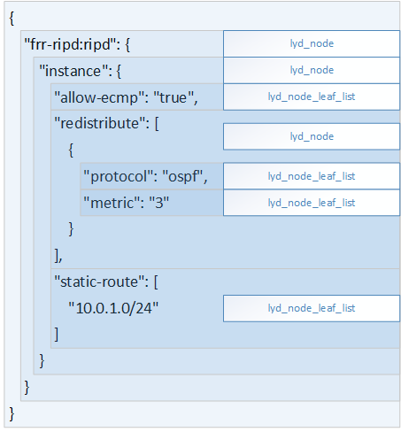
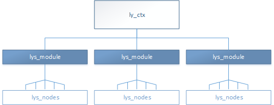
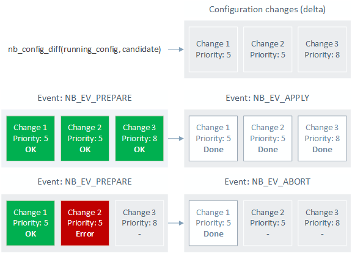

Introduction
------------

The goal of the new northbound API is to provide a better interface to
configure and monitor FRR programatically. The current design based on
CLI commands is no longer adequate in a world where computer networks
are becoming increasingly bigger, more diverse and more complex. Network
scripting using *expect* and screen scraping techniques is too primitive
and unreliable to be used in large-scale networks. What is proposed is
to modernize FRR to turn it into an API-first routing stack, and
reposition the CLI on top of this API. The most important change,
however, is not the API that will be provided to external users. In
fact, multiple APIs will be supported and users will have the ability to
write custom management APIs if necessary. The biggest change is the
introduction of a model-driven management architecture based on the
`YANG <https://tools.ietf.org/html/rfc7950>`__ modeling language.
Instead of writing code tied to any particular user interface
(e.g. DEFUNs), YANG allows us to write API-agnostic code (in the form of
callbacks) that can be used by any management interface. As an example,
it shouldn’t matter if a set of configuration changes is coming from a
`NETCONF <https://tools.ietf.org/html/rfc6241>`__ session or from a CLI
terminal, the same callbacks should be called to process the
configuration changes regardless of where they came from. This
model-driven design ensures feature parity across all management
interfaces supported by FRR.

Quoting :rfc:`7950`:

   YANG is a language originally designed to model data for the NETCONF
   protocol. A YANG module defines hierarchies of data that can be used for
   NETCONF-based operations, including configuration, state data, RPCs, and
   notifications. This allows a complete description of all data sent between a
   NETCONF client and server. Although out of scope for this specification,
   YANG can also be used with protocols other than NETCONF.

While the YANG and NETCONF specifications are tightly coupled with one
another, both are independent to a certain extent and are evolving
separately. Examples of other management protocols that use YANG include
`RESTCONF <https://tools.ietf.org/html/rfc8040>`__,
`gNMI <https://github.com/openconfig/reference/tree/master/rpc/gnmi>`__
and
`CoAP <https://www.ietf.org/archive/id/draft-vanderstok-core-comi-11.txt>`__.

In addition to being management-protocol independent, some other
advantages of using YANG in FRR are listed below: \* Have a formal
contract between FRR and application developers (management clients). A
management client that has access to the FRR YANG models knows about all
existing configuration options available for use. This information can
be used to auto-generate user-friendly interfaces like Web-UIs, custom
CLIs and even code bindings for several different programming languages.
Using `PyangBind <https://github.com/robshakir/pyangbind>`__, for
example, it’s possible to generate Python class hierarchies from YANG
models and use these classes to instantiate objects that mirror the
structure of the YANG modules and can be serialized/deserialized using
different encoding formats. \* Support different encoding formats for
instance data. Currently only JSON and XML are supported, but
`GPB <https://developers.google.com/protocol-buffers/>`__ and
`CBOR <http://cbor.io/>`__ are other viable options in the long term.
Additional encoding formats can be implemented in the *libyang* library
for optimal performance, or externally by translating data to/from one
of the supported formats (with a performance penalty). \* Have a formal
mechanism to introduce backward-incompatible changes based on `semantic
versioning <http://www.openconfig.net/docs/semver/>`__ (not part of the
YANG standard, which allows backward-compatible module updates only). \*
Provide seamless support to the industry-standard NETCONF/RESTCONF
protocols as alternative management APIs. If FRR configuration/state
data is modeled using YANG, supporting YANG-based protocols like NETCONF
and RESTCONF is much easier.

As important as shifting to a model-driven management paradigm, the new
northbound architecture also introduces the concept of configuration
transactions. Configuration transactions allow management clients to
commit multiple configuration changes at the same time and rest assured
that either all changes will be applied or none will (all-or-nothing).
Configuration transactions are implemented as pseudo-atomic operations
and facilitate automation by removing the burden of error recovery from
the management side. Another property of configuration transactions is
that the configuration changes are always processed in a pre-defined
order to ensure consistency. Configuration transactions that encompass
multiple network devices are called network-wide transactions and are
also supported by the new northbound architecture. When FRR is built
using the ``--enable-config-rollbacks`` option, all committed
transactions are recorded in the FRR rollback log, which can reside
either in memory (volatile) or on persistent storage.

   Network-wide Transactions is the most important leap in network
   management technology since SNMP. The error recovery and sequencing
   tasks are removed from the manager side. This is usually more than
   half the cost in a mature system; more than the entire cost of the
   managed devices.
   `[source] <https://www.nanog.org/sites/default/files/tuesday_tutorial_moberg_netconf_35.pdf>`__.

Figures 1 and 2 below illustrate the old and new northbound architecture
of FRR, respectively. As it can be seen, in the old architecture the CLI
was the only interface used to configure and monitor FRR (the SNMP
plugin was’t taken into account given the small number of implemented
MIBs). This means that the only way to automate FRR was by writing
scripts that send CLI commands and parse the text output (which usually
doesn’t have any structure) using screen scraping and regular
expressions.

   Old northbound architecture

The new northbound architectures, on the other hand, features a
multitude of different management APIs, all of them connected to the
northbound layer of the FRR daemons. By default, only the CLI interface
is compiled built-in in the FRR daemons. The other management interfaces
are provided as optional plugins and need to be loaded during the daemon
initialization (e.g. *zebra -M confd*). This design makes it possible to
integrate FRR with different NETCONF solutions without introducing
vendor lock-in. The [[Plugins - Writing Your Own]] page explains how to
write custom northbound plugins that can be tailored to all needs
(e.g. support custom transport protocols, different data encoding
formats, fine-grained access control, etc).

   New northbound architecture

Figure 3 shows the internal view of the FRR northbound architecture. In
this image we can see that northbound layer is an abstract entity
positioned between the northbound callbacks and the northbound clients.
The northbound layer is responsible to process the requests coming from
the northbound clients and call the appropriate callbacks to satisfy
these requests. The northbound plugins communicate with the northbound
layer through a public API, which allow users to write third-party
plugins that can be maintained separately. The northbound plugins, in
turn, have their own APIs to communicate with external management
clients.

   New northbound architecture - internal view

Initially the CLI (and all of its commands) will be maintained inside
the FRR daemons. In the long term, however, the goal is to move the CLI
to a separate program just like any other management client. The
[[Advanced Topics]] page describes the motivations and challenges of
doing that. Last but not least, the *libyang* block inside the
northbound layer is the engine that makes everything possible. The
*libyang* library will be described in more detail in the following
sections.

YANG models
-----------

The main decision to be made when using YANG is which models to
implement. There’s a general consensus that using standard models is
preferable over using custom (native) models. The reasoning is that
applications based on standard models can be reused for all network
appliances that support those models, whereas the same doesn’t apply for
applications written based on custom models.

That said, there are multiple standards bodies publishing YANG models
and unfortunately not all of them are converging (or at least not yet).
In the context of FRR, which is a routing stack, the two sets of YANG
models that would make sense to implement are the ones from IETF and
from the OpenConfig working group. The question that arises is: which
one of them should we commit to? Or should we try to support both
somehow, at the cost of extra development efforts?

Another problem, from an implementation point of view, is that it’s
challenging to adapt the existing code base to match standard models. A
more reasonable solution, at least in a first moment, would be to use
YANG deviations and augmentations to do the opposite: adapt the standard
models to the existing code. In practice however this is not as simple
as it seems. There are cases where the differences are too substantial
to be worked around without restructuring the code by changing its data
structures and their relationships. As an example, the *ietf-rip* model
places per-interface RIP configuration parameters inside the
*control-plane-protocol* list (which is augmented by *ietf-rip*). This
means that it’s impossible to configure RIP interface parameters without
first configuring a RIP routing instance. The *ripd* daemon on the other
hand allows the operator to configure RIP interface parameters even if
``router rip`` is not configured. If we were to implement the *ietf-rip*
module natively, we’d need to change ripd’s CLI commands (and the
associated code) to reflect the new configuration hierarchy.

Taking into account that FRR has a huge code base and that the
northbound retrofitting process per-se will cause a lot of impact, it
was decided to take a conservative approach and write custom YANG models
for FRR modeled after the existing CLI commands. Having YANG models that
closely mirror the CLI commands will allow the FRR developers to
retrofit the code base much more easily, without introducing
backward-incompatible changes in the CLI and reducing the likelihood of
introducing bugs. The [[Retrofitting Configuration Commands]] page
explains in detail how to convert configuration commands to the new
northbound model.

Even though having native YANG models is not the ideal solution, it will
be already a big step forward for FRR to migrate to a model-driven
management architecture, with support for configuration transactions and
multiple management interfaces, including NETCONF and RESTCONF (through
the northbound plugins).

The new northbound also features an experimental YANG module translator
that will allow users to translate to and from standard YANG models by
using translation tables. The [[YANG module translator]] page describes
this mechanism in more detail. At this point it’s unclear what can be
achieved through module translation and if that can be considered as a
definitive solution to support standard models or not.

Northbound Architecture
-----------------------

   ``libyang's`` lys_node data structure

   ``libyang's`` lyd_node data structure

   ``libyang's`` ly_ctx data structure

   Configuration transactions

Testing
-------

The new northbound adds the libyang library as a new mandatory
dependency for FRR. To obtain and install this library, follow the steps
below:

.. code-block:: console

   git clone https://github.com/CESNET/libyang
   cd libyang
   git checkout devel
   mkdir build ; cd build
   cmake -DENABLE_LYD_PRIV=ON ..
   make
   sudo make install

.. note::

   first make sure to install the libyang
   `requirements <https://github.com/CESNET/libyang#build-requirements>`__.

FRR needs libyang from version 0.16.7 or newer, which is maintained in
the ``devel`` branch. libyang 0.15.x is maintained in the ``master``
branch and doesn’t contain one small feature used by FRR (the
``LY_CTX_DISABLE_SEARCHDIR_CWD`` flag). FRR also makes use of the
libyang’s ``ENABLE_LYD_PRIV`` feature, which is disabled by default and
needs to be enabled at compile time.

It’s advisable (but not required) to install sqlite3 and build FRR with
``--enable-config-rollbacks`` in order to have access to the
configuration rollback feature.

To test the northbound, the suggested method is to use the
[[Transactional CLI]] with the *ripd* daemon and play with the new
commands. The ``debug northbound`` command can be used to see which
northbound callbacks are called in response to the ``commit`` command.
For reference, the [[Demos]] page shows a small demonstration of the
transactional CLI in action and what it’s capable of.
