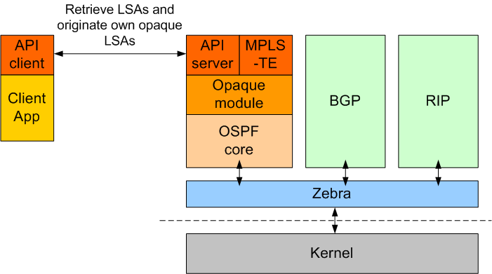
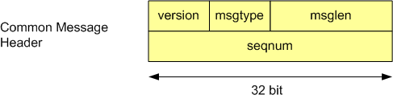
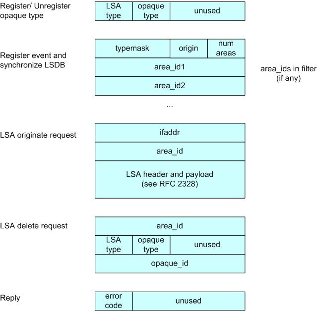
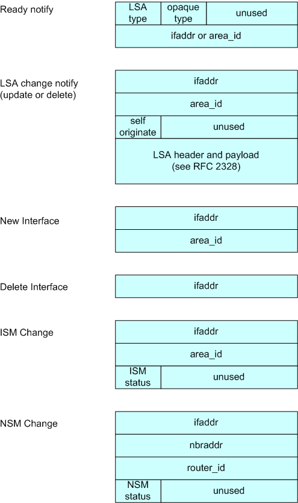

OSPF API Documentation
======================

Disclaimer
----------

The OSPF daemon contains an API for application access to the LSA
database. This API was created by Ralph Keller, originally as patch for
Zebra. Unfortunately, the page containing documentation of the API is no
longer online. This page is an attempt to recreate documentation for the
API (with lots of help of the WayBackMachine)

Introduction
------------

This page describes an API that allows external applications to access
the link-state database (LSDB) of the OSPF daemon. The implementation is
based on the OSPF code from FRRouting (forked from Quagga and formerly
Zebra) routing protocol suite and is subject to the GNU General Public
License. The OSPF API provides you with the following functionality:

-  Retrieval of the full or partial link-state database of the OSPF
   daemon. This allows applications to obtain an exact copy of the LSDB
   including router LSAs, network LSAs and so on. Whenever a new LSA
   arrives at the OSPF daemon, the API module immediately informs the
   application by sending a message. This way, the application is always
   synchronized with the LSDB of the OSPF daemon.
-  Origination of own opaque LSAs (of type 9, 10, or 11) which are then
   distributed transparently to other routers within the flooding scope
   and received by other applications through the OSPF API.

Opaque LSAs, which are described in RFC 2370 , allow you to distribute
application-specific information within a network using the OSPF
protocol. The information contained in opaque LSAs is transparent for
the routing process but it can be processed by other modules such as
traffic engineering (e.g., MPLS-TE).

Architecture
------------

The following picture depicts the architecture of the Quagga/Zebra
protocol suite. The OSPF daemon is extended with opaque LSA capabilities
and an API for external applications. The OSPF core module executes the
OSPF protocol by discovering neighbors and exchanging neighbor state.
The opaque module, implemented by Masahiko Endo, provides functions to
exchange opaque LSAs between routers. Opaque LSAs can be generated by
several modules such as the MPLS-TE module or the API server module.
These modules then invoke the opaque module to flood their data to
neighbors within the flooding scope.

The client, which is an application potentially running on a different
node than the OSPF daemon, links against the OSPF API client library.
This client library establishes a socket connection with the API server
module of the OSPF daemon and uses this connection to retrieve LSAs and
originate opaque LSAs.

   image

The OSPF API server module works like any other internal opaque module
(such as the MPLS-TE module), but listens to connections from external
applications that want to communicate with the OSPF daemon. The API
server module can handle multiple clients concurrently.

One of the main objectives of the implementation is to make as little
changes to the existing Zebra code as possible.

Installation & Configuration
----------------------------

Download FRRouting and unpack

Configure your frr version (note that --enable-opaque-lsa also enables
the ospfapi server and ospfclient).

::

    % sh ./configure --enable-opaque-lsa
    % make

This should also compile the client library and sample application in
ospfclient.

Make sure that you have enabled opaque LSAs in your configuration. Add
the ospf opaque-lsa statement to your ospfd.conf:

::

    ! -*- ospf -*-
    !
    ! OSPFd sample configuration file
    !
    !
    hostname xxxxx
    password xxxxx

    router ospf
      router-id 10.0.0.1
      network 10.0.0.1/24 area 1
      neighbor 10.0.0.2
      network 10.0.1.2/24 area 1
      neighbor 10.0.1.1
      ospf opaque-lsa      <============ add this statement!

Usage
-----

In the following we describe how you can use the sample application to
originate opaque LSAs. The sample application first registers with the
OSPF daemon the opaque type it wants to inject and then waits until the
OSPF daemon is ready to accept opaque LSAs of that type. Then the client
application originates an opaque LSA, waits 10 seconds and then updates
the opaque LSA with new opaque data. After another 20 seconds, the
client application deletes the opaque LSA from the LSDB. If the clients
terminates unexpectedly, the OSPF API module will remove all the opaque
LSAs that the application registered. Since the opaque LSAs are flooded
to other routers, we will see the opaque LSAs in all routers according
to the flooding scope of the opaque LSA.

We have a very simple demo setup, just two routers connected with an ATM
point-to-point link. Start the modified OSPF daemons on two adjacent
routers. First run on msr2:

::

        > msr2:/home/keller/ospfapi/zebra/ospfd# ./ospfd -f /usr/local/etc/ospfd.conf

And on the neighboring router msr3:

::

        > msr3:/home/keller/ospfapi/zebra/ospfd# ./ospfd -f /usr/local/etc/ospfd.conf

Now the two routers form adjacency and start exchanging their databases.
Looking at the OSPF daemon of msr2 (or msr3), you see this:

::

        ospfd> show ip ospf database

               OSPF Router with ID (10.0.0.1)

                        Router Link States (Area 0.0.0.1)

        Link ID         ADV Router      Age  Seq#       CkSum  Link count
        10.0.0.1        10.0.0.1          55 0x80000003 0xc62f 2
        10.0.0.2        10.0.0.2          55 0x80000003 0xe3e4 3

                        Net Link States (Area 0.0.0.1)

        Link ID         ADV Router      Age  Seq#       CkSum
        10.0.0.2        10.0.0.2          60 0x80000001 0x5fcb

Now we start the sample main application that originates an opaque LSA.

::

        > cd ospfapi/apiclient
        > ./main msr2 10 250 20 0.0.0.0 0.0.0.1

This originates an opaque LSA of type 10 (area local), with opaque type
250 (experimental), opaque id of 20 (chosen arbitrarily), interface
address 0.0.0.0 (which is used only for opaque LSAs type 9), and area
0.0.0.1

Again looking at the OSPF database you see:

::

        ospfd> show ip ospf database

               OSPF Router with ID (10.0.0.1)

                        Router Link States (Area 0.0.0.1)

        Link ID         ADV Router      Age  Seq#       CkSum  Link count
        10.0.0.1        10.0.0.1         437 0x80000003 0xc62f 2
        10.0.0.2        10.0.0.2         437 0x80000003 0xe3e4 3

                        Net Link States (Area 0.0.0.1)

        Link ID         ADV Router      Age  Seq#       CkSum
        10.0.0.2        10.0.0.2         442 0x80000001 0x5fcb

                        Area-Local Opaque-LSA (Area 0.0.0.1)

        Opaque-Type/Id  ADV Router      Age  Seq#       CkSum
        250.0.0.20      10.0.0.1           0 0x80000001 0x58a6  <=== opaque LSA

You can take a closer look at this opaque LSA:

::

           ospfd> show ip ospf database opaque-area

           OSPF Router with ID (10.0.0.1)

           Area-Local Opaque-LSA (Area 0.0.0.1)

           LS age: 4
           Options: 66
           LS Type: Area-Local Opaque-LSA
           Link State ID: 250.0.0.20 (Area-Local Opaque-Type/ID)
           Advertising Router: 10.0.0.1
           LS Seq Number: 80000001
           Checksum: 0x58a6
           Length: 24
           Opaque-Type 250 (Private/Experimental)
           Opaque-ID 0x14
           Opaque-Info: 4 octets of data
           Added using OSPF API: 4 octets of opaque data
           Opaque data: 1 0 0 0 <==== counter is 1

Note that the main application updates the opaque LSA after 10 seconds,
then it looks as follows:

::

        ospfd> show ip ospf database opaque-area

               OSPF Router with ID (10.0.0.1)

                        Area-Local Opaque-LSA (Area 0.0.0.1)

          LS age: 1
          Options: 66
          LS Type: Area-Local Opaque-LSA
          Link State ID: 250.0.0.20 (Area-Local Opaque-Type/ID)
          Advertising Router: 10.0.0.1
          LS Seq Number: 80000002
          Checksum: 0x59a3
          Length: 24
          Opaque-Type 250 (Private/Experimental)
          Opaque-ID   0x14
          Opaque-Info: 4 octets of data
          Added using OSPF API: 4 octets of opaque data
          Opaque data: 2 0 0 0  <==== counter is now 2

Note that the payload of the opaque LSA has changed as you can see
above.

Then, again after another 20 seconds, the opaque LSA is flushed from the
LSDB.

Important note:
^^^^^^^^^^^^^^^

In order to originate an opaque LSA, there must be at least one active
opaque-capable neighbor. Thus, you cannot originate opaque LSAs of no
neighbors are present. If you try to originate even so no neighbor is
ready, you will receive a not ready error message. The reason for this
restriction is that it might be possible that some routers have an
identical opaque LSA from a previous origination in their LSDB that
unfortunately could not be flushed due to a crash, and now if the router
comes up again and starts originating a new opaque LSA, the new opaque
LSA is considered older since it has a lower sequence number and is
ignored by other routers (that consider the stalled opaque LSA as more
recent). However, if the originating router first synchronizes the
database before originating opaque LSAs, it will detect the older opaque
LSA and can flush it first.

Protocol and Message Formats
----------------------------

If you are developing your own client application and you don't want to
make use of the client library (due to the GNU license restriction or
whatever reason), you can implement your own client-side message
handling. The OSPF API uses two connections between the client and the
OSPF API server: One connection is used for a synchronous request /reply
protocol and another connection is used for asynchronous notifications
(e.g., LSA update, neighbor status change).

Each message begins with the following header:

   image

The message type field can take one of the following values:

+-------------------------------+---------+
| Messages to OSPF deamon       | Value   |
+===============================+=========+
| MSG\_REGISTER\_OPAQUETYPE     | 1       |
+-------------------------------+---------+
| MSG\_UNREGISTER\_OPAQUETYPE   | 2       |
+-------------------------------+---------+
| MSG\_REGISTER\_EVENT          | 3       |
+-------------------------------+---------+
| MSG\_SYNC\_LSDB               | 4       |
+-------------------------------+---------+
| MSG\_ORIGINATE\_REQUEST       | 5       |
+-------------------------------+---------+
| MSG\_DELETE\_REQUEST          | 6       |
+-------------------------------+---------+

+-----------------------------+---------+
| Messages from OSPF deamon   | Value   |
+=============================+=========+
| MSG\_REPLY                  | 10      |
+-----------------------------+---------+
| MSG\_READY\_NOTIFY          | 11      |
+-----------------------------+---------+
| MSG\_LSA\_UPDATE\_NOTIFY    | 12      |
+-----------------------------+---------+
| MSG\_LSA\_DELETE\_NOTIFY    | 13      |
+-----------------------------+---------+
| MSG\_NEW\_IF                | 14      |
+-----------------------------+---------+
| MSG\_DEL\_IF                | 15      |
+-----------------------------+---------+
| MSG\_ISM\_CHANGE            | 16      |
+-----------------------------+---------+
| MSG\_NSM\_CHANGE            | 17      |
+-----------------------------+---------+

The synchronous requests and replies have the following message formats:

   image

The origin field allows to select according to the following types of
origins:

+-------------------------+---------+
| Origin                  | Value   |
+=========================+=========+
| NON\_SELF\_ORIGINATED   | 0       |
+-------------------------+---------+
| SELF\_ORIGINATED        | 1       |
+-------------------------+---------+
| ANY\_ORIGIN             | 2       |
+-------------------------+---------+

The reply message has on of the following error codes:

+--------------------------+---------+
| Error code               | Value   |
+==========================+=========+
| API\_OK                  | 0       |
+--------------------------+---------+
| API\_NOSUCHINTERFACE     | -1      |
+--------------------------+---------+
| API\_NOSUCHAREA          | -2      |
+--------------------------+---------+
| API\_NOSUCHLSA           | -3      |
+--------------------------+---------+
| API\_ILLEGALSATYPE       | -4      |
+--------------------------+---------+
| API\_ILLEGALOPAQUETYPE   | -5      |
+--------------------------+---------+
| API\_OPAQUETYPEINUSE     | -6      |
+--------------------------+---------+
| API\_NOMEMORY            | -7      |
+--------------------------+---------+
| API\_ERROR               | -99     |
+--------------------------+---------+
| API\_UNDEF               | -100    |
+--------------------------+---------+

The asynchronous notifications have the following message formats:

   image

Original Acknowledgments from Ralph Keller
------------------------------------------

I would like to thank Masahiko Endo, the author of the opaque LSA
extension module, for his great support. His wonderful ASCII graphs
explaining the internal workings of this code, and his invaluable input
proved to be crucial in designing a useful API for accessing the link
state database of the OSPF daemon. Once, he even decided to take the
plane from Tokyo to Zurich so that we could actually meet and have
face-to-face discussions, which was a lot of fun. Clearly, without
Masahiko no API would ever be completed. I also would like to thank
Daniel Bauer who wrote an opaque LSA implementation too and was willing
to test the OSPF API code in one of his projects.
