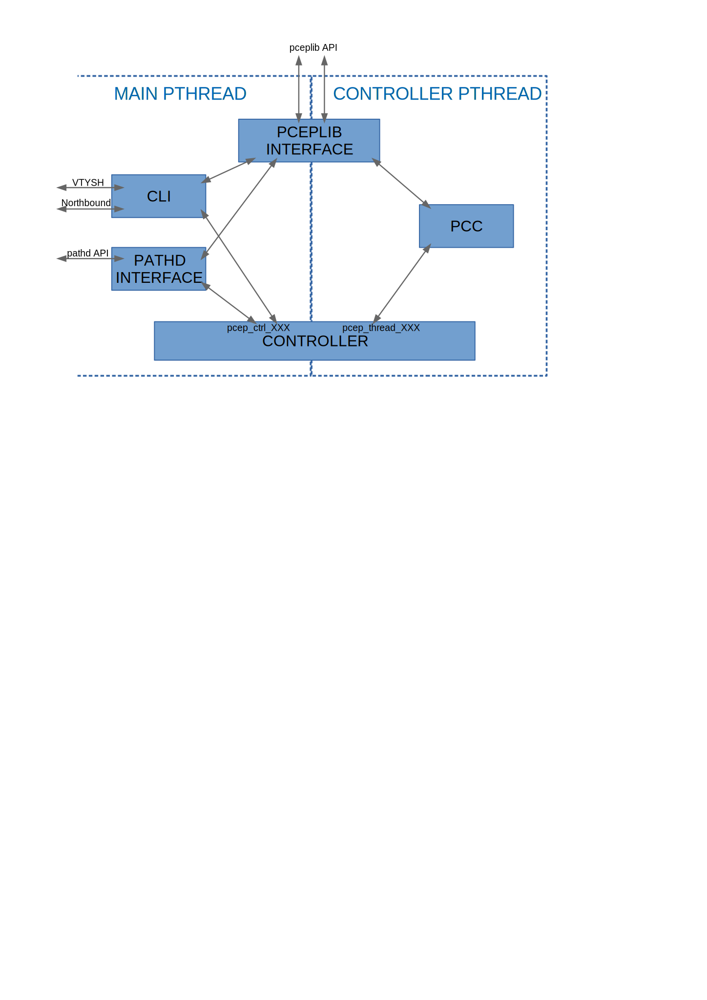

PCEP Module Internals
=====================

Introduction
------------

The PCEP module for the pathd daemon implements the PCEP protocol described in
:rfc:`5440` to update the policies and candidate paths.

The protocol encoding/decoding and the basic session management is handled by
the `pceplib external library 1.2 <https://github.com/volta-networks/pceplib/tree/devel-1.2>`_.

Together with pceplib, this module supports at least partially:

  - :rfc:`5440`

        Most of the protocol defined in the RFC is implemented.
        All the messages can be parsed, but this was only tested in the context
        of segment routing. Only a very small subset of metric types can be
        configured, and there is a known issue with some Cisco routers not
        following the IANA numbers for metrics.

  - :rfc:`8231`

        Support delegation of candidate path after performing the initial
        computation request. If the PCE does not respond or cannot compute
        a path, an empty candidate path is delegated to the PCE.
        Only tested in the context of segment routing.

  - :rfc:`8408`

        Only used to comunicate the support for segment routing to the PCE.

  - :rfc:`8664`

        All the NAI types are implemented, but only the MPLS NAI are supported.
        If the PCE provide segments that are not MPLS labels, the PCC will
        return an error.

Note that pceplib supports more RFCs and drafts, see pceplib
`README <https://github.com/volta-networks/pceplib/blob/master/README.md>`_
for more details.

Architecture
------------

Overview
........

The module is separated into multiple layers:

 - pathd interface
 - command-line console
 - controller
 - PCC
 - pceplib interface

The pathd interface handles all the interactions with the daemon API.

The command-line console handles all the VTYSH configuration commands.

The controller manages the multiple PCC connections and the interaction between
them and the daemon interface.

The PCC handles a single connection to a PCE through a pceplib session.

The pceplib interface abstracts the API of the pceplib.

Threading Model
---------------

The module requires multiple threads to cooperate:

 - The main thread used by the pathd daemon.
 - The controller pthread used to isolate the PCC from the main thread.
 - The possible threads started in the pceplib library.

To ensure thread safety, all the controller and PCC state data structures can
only be read and modified in the controller thread, and all the global data
structures can only be read and modified in the main thread. Most of the
interactions between these threads are done through FRR timers and events.

The controller is the bridge between the two threads, all the functions that
**MUST** be called from the main thread start with the prefix `pcep_ctrl_` and
all the functions that **MUST** be called from the controller thread start
with the prefix `pcep_thread_`. When an asynchronous action must be taken in
a different thread, an FRR event is sent to the thread. If some synchronous
operation is needed, the calling thread will block and run a callback in the
other thread, there the result is **COPIED** and returned to the calling thread.

No function other than the controller functions defined for it should be called
from the main thread. The only exception being some utility functions from
`path_pcep_lib.[hc]`.

All the calls to pathd API functions **MUST** be performed in the main thread,
for that, the controller sends FRR events handled in function
`path_pcep.c:pcep_main_event_handler`.

For the same reason, the console client only runs in the main thread. It can
freely use the global variable, but **MUST** use controller's `pcep_ctrl_`
functions to interact with the PCCs.

Source Code
-----------

Generic Data Structures
.......................

The data structures are defined in multiple places, and where they are defined
dictates where they can be used.

The data structures defined in `path_pcep.h` can be used anywhere in the module.

Internally, throughout the module, the `struct path` data structure is used
to describe PCEP messages. It is a simplified flattened structure that can
represent multiple complex PCEP message types. The conversion from this
structure to the PCEP data structures used by pceplib is done in the pceplib
interface layer.

The data structures defined in `path_pcep_controller.h` should only be used
in `path_pcep_controller.c`. Even if a structure pointer is passed as a parameter
to functions defined in `path_pcep_pcc.h`, these should consider it as an opaque
data structure only used to call back controller functions.

The same applies to the structures defined in `path_pcep_pcc.h`, even if the
controller owns a reference to this data structure, it should never read or
modify it directly, it should be considered an opaque structure.

The global data structure can be accessed from the pathd interface layer
`path_pcep.c` and the command line client code `path_pcep_cli.c`.

Interface With Pathd
....................

All the functions calling or called by the pathd daemon are implemented in
`path_pcep.c`. These functions **MUST** run in the main FRR thread, and
all the interactions with the controller and the PCCs **MUST** pass through
the controller's `pcep_ctrl_` prefixed functions.

To handle asynchronous events from the PCCs, a callback is passed to
`pcep_ctrl_initialize` that is called in the FRR main thread context.

Command Line Client
...................

All the command line configuration commands (VTYSH) are implemented in
`path_pcep_cli.c`. All the functions there run in the main FRR thread and
can freely access the global variables. All the interaction with the
controller's and the PCCs **MUST** pass through the controller `pcep_ctrl_`
prefixed functions.

Debugging Helpers
.................

All the functions formating data structures for debugging and logging purposes
are implemented in `path_pcep_debug.[hc]`.

Interface with pceplib
......................

All the functions calling the pceplib external library are defined in
`path_pcep_lib.[hc]`. Some functions are called from the main FRR thread, like
`pcep_lib_initialize`, `pcep_lib_finalize`; some can be called from either
thread, like `pcep_lib_free_counters`; some function must be called from the
controller thread, like `pcep_lib_connect`. This will probably be formalized
later on with function prefix like done in the controller.

Controller
..........

The controller is defined and implemented in `path_pcep_controller.[hc]`.
Part of the controller code runs in FRR main thread and part runs in its own
FRR pthread started to isolate the main thread from the PCCs' event loop.
To communicate between the threads it uses FRR events, timers and
`event_execute` calls.

PCC
...

Each PCC instance owns its state and runs in the controller thread. They are
defined and implemented in `path_pcep_pcc.[hc]`. All the interactions with
the daemon must pass through some controller's `pcep_thread_` prefixed function.
