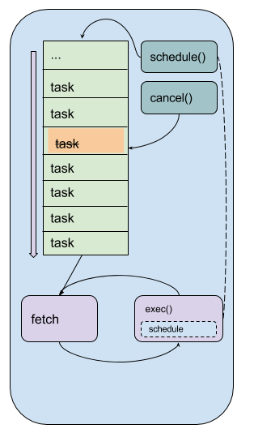
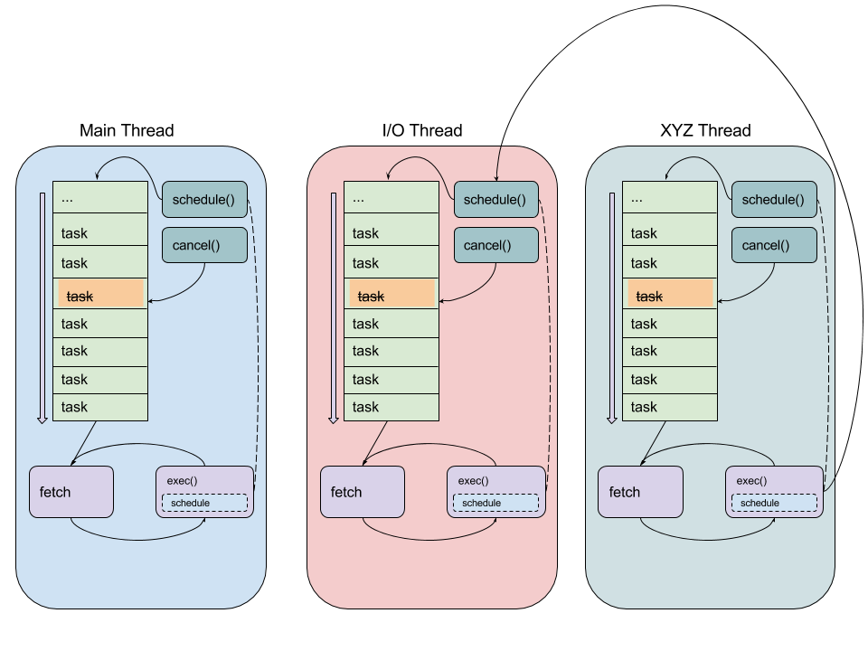

.. _process-architecture:

Process Architecture
====================

FRR inherited its overall design architecture from Quagga. The chosen model for
Quagga is that of a suite of independent daemons that do IPC via Unix domain
sockets. Within each daemon, the architecture follows the event-driven model.
FRR has inherited this model as well. As FRR is deployed at larger scales and
gains ever more features, each adding to the overall processing workload, we
are approaching the saturation point for a single thread per daemon. In light
of this, there are ongoing efforts to introduce multithreading to various
components of FRR. This document aims to describe the current design choices
and overall model for integrating the event-driven and multithreaded
architectures into a cohesive whole.

Terminology
-----------
Because this document describes the architecture for true kernel threads as
well as the event system, a digression on terminology is in order here.

Historically Quagga's event system was viewed as an implementation of userspace
threading. Because of this design choice, the names for various datastructures
within the event system are variations on the term "thread". The primary
context datastructure in this system is called a "threadmaster". What would
today be called an 'event' or 'task' in systems such as libevent are called
"threads" and the datastructure for them is ``struct thread``. To add to the
confusion, these "threads" have various types, one of which is "event". To
hopefully avoid some of this confusion, this document refers to these "threads"
as a 'task' except where the datastructures are explicitly named. When they are
explicitly named, they will be formatted ``like this`` to differentiate from
the conceptual names. When speaking of kernel threads, the term used will be
"pthread" since FRR's kernel threading implementation is POSIX threads.

.. This should be broken into its document under :ref:`libfrr`
.. _event-architecture:

Event Architecture
------------------
This section presents a brief overview of the event model as currently
implemented in FRR. This doc should be expanded and broken off into its own
section. For now it provides basic information necessary to understand the
interplay between the event system and kernel threads.

The core event system is implemented in :file:`lib/thread.[ch]`. The primary
structure is ``struct thread_master``, hereafter referred to as a
``threadmaster``. A ``threadmaster`` is a global state object, or context, that
holds all the tasks currently pending execution as well as statistics on tasks
that have already executed. The event system is driven by adding tasks to this
data structure and then calling a function to retrieve the next task to
execute. At initialization, a daemon will typically create one
``threadmaster``, add a small set of initial tasks, and then run a loop to
fetch each task and execute it.

These tasks have various types corresponding to their general action. The types
are given by integer macros in :file:`thread.h` and are:

``THREAD_READ``
   Task which waits for a file descriptor to become ready for reading and then
   executes.

``THREAD_WRITE``
   Task which waits for a file descriptor to become ready for writing and then
   executes.

``THREAD_TIMER``
   Task which executes after a certain amount of time has passed since it was
   scheduled.

``THREAD_EVENT``
   Generic task that executes with high priority and carries an arbitrary
   integer indicating the event type to its handler. These are commonly used to
   implement the finite state machines typically found in routing protocols.

``THREAD_READY``
   Type used internally for tasks on the ready queue.

``THREAD_UNUSED``
   Type used internally for ``struct thread`` objects that aren't being used.
   The event system pools ``struct thread`` to avoid heap allocations; this is
   the type they have when they're in the pool.

``THREAD_EXECUTE``
   Just before a task is run its type is changed to this. This is used to show
   ``X`` as the type in the output of :clicmd:`show thread cpu`.

The programmer never has to work with these types explicitly. Each type of task
is created and queued via special-purpose functions (actually macros, but
irrelevant for the time being) for the specific type. For example, to add a
``THREAD_READ`` task, you would call

::

   thread_add_read(struct thread_master *master, int (*handler)(struct thread *), void *arg, int fd, struct thread **ref);

The ``struct thread`` is then created and added to the appropriate internal
datastructure within the ``threadmaster``.

The Event Loop
^^^^^^^^^^^^^^
To use the event system, after creating a ``threadmaster`` the program adds an
initial set of tasks. As these tasks execute, they add more tasks that execute
at some point in the future. This sequence of tasks drives the lifecycle of the
program. When no more tasks are available, the program dies. Typically at
startup the first task added is an I/O task for VTYSH as well as any network
sockets needed for peerings or IPC.

To retrieve the next task to run the program calls ``thread_fetch()``.
``thread_fetch()`` internally computes which task to execute next based on
rudimentary priority logic. Events (type ``THREAD_EVENT``) execute with the
highest priority, followed by expired timers and finally I/O tasks (type
``THREAD_READ`` and ``THREAD_WRITE``). When scheduling a task a function and an
arbitrary argument are provided. The task returned from ``thread_fetch()`` is
then executed with ``thread_call()``.

The following diagram illustrates a simplified version of this infrastructure.

.. todo: replace these with SVG

   
   Lifecycle of a program using a single threadmaster.

The series of "task" boxes represents the current ready task queue. The various
other queues for other types are not shown. The fetch-execute loop is
illustrated at the bottom.

Mapping the general names used in the figure to specific FRR functions:

- ``task`` is ``struct thread *``
- ``fetch`` is ``thread_fetch()``
- ``exec()`` is ``thread_call``
- ``cancel()`` is ``thread_cancel()``
- ``schedule()`` is any of the various task-specific ``thread_add_*`` functions

Adding tasks is done with various task-specific function-like macros. These
macros wrap underlying functions in :file:`thread.c` to provide additional
information added at compile time, such as the line number the task was
scheduled from, that can be accessed at runtime for debugging, logging and
informational purposes. Each task type has its own specific scheduling function
that follow the naming convention ``thread_add_<type>``; see :file:`thread.h`
for details.

There are some gotchas to keep in mind:

- I/O tasks are keyed off the file descriptor associated with the I/O
  operation. This means that for any given file descriptor, only one of each
  type of I/O task (``THREAD_READ`` and ``THREAD_WRITE``) can be scheduled. For
  example, scheduling two write tasks one after the other will overwrite the
  first task with the second, resulting in total loss of the first task and
  difficult bugs.

- Timer tasks are only as accurate as the monotonic clock provided by the
  underlying operating system.

- Memory management of the arbitrary handler argument passed in the schedule
  call is the responsibility of the caller.

Kernel Thread Architecture
--------------------------
Efforts have begun to introduce kernel threads into FRR to improve performance
and stability. Naturally a kernel thread architecture has long been seen as
orthogonal to an event-driven architecture, and the two do have significant
overlap in terms of design choices. Since the event model is tightly integrated
into FRR, careful thought has been put into how pthreads are introduced, what
role they fill, and how they will interoperate with the event model.

Design Overview
^^^^^^^^^^^^^^^
Each kernel thread behaves as a lightweight process within FRR, sharing the
same process memory space. On the other hand, the event system is designed to
run in a single process and drive serial execution of a set of tasks. With this
consideration, a natural choice is to implement the event system within each
kernel thread. This allows us to leverage the event-driven execution model with
the currently existing task and context primitives. In this way the familiar
execution model of FRR gains the ability to execute tasks simultaneously while
preserving the existing model for concurrency.

The following figure illustrates the architecture with multiple pthreads, each
running their own ``threadmaster``-based event loop.

.. todo: replace these with SVG

   
   Lifecycle of a program using multiple pthreads, each running their own
   ``threadmaster``

Each roundrect represents a single pthread running the same event loop
described under :ref:`event-architecture`. Note the arrow from the ``exec()``
box on the right to the ``schedule()`` box in the middle pthread. This
illustrates code running in one pthread scheduling a task onto another
pthread's threadmaster. A global lock for each ``threadmaster`` is used to
synchronize these operations. The pthread names are examples.

.. This should be broken into its document under :ref:`libfrr`
.. _kernel-thread-wrapper:

Kernel Thread Wrapper
^^^^^^^^^^^^^^^^^^^^^
The basis for the integration of pthreads and the event system is a lightweight
wrapper for both systems implemented in :file:`lib/frr_pthread.[ch]`. The
header provides a core datastructure, ``struct frr_pthread``, that encapsulates
structures from both POSIX threads and :file:`thread.[ch]`. In particular, this
datastructure has a pointer to a ``threadmaster`` that runs within the pthread.
It also has fields for a name as well as start and stop functions that have
signatures similar to the POSIX arguments for ``pthread_create()``.

Calling ``frr_pthread_new()`` creates and registers a new ``frr_pthread``. The
returned structure has a pre-initialized ``threadmaster``, and its ``start``
and ``stop`` functions are initialized to defaults that will run a basic event
loop with the given threadmaster. Calling ``frr_pthread_run`` starts the thread
with the ``start`` function. From there, the model is the same as the regular
event model. To schedule tasks on a particular pthread, simply use the regular
:file:`thread.c` functions as usual and provide the ``threadmaster`` pointed to
from the ``frr_pthread``. As part of implementing the wrapper, the
:file:`thread.c` functions were made thread-safe. Consequently, it is safe to
schedule events on a ``threadmaster`` belonging both to the calling thread as
well as *any other pthread*. This serves as the basis for inter-thread
communication and boils down to a slightly more complicated method of message
passing, where the messages are the regular task events as used in the
event-driven model. The only difference is thread cancellation, which requires
calling ``thread_cancel_async()`` instead of ``thread_cancel`` to cancel a task
currently scheduled on a ``threadmaster`` belonging to a different pthread.
This is necessary to avoid race conditions in the specific case where one
pthread wants to guarantee that a task on another pthread is cancelled before
proceeding.

In addition, the existing commands to show statistics and other information for
tasks within the event driven model have been expanded to handle multiple
pthreads; running :clicmd:`show thread cpu` will display the usual event
breakdown, but it will do so for each pthread running in the program. For
example, :ref:`bgpd` runs a dedicated I/O pthread and shows the following
output for :clicmd:`show thread cpu`:

::

   frr# show thread cpu

   Thread statistics for bgpd:

   Showing statistics for pthread main
   ------------------------------------
                         CPU (user+system): Real (wall-clock):
   Active   Runtime(ms)   Invoked Avg uSec Max uSecs Avg uSec Max uSecs  Type  Thread
       0       1389.000        10   138900    248000   135549    255349   T   subgroup_coalesce_timer
       0          0.000         1        0         0       18        18   T   bgp_startup_timer_expire
       0        850.000        18    47222    222000    47795    233814   T   work_queue_run
       0          0.000        10        0         0        6        14   T   update_subgroup_merge_check_thread_cb
       0          0.000         8        0         0      117       160  W    zclient_flush_data
       2          2.000         1     2000      2000      831       831 R     bgp_accept
       0          1.000         1     1000      1000     2832      2832    E  zclient_connect
       1      42082.000    240574      174     37000      178     72810 R     vtysh_read
       1        152.000      1885       80      2000       96      6292 R     zclient_read
       0     549346.000   2997298      183      7000      153     20242    E  bgp_event
       0       2120.000       300     7066     14000     6813     22046   T   (bgp_holdtime_timer)
       0          0.000         2        0         0       57        59   T   update_group_refresh_default_originate_route_map
       0         90.000         1    90000     90000    73729     73729   T   bgp_route_map_update_timer
       0       1417.000      9147      154     48000      132     61998   T   bgp_process_packet
     300      71807.000   2995200       23      3000       24     11066   T   (bgp_connect_timer)
       0       1894.000     12713      148     45000      112     33606   T   (bgp_generate_updgrp_packets)
       0          0.000         1        0         0      105       105  W    vtysh_write
       0         52.000       599       86      2000      138      6992   T   (bgp_start_timer)
       1          1.000         8      125      1000      164       593 R     vtysh_accept
       0         15.000       600       25      2000       15       153   T   (bgp_routeadv_timer)
       0         11.000       299       36      3000       53      3128 RW    bgp_connect_check

   Showing statistics for pthread BGP I/O thread
   ----------------------------------------------
                         CPU (user+system): Real (wall-clock):
   Active   Runtime(ms)   Invoked Avg uSec Max uSecs Avg uSec Max uSecs  Type  Thread
       0       1611.000      9296      173     13000      188     13685 R     bgp_process_reads
       0       2995.000     11753      254     26000      182     29355  W    bgp_process_writes

   Showing statistics for pthread BGP Keepalives thread
   -----------------------------------------------------
                         CPU (user+system): Real (wall-clock):
   Active   Runtime(ms)   Invoked Avg uSec Max uSecs Avg uSec Max uSecs  Type  Thread
   No data to display yet.

Attentive readers will notice that there is a third thread, the Keepalives
thread. This thread is responsible for -- surprise -- generating keepalives for
peers. However, there are no statistics showing for that thread. Although the
pthread uses the ``frr_pthread`` wrapper, it opts not to use the embedded
``threadmaster`` facilities. Instead it replaces the ``start`` and ``stop``
functions with custom functions. This was done because the ``threadmaster``
facilities introduce a small but significant amount of overhead relative to the
pthread's task. In this case since the pthread does not need the event-driven
model and does not need to receive tasks from other pthreads, it is simpler and
more efficient to implement it outside of the provided event facilities.  The
point to take away from this example is that while the facilities to make using
pthreads within FRR easy are already implemented, the wrapper is flexible and
allows usage of other models while still integrating with the rest of the FRR
core infrastructure. Starting and stopping this pthread works the same as it
does for any other ``frr_pthread``; the only difference is that event
statistics are not collected for it, because there are no events.

Notes on Design and Documentation
---------------------------------
Because of the choice to embed the existing event system into each pthread
within FRR, at this time there is not integrated support for other models of
pthread use such as divide and conquer. Similarly, there is no explicit support
for thread pooling or similar higher level constructs. The currently existing
infrastructure is designed around the concept of long-running worker threads
responsible for specific jobs within each daemon. This is not to say that
divide and conquer, thread pooling, etc. could not be implemented in the
future. However, designs in this direction must be very careful to take into
account the existing codebase. Introducing kernel threads into programs that
have been written under the assumption of a single thread of execution must be
done very carefully to avoid insidious errors and to ensure the program remains
understandable and maintainable.

In keeping with these goals, future work on kernel threading should be
extensively documented here and FRR developers should be very careful with
their design choices, as poor choices tightly integrated can prove to be
catastrophic for development efforts in the future.
