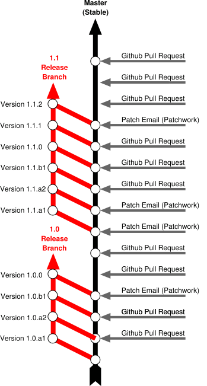

.. _process-and-workflow:

*******************
Process & Workflow
*******************

.. highlight:: none

FRR is a large project developed by many different groups. This section
documents standards for code style & quality, commit messages, pull requests
and best practices that all contributors are asked to follow.

This chapter is "descriptive/post-factual" in that it documents pratices that
are in use; it is not "definitive/pre-factual" in prescribing practices. This
means that when a procedure changes, it is agreed upon, then put into practice,
and then documented here. If this document doesn't match reality, it's the
document that needs to be updated, not reality.

Mailing Lists
=============

The FRR development group maintains multiple mailing lists for use by the
community. Italicized lists are private.

+----------------------------------+--------------------------------+
| Topic                            | List                           |
+==================================+================================+
| Development                      | dev@lists.frrouting.org        |
+----------------------------------+--------------------------------+
| Users & Operators                | frog@lists.frrouting.org       |
+----------------------------------+--------------------------------+
| Announcements                    | announce@lists.frrouting.org   |
+----------------------------------+--------------------------------+
| *Security*                       | security@lists.frrouting.org   |
+----------------------------------+--------------------------------+
| *Technical Steering Committee*   | tsc@lists.frrouting.org        |
+----------------------------------+--------------------------------+

The Development list is used to discuss and document general issues related to
project development and governance. The public
`Slack instance <https://frrouting.slack.com>`_ and weekly technical meetings
provide a higher bandwidth channel for discussions.  The results of such
discussions must be reflected in updates, as appropriate, to code (i.e.,
merges), `GitHub issues`_, and for governance or process changes, updates to
the Development list and either this file or information posted at
https://frrouting.org/.

Development & Release Cycle
===========================

Development
-----------

   Rough outline of FRR development workflow

The master Git for FRR resides on `GitHub`_.

There is one main branch for development, ``master``. For each major release
(2.0, 3.0 etc) a new release branch is created based on the master. Significant
bugfixes should be backported to upcoming and existing release branches no more
than 1 year old. As a general rule new features are not backported to release
branches.

Subsequent point releases based on a major branch are handled with git tags.

Releases
--------
FRR employs a ``<MAJOR>.<MINOR>.<BUGFIX>`` versioning scheme.

``MAJOR``
   Significant new features or multiple minor features. The addition of a new
   routing protocol or daemon would fall under this class.

``MINOR``
   Small features, e.g. options for automatic BGP shutdown.

``BUGFIX``
   Fixes for actual bugs and/or security issues.

We will pull a new development branch for the next release every 4 months.  The
current schedule is Feb/June/October 1. The decision for a ``MAJOR/MINOR``
release is made at the time of branch pull based on what has been received the
previous 4 months. The branch name will be ``dev/MAJOR.MINOR``. At this point
in time the master branch and this new branch, :file:`configure.ac`,
documentation and packaging systems will be updated to reflect the next
possible release name to allow for easy distinguishing.

After one month the development branch will be renamed to
``stable/MAJOR.MINOR``.  This process is not held up unless a crash or security
issue has been found and needs to be addressed. Issues being fixed will not
cause a delay.

Bugfix releases are made as needed at 1 month intervals until the next
``MAJOR.MINOR`` relese branch is pulled. Depending on the severity of the bugs,
bugfix releases may occur sooner.

Bugfixes are applied to the two most recent releases. Security fixes are
backported to all releases less than or equal to one year old. Security fixes
may also be backported to older releases depending on severity.

Changelog
---------
The changelog will be the base for the release notes. A changelog entry for
your changes is usually not required and will be added based on your commit
messages by the maintainers. However, you are free to include an update to the
changelog with some better description.

Submitting Patches and Enhancements
===================================

FRR accepts patches from two sources:

- Email (git format-patch)
- GitHub pull request

Contributors are highly encouraged to use GitHub's fork-and-PR workflow. It is
easier for us to review it, test it, try it and discuss it on GitHub than it is
via email, thus your patch will get more attention more quickly on GitHub.

The base branch for new contributions and non-critical bug fixes should be
``master``. Please ensure your pull request is based on this branch when you
submit it.

GitHub Pull Requests
--------------------

The preferred method of submitting changes is a GitHub pull request.  Code
submitted by pull request will be automatically tested by one or more CI
systems. Once the automated tests succeed, other developers will review your
code for quality and correctness. After any concerns are resolved, your code
will be merged into the branch it was submitted against.

Patch Submission via Mailing List
---------------------------------

As an alternative submission method, a patch can be mailed to the
development mailing list. Patches received on the mailing list will be
picked up by Patchwork and tested against the latest development branch.

The recommended way to send the patch (or series of NN patches) to the
list is by using ``git send-email`` as follows (assuming they are the N
most recent commit(s) in your git history)::

    git send-email -NN --annotate --to=dev@lists.frrouting.org

If your commits do not already contain a ``Signed-off-by`` line, then
use the following command to add it (after making sure you agree to the
Developer Certificate of Origin as outlined above)::

    git send-email -NN --annotate --signoff --to=dev@lists.frrouting.org

Submitting multi-commit patches as a GitHub pull request is **strongly
encouraged** and increases the probability of your patch getting reviewed and
merged in a timely manner.

.. _license-for-contributions:

License for Contributions
-------------------------
FRR is under a “GPLv2 or later” license. Any code submitted must be released
under the same license (preferred) or any license which allows redistribution
under this GPLv2 license (eg MIT License).

Pre-submission Checklist
------------------------
-  Format code (see `Code Formatting <#code-formatting>`__)
-  Verify and acknowledge license (see :ref:`license-for-contributions`)
-  Ensure you have properly signed off (see :ref:`signing-off`)
-  Test building with various configurations:

   -  ``buildtest.sh``

-  Verify building source distribution:

   -  ``make dist`` (and try rebuilding from the resulting tar file)

-  Run unit tests:

   -  ``make test``

- In the case of a major new feature or other significant change, document
  plans for continued maintenance of the feature

.. _signing-off:

Signing Off
-----------
Code submitted to FRR must be signed off. We have the same requirements for
using the signed-off-by process as the Linux kernel. In short, you must include
a ``Signed-off-by`` tag in every patch.

``Signed-off-by`` is a developer's certification that they have the right to
submit the patch for inclusion into the project. It is an agreement to the
:ref:`Developer's Certificate of Origin <developers-certificate-of-origin>`.
Code without a proper ``Signed-off-by`` line cannot and will not be merged.

If you are unfamiliar with this process, you should read the
`official policy at kernel.org <https://www.kernel.org/doc/html/latest/process/submitting-patches.html>`_.
You might also find
`this article <http://www.linuxfoundation.org/content/how-participate-linux-community-0>`_
about participating in the Linux community on the Linux Foundation website to
be a helpful resource.

.. _developers-certificate-of-origin:

In short, when you sign off on a commit, you assert your agreement to all of
the following::

   Developer's Certificate of Origin 1.1

   By making a contribution to this project, I certify that:

   (a) The contribution was created in whole or in part by me and I
       have the right to submit it under the open source license
       indicated in the file; or

   (b) The contribution is based upon previous work that, to the best
       of my knowledge, is covered under an appropriate open source
       license and I have the right under that license to submit that
       work with modifications, whether created in whole or in part by
       me, under the same open source license (unless I am permitted to
       submit under a different license), as indicated in the file; or

   (c) The contribution was provided directly to me by some other
       person who certified (a), (b) or (c) and I have not modified it.

   (d) I understand and agree that this project and the contribution
       are public and that a record of the contribution (including all
       personal information I submit with it, including my sign-off) is
       maintained indefinitely and may be redistributed consistent with
       this project or the open source license(s) involved.

After Submitting Your Changes
-----------------------------

-  Watch for Continuous Integration (CI) test results

   -  You should automatically receive an email with the test results
      within less than 2 hrs of the submission. If you don’t get the
      email, then check status on the GitHub pull request.
   -  Please notify the development mailing list if you think something
      doesn't work.

-  If the tests failed:

   -  In general, expect the community to ignore the submission until
      the tests pass.
   -  It is up to you to fix and resubmit.

      -  This includes fixing existing unit (“make test”) tests if your
         changes broke or changed them.
      -  It also includes fixing distribution packages for the failing
         platforms (ie if new libraries are required).
      -  Feel free to ask for help on the development list.

   -  Go back to the submission process and repeat until the tests pass.

-  If the tests pass:

   -  Wait for reviewers. Someone will review your code or be assigned
      to review your code.
   -  Respond to any comments or concerns the reviewer has.  Use e-mail or
      add a comment via github to respond or to let the reviewer know how
      their comment or concern is addressed.
   -  An author must never delete or manually dismiss someone else's comments
      or review.  (A review may be overridden by agreement in the weekly
      technical meeting.)
   -  Automatically generated comments, e.g., those generated by CI systems,
      may be deleted by authors and others when such comments are not the most
      recent results from that automated comment source.
   -  After all comments and concerns are addressed, expect your patch
      to be merged.

-  Watch out for questions on the mailing list. At this time there will
   be a manual code review and further (longer) tests by various
   community members.
-  Your submission is done once it is merged to the master branch.

Programming Languages, Tools and Libraries
==========================================

The core of FRR is written in C (gcc or clang supported) and makes
use of GNU compiler extensions. A few non-essential scripts are
implemented in Perl and Python. FRR requires the following tools
to build distribution packages: automake, autoconf, texinfo, libtool and
gawk and various libraries (i.e. libpam and libjson-c).

If your contribution requires a new library or other tool, then please
highlight this in your description of the change. Also make sure it’s
supported by all FRR platform OSes or provide a way to build
without the library (potentially without the new feature) on the other
platforms.

Documentation should be written in reStructuredText. Sphinx extensions may be
utilized but pure ReST is preferred where possible. See
:ref:`documentation`.

Coding Practices & Style
========================

Commit messages
---------------

Commit messages should be formatted in the same way as Linux kernel
commit messages. The format is roughly::

    dir: short summary

    extended summary

``dir`` should be the top level source directory under which the change was
made. For example, a change in :file:`bgpd/rfapi` would be formatted as::

   bgpd: short summary

   ...

The first line should be no longer than 50 characters. Subsequent lines should
be wrapped to 72 characters.

You must also sign off on your commit.

.. seealso:: :ref:`signing-off`

Source File Header
------------------

New files must have a copyright header (see :ref:`license-for-contributions`
above) added to the file. The header should be:

.. code-block:: c

    /*
     * Title/Function of file
     * Copyright (C) YEAR  Author’s Name
     *
     * This program is free software; you can redistribute it and/or modify it
     * under the terms of the GNU General Public License as published by the Free
     * Software Foundation; either version 2 of the License, or (at your option)
     * any later version.
     *
     * This program is distributed in the hope that it will be useful, but WITHOUT
     * ANY WARRANTY; without even the implied warranty of MERCHANTABILITY or
     * FITNESS FOR A PARTICULAR PURPOSE.  See the GNU General Public License for
     * more details.
     *
     * You should have received a copy of the GNU General Public License along
     * with this program; see the file COPYING; if not, write to the Free Software
     * Foundation, Inc., 51 Franklin St, Fifth Floor, Boston, MA 02110-1301 USA
     */

    #include <zebra.h>

Please copy-paste this header verbatim. In particular:

- Do not replace "This program" with "FRR"
- Do not change the address of the FSF

Adding Copyright Claims to Existing Files
-----------------------------------------

When adding copyright claims for modifications to an existing file, please
add a ``Portions:`` section as shown below. If this section already exists, add
your new claim at the end of the list.

.. code-block:: c

    /*
     * Title/Function of file
     * Copyright (C) YEAR  Author’s Name
     * Portions:
     *     Copyright (C) 2010 Entity A ....
     *     Copyright (C) 2016 Your name [optional brief change description]
     * ...
     */

Code Formatting
---------------

FRR uses Linux kernel style except where noted below. Code which does not
comply with these style guidelines will not be accepted.

The project provides multiple tools to allow you to correctly style your code
as painlessly as possible, primarily built around ``clang-format``.

clang-format
   In the project root there is a :file:`.clang-format` configuration file
   which can be used with the ``clang-format`` source formatter tool from the
   LLVM project. Most of the time, this is the easiest and smartest tool to
   use. It can be run in a variety of ways. If you point it at a C source file
   or directory of source files, it will format all of them. In the LLVM source
   tree there are scripts that allow you to integrate it with ``git``, ``vim``
   and ``emacs``, and there are third-party plugins for other editors. The
   ``git`` integration is particularly useful; suppose you have some changes in
   your git index. Then, with the integration installed, you can do the
   following:

   ::

      git clang-format

   This will format *only* the changes present in your index. If you have just
   made a few commits and would like to correctly style only the changes made
   in those commits, you can use the following syntax:

   ::

      git clang-format HEAD~X

   Where X is one more than the number of commits back from the tip of your
   branch you would like ``clang-format`` to look at (similar to specifying the
   target for a rebase).

   The ``vim`` plugin is particularly useful. It allows you to select lines in
   visual line mode and press a key binding to invoke ``clang-format`` on only
   those lines.

   When using ``clang-format``, it is recommended to use the latest version.
   Each consecutive version generally has better handling of various edge
   cases. You may notice on occasion that two consecutive runs of
   ``clang-format`` over the same code may result in changes being made on the
   second run. This is an unfortunate artifact of the tool. Please check with
   the kernel style guide if in doubt.

   One stylistic problem with the FRR codebase is the use of ``DEFUN`` macros
   for defining CLI commands. ``clang-format`` will happily format these macro
   invocations, but the result is often unsightly and difficult to read.
   Consequently, FRR takes a more relaxed position with how these are
   formatted. In general you should lean towards using the style exemplified in
   the section on :ref:`command-line-interface`. Because ``clang-format``
   mangles this style, there is a Python script named ``tools/indent.py`` that
   wraps ``clang-format`` and handles ``DEFUN`` macros as well as some other
   edge cases specific to FRR. If you are submitting a new file, it is
   recommended to run that script over the new file, preferably after ensuring
   that the latest stable release of ``clang-format`` is in your ``PATH``.

   Documentation on ``clang-format`` and its various integrations is maintained
   on the LLVM website.

   https://clang.llvm.org/docs/ClangFormat.html

checkpatch.sh
   In the Linux kernel source tree there is a Perl script used to check
   incoming patches for style errors. FRR uses an adapted version of this
   script for the same purpose. It can be found at
   :file:`tools/checkpatch.sh`. This script takes a git-formatted diff or
   patch file, applies it to a clean FRR tree, and inspects the result to catch
   potential style errors. Running this script on your patches before
   submission is highly recommended. The CI system runs this script as well and
   will comment on the PR with the results if style errors are found.

   It is run like this::

      ./checkpatch.sh <patch> <tree>

   Reports are generated on ``stderr`` and the exit code indicates whether
   issues were found (2, 1) or not (0).

   Where ``<patch>`` is the path to the diff or patch file and ``<tree>`` is
   the path to your FRR source tree. The tree should be on the branch that you
   intend to submit the patch against. The script will make a best-effort
   attempt to save the state of your working tree and index before applying the
   patch, and to restore it when it is done, but it is still recommended that
   you have a clean working tree as the script does perform a hard reset on
   your tree during its run.

   The script reports two classes of issues, namely WARNINGs and ERRORs. Please
   pay attention to both of them. The script will generally report WARNINGs
   where it cannot be 100% sure that a particular issue is real. In most cases
   WARNINGs indicate an issue that needs to be fixed. Sometimes the script will
   report false positives; these will be handled in code review on a
   case-by-case basis. Since the script only looks at changed lines,
   occasionally changing one part of a line can cause the script to report a
   style issue already present on that line that is unrelated to the change.
   When convenient it is preferred that these be cleaned up inline, but this is
   not required.

   In general, a developer should heed the information reported by checkpatch.
   However, some flexibility is needed for cases where human judgement yields
   better clarity than the script. Accordingly, it may be appropriate to
   ignore some checkpatch.sh warnings per discussion among the submitter(s)
   and reviewer(s) of a change. Misreporting of errors by the script is
   possible. When this occurs, the exception should be handled either by
   patching checkpatch to correct the false error report, or by documenting the
   exception in this document under :ref:`style-exceptions`. If the incorrect
   report is likely to appear again, a checkpatch update is preferred.

   If the script finds one or more WARNINGs it will exit with 1. If it finds
   one or more ERRORs it will exit with 2.

Please remember that while FRR provides these tools for your convenience,
responsibility for properly formatting your code ultimately lies on the
shoulders of the submitter. As such, it is recommended to double-check the
results of these tools to avoid delays in merging your submission.

In some cases, these tools modify or flag the format in ways that go beyond or
even conflict [#tool_style_conflicts]_ with the canonical documented Linux
kernel style. In these cases, the Linux kernel style takes priority;
non-canonical issues flagged by the tools are not compulsory but rather are
opportunities for discussion among the submitter(s) and reviewer(s) of a change.

**Whitespace changes in untouched parts of the code are not acceptable
in patches that change actual code.** To change/fix formatting issues,
please create a separate patch that only does formatting changes and
nothing else.

Kernel and BSD styles are documented externally:

-  https://www.kernel.org/doc/html/latest/process/coding-style.html
-  http://man.openbsd.org/style

For GNU coding style, use ``indent`` with the following invocation:

::

    indent -nut -nfc1 file_for_submission.c

Historically, FRR used fixed-width integral types that do not exist in any
standard but were defined by most platforms at some point. Officially these
types are not guaranteed to exist. Therefore, please use the fixed-width
integral types introduced in the C99 standard when contributing new code to
FRR. If you need to convert a large amount of code to use the correct types,
there is a shell script in :file:`tools/convert-fixedwidth.sh` that will do the
necessary replacements.

+-----------+--------------------------+
| Incorrect | Correct                  |
+===========+==========================+
| u_int8_t  | uint8_t                  |
+-----------+--------------------------+
| u_int16_t | uint16_t                 |
+-----------+--------------------------+
| u_int32_t | uint32_t                 |
+-----------+--------------------------+
| u_int64_t | uint64_t                 |
+-----------+--------------------------+
| u_char    | uint8_t or unsigned char |
+-----------+--------------------------+
| u_short   | unsigned short           |
+-----------+--------------------------+
| u_int     | unsigned int             |
+-----------+--------------------------+
| u_long    | unsigned long            |
+-----------+--------------------------+

.. _style-exceptions:

Exceptions
^^^^^^^^^^

FRR project code comes from a variety of sources, so there are some
stylistic exceptions in place. They are organized here by branch.

For ``master``
""""""""""""""

BSD coding style applies to:

-  ``ldpd/``

``babeld`` uses, approximately, the following style:

-  K&R style braces
-  Indents are 4 spaces
-  Function return types are on their own line

For ``stable/3.0`` and ``stable/2.0``
"""""""""""""""""""""""""""""""""""""

GNU coding style apply to the following parts:

-  ``lib/``
-  ``zebra/``
-  ``bgpd/``
-  ``ospfd/``
-  ``ospf6d/``
-  ``isisd/``
-  ``ripd/``
-  ``ripngd/``
-  ``vtysh/``

BSD coding style applies to:

-  ``ldpd/``

Specific Exceptions
^^^^^^^^^^^^^^^^^^^

Most of the time checkpatch errors should be corrected. Occasionally as a group
maintainers will decide to ignore certain stylistic issues. Usually this is
because correcting the issue is not possible without large unrelated code
changes. When an exception is made, if it is unlikely to show up again and
doesn't warrant an update to checkpatch, it is documented here.

+------------------------------------------+---------------------------------------------------------------+
| Issue                                    | Ignore Reason                                                 |
+==========================================+===============================================================+
| DEFPY_HIDDEN, DEFPY_ATTR: complex macros | DEF* macros cannot be wrapped in parentheses without updating |
| should be wrapped in parentheses         | all usages of the macro, which would be highly disruptive.    |
+------------------------------------------+---------------------------------------------------------------+

Compile-time conditional code
-----------------------------

Many users access FRR via binary packages from 3rd party sources;
compile-time code puts inclusion/exclusion in the hands of the package
maintainer. Please think very carefully before making code conditional
at compile time, as it increases regression testing, maintenance
burdens, and user confusion. In particular, please avoid gratuitous
``--enable-…`` switches to the configure script - in general, code
should be of high quality and in working condition, or it shouldn’t be
in FRR at all.

When code must be compile-time conditional, try have the compiler make
it conditional rather than the C pre-processor so that it will still be
checked by the compiler, even if disabled. For example,

::

    if (SOME_SYMBOL)
          frobnicate();

is preferred to

::

    #ifdef SOME_SYMBOL
    frobnicate ();
    #endif /* SOME_SYMBOL */

Note that the former approach requires ensuring that ``SOME_SYMBOL`` will be
defined (watch your ``AC_DEFINE``\ s).

Debug-guards in code
--------------------

Debugging statements are an important methodology to allow developers to fix
issues found in the code after it has been released. The caveat here is that
the developer must remember that people will be using the code at scale and in
ways that can be unexpected for the original implementor. As such debugs
**MUST** be guarded in such a way that they can be turned off. FRR has the
ability to turn on/off debugs from the CLI and it is expected that the
developer will use this convention to allow control of their debugs.

Static Analysis and Sanitizers
------------------------------
Clang/LLVM comes with a variety of tools that can be used to help find bugs in FRR.

clang-analyze
   This is a static analyzer that scans the source code looking for patterns
   that are likely to be bugs. The tool is run automatically on pull requests
   as part of CI and new static analysis warnings will be placed in the CI
   results. FRR aims for absolutely zero static analysis errors. While the
   project is not quite there, code that introduces new static analysis errors
   is very unlikely to be merged.

AddressSanitizer
   This is an excellent tool that provides runtime instrumentation for
   detecting memory errors. As part of CI FRR is built with this
   instrumentation and run through a series of tests to look for any results.
   Testing your own code with this tool before submission is encouraged. You
   can enable it by passing::

      --enable-address-sanitizer

   to ``configure``.

ThreadSanitizer
   Similar to AddressSanitizer, this tool provides runtime instrumentation for
   detecting data races. If you are working on or around multithreaded code,
   extensive testing with this instrumtation enabled is *highly* recommended.
   You can enable it by passing::

      --enable-thread-sanitizer

   to ``configure``.

MemorySanitizer
   Similar to AddressSanitizer, this tool provides runtime instrumentation for
   detecting use of uninitialized heap memory. Testing your own code with this
   tool before submission is encouraged. You can enable it by passing::

      --enable-memory-sanitizer

   to ``configure``.

All of the above tools are available in the Clang/LLVM toolchain since 3.4.
AddressSanitizer and ThreadSanitizer are available in recent versions of GCC,
but are no longer actively maintained. MemorySanitizer is not available in GCC.

Additionally, the FRR codebase is regularly scanned with Coverity.
Unfortunately Coverity does not have the ability to handle scanning pull
requests, but after code is merged it will send an email notifying project
members with Coverity access of newly introduced defects.

CLI changes
-----------

CLI's are a complicated ugly beast. Additions or changes to the CLI should use
a DEFUN to encapsulate one setting as much as is possible.  Additionally as new
DEFUN's are added to the system, documentation should be provided for the new
commands.

Backwards Compatibility
-----------------------

As a general principle, changes to CLI and code in the lib/ directory should be
made in a backwards compatible fashion. This means that changes that are purely
stylistic in nature should be avoided, e.g., renaming an existing macro or
library function name without any functional change. When adding new parameters
to common functions, it is also good to consider if this too should be done in
a backward compatible fashion, e.g., by preserving the old form in addition to
adding the new form.

This is not to say that minor or even major functional changes to CLI and
common code should be avoided, but rather that the benefit gained from a change
should be weighed against the added cost/complexity to existing code. Also,
that when making such changes, it is good to preserve compatibility when
possible to do so without introducing maintenance overhead/cost. It is also
important to keep in mind, existing code includes code that may reside in
private repositories (and is yet to be submitted) or code that has yet to be
migrated from Quagga to FRR.

That said, compatibility measures can (and should) be removed when either:

-  they become a significant burden, e.g. when data structures change and the
   compatibility measure would need a complex adaptation layer or becomes
   flat-out impossible
-  some measure of time (dependent on the specific case) has passed, so that
   the compatibility grace period is considered expired.

In all cases, compatibility pieces should be marked with compiler/preprocessor
annotations to print warnings at compile time, pointing to the appropriate
update path. A ``-Werror`` build should fail if compatibility bits are used. To
avoid compilation issues in released code, such compiler/preprocessor
annotations must be ignored non-development branches. For example:

.. code-block:: c

   #if defined(VERSION_TYPE_DEV) && CONFDATE > 20180403
   CPP_NOTICE("Use of <XYZ> is deprecated, please use <ABC>")
   #endif

Preferably, the shell script :file:`tools/fixup-deprecated.py` will be
updated along with making non-backwards compatible code changes, or an
alternate script should be introduced, to update the code to match the
change.  When the script is updated, there is no need to preserve the
deprecated code. Note that this does not apply to user interface
changes, just internal code, macros and libraries.

Miscellaneous
-------------

When in doubt, follow the guidelines in the Linux kernel style guide, or ask on
the development mailing list / public Slack instance.

.. _documentation:

Documentation
=============

FRR uses Sphinx+RST as its documentation system. The document you are currently
reading was generated by Sphinx from RST source in
:file:`doc/developer/workflow.rst`. The documentation is structured as follows:

+-----------------------+-------------------------------------------+
| Directory             | Contents                                  |
+=======================+===========================================+
| :file:`doc/user`      | User documentation; configuration guides; |
|                       | protocol overviews                        |
+-----------------------+-------------------------------------------+
| :file:`doc/developer` | Developer's documentation; API specs;     |
|                       | datastructures; architecture overviews;   |
|                       | project management procedure              |
+-----------------------+-------------------------------------------+
| :file:`doc/manpages`  | Source for manpages                       |
+-----------------------+-------------------------------------------+
| :file:`doc/figures`   | Images and diagrams                       |
+-----------------------+-------------------------------------------+
| :file:`doc/extra`     | Miscellaneous Sphinx extensions, scripts, |
|                       | customizations, etc.                      |
+-----------------------+-------------------------------------------+

Each of these directories, with the exception of :file:`doc/figures` and
:file:`doc/extra`, contains a Sphinx-generated Makefile and configuration
script :file:`conf.py` used to set various document parameters. The makefile
can be used for a variety of targets; invoke `make help` in any of these
directories for a listing of available output formats. For convenience, there
is a top-level :file:`Makefile.am` that has targets for PDF and HTML
documentation for both developer and user documentation, respectively. That
makefile is also responsible for building manual pages packed with distribution
builds.

Indent and styling should follow existing conventions:

- 3 spaces for indents under directives
- Cross references may contain only lowercase alphanumeric characters and
  hyphens ('-')
- Lines wrapped to 80 characters where possible

Characters for header levels should follow Python documentation guide:

- ``#`` with overline, for parts
- ``*`` with overline, for chapters
- ``=``, for sections
- ``-``, for subsections
- ``^``, for subsubsections
- ``"``, for paragraphs

After you have made your changes, please make sure that you can invoke
``make latexpdf`` and ``make html`` with no warnings.

The documentation is currently incomplete and needs love. If you find a broken
cross-reference, figure, dead hyperlink, style issue or any other nastiness we
gladly accept documentation patches.

To build the docs, please ensure you have installed a recent version of
`Sphinx <http://www.sphinx-doc.org/en/stable/install.html>`_. If you want to
build LaTeX or PDF docs, you will also need a full LaTeX distribution
installed.

Code
----

FRR is a large and complex software project developed by many different people
over a long period of time. Without adequate documentation, it can be
exceedingly difficult to understand code segments, APIs and other interfaces.
In the interest of keeping the project healthy and maintainable, you should
make every effort to document your code so that other people can understand
what it does without needing to closely read the code itself.

Some specific guidelines that contributors should follow are:

- Functions exposed in header files should have descriptive comments above
  their signatures in the header file. At a minimum, a function comment should
  contain information about the return value, parameters, and a general summary
  of the function's purpose.  Documentation on parameter values can be omitted
  if it is (very) obvious what they are used for.

  Function comments must follow the style for multiline comments laid out in
  the kernel style guide.

  Example:

  .. code-block:: c

     /*
      * Determines whether or not a string is cool.
      *
      * text
      *    the string to check for coolness
      *
      * is_clccfc
      *    whether capslock is cruise control for cool
      *
      * Returns:
      *    7 if the text is cool, 0 otherwise
      */
     int check_coolness(const char *text, bool is_clccfc);

  Function comments should make it clear what parameters and return values are
  used for.

- Static functions should have descriptive comments in the same form as above
  if what they do is not immediately obvious. Use good engineering judgement
  when deciding whether a comment is necessary.  If you are unsure, document
  your code.
- Global variables, static or not, should have a comment describing their use.
- **For new code in lib/, these guidelines are hard requirements.**

If you make significant changes to portions of the codebase covered in the
Developer's Manual, add a major subsystem or feature, or gain arcane mastery of
some undocumented or poorly documented part of the codebase, please document
your work so others can benefit. If you add a major feature or introduce a new
API, please document the architecture and API to the best of your abilities in
the Developer's Manual, using good judgement when choosing where to place it.

Finally, if you come across some code that is undocumented and feel like
going above and beyond, document it! We absolutely appreciate and accept
patches that document previously undocumented code.

User
----

If you are contributing code that adds significant user-visible functionality
please document how to use it in :file:`doc/user`. Use good judgement when
choosing where to place documentation. For example, instructions on how to use
your implementation of a new BGP draft should go in the BGP chapter instead of
being its own chapter. If you are adding a new protocol daemon, please create a
new chapter.

FRR Specific Markup
-------------------

FRR has some customizations applied to the Sphinx markup that go a long way
towards making documentation easier to use, write and maintain.

CLI Commands
^^^^^^^^^^^^

When documenting CLI please use a combination of the ``.. index::`` and
``.. clicmd::`` directives. For example, the command :clicmd:`show pony` would
be documented as follows:

.. code-block:: rest

   .. index:: show pony
   .. clicmd:: show pony

      Prints an ASCII pony. Example output:::

              >>\.
             /_  )`.
            /  _)`^)`.   _.---. _
           (_,' \  `^-)""      `.\
                 |  | \
                 \              / |
                / \  /.___.'\  (\ (_
               < ,"||     \ |`. \`-'
                \\ ()      )|  )/
         hjw    |_>|>     /_] //
                  /_]        /_]

When documented this way, CLI commands can be cross referenced with the
``:clicmd:`` inline markup like so:

.. code-block:: rest

   :clicmd:`show pony`

This is very helpful for users who want to quickly remind themselves what a
particular command does.

Configuration Snippets
^^^^^^^^^^^^^^^^^^^^^^

When putting blocks of example configuration please use the
``.. code-block::`` directive and specify ``frr`` as the highlighting language,
as in the following example. This will tell Sphinx to use a custom Pygments
lexer to highlight FRR configuration syntax.

.. code-block:: rest

   .. code-block:: frr

      !
      ! Example configuration file.
      !
      log file /tmp/log.log
      service integrated-vtysh-config
      !
      ip route 1.2.3.0/24 reject
      ipv6 route de:ea:db:ee:ff::/64 reject
      !

.. _GitHub: https://github.com/frrouting/frr
.. _GitHub issues: https://github.com/frrouting/frr/issues

.. rubric:: Footnotes

.. [#tool_style_conflicts] For example, lines over 80 characters are allowed
   for text strings to make it possible to search the code for them: please
   see `Linux kernel style (breaking long lines and strings) <https://www.kernel.org/doc/html/v4.10/process/coding-style.html#breaking-long-lines-and-strings>`_
   and `Issue #1794 <https://github.com/FRRouting/frr/issues/1794>`_.
