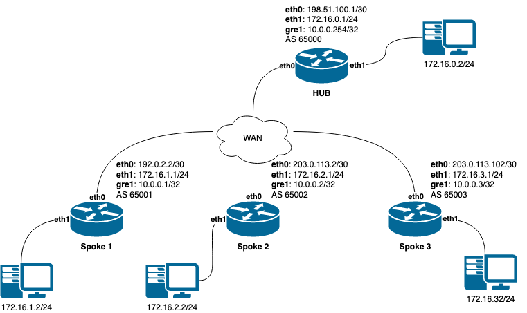

.. _nhrp:

****
NHRP
****

*nhrpd* is an implementation of the :abbr:`NHRP (Next Hop Routing Protocol)`.
NHRP is described in :rfc:`2332`.

NHRP is used to improve the efficiency of routing computer network traffic over
:abbr:`NBMA (Non-Broadcast, Multiple Access)` networks. NHRP provides an
ARP-like solution that allows a system to dynamically learn the NBMA address of
the other systems that are part of that network, allowing these systems to
directly communicate without requiring traffic to use an intermediate hop.

NHRP is a client-server protocol. The server side is called the :abbr:`NHS
(Next Hop Server)` or the hub, while a client is referred to as the :abbr:`NHC
(Next Hop Client)` or the spoke. When a node is configured as an NHC, it
registers its address with the NHS which keeps track of all registered spokes.
An NHC client can then query the addresses of other clients from NHS allowing
all spokes to communicate directly with each other.

Cisco Dynamic Multipoint VPN (DMVPN) is based on NHRP, and |PACKAGE_NAME| nhrpd
implements this scenario.

.. _routing-design:

Routing Design
==============

nhrpd never handles routing of prefixes itself. You need to run some
real routing protocol (e.g. BGP) to advertise routes over the tunnels.
What nhrpd does it establishes 'shortcut routes' that optimizes the
routing protocol to avoid going through extra nodes in NBMA GRE mesh.

nhrpd does route NHRP domain addresses individually using per-host prefixes.
This is similar to Cisco FlexVPN; but in contrast to opennhrp which uses
a generic subnet route.

To create NBMA GRE tunnel you might use the following (Linux terminal
commands):

.. code-block:: console

   ip tunnel add gre1 mode gre key 42 ttl 64
   ip addr add 10.255.255.2/32 dev gre1
   ip link set gre1 up

Note that the IP-address is assigned as host prefix to gre1. nhrpd will
automatically create additional host routes pointing to gre1 when
a connection with these hosts is established.

The gre1 subnet prefix should be announced by routing protocol from the
hub nodes (e.g. BGP 'network' announce). This allows the routing protocol
to decide which is the closest hub and determine the relay hub on prefix
basis when direct tunnel is not established.

nhrpd will redistribute directly connected neighbors to zebra. Within
hub nodes, these routes should be internally redistributed using some
routing protocol (e.g. iBGP) to allow hubs to be able to relay all traffic.

This can be achieved in hubs with the following bgp configuration (network
command defines the GRE subnet):

.. code-block:: frr

  router bgp 65555
   address-family ipv4 unicast
     network 172.16.0.0/16
     redistribute nhrp
   exit-address-family

.. _configuring-nhrp:

Configuring NHRP
================

.. clicmd:: ip nhrp holdtime (1-65000)

   Holdtime is the number of seconds that have to pass before stopping to
   advertise an NHRP NBMA address as valid. It also controls how often NHRP
   registration requests are sent. By default registrations are sent every one
   third of the holdtime.

.. clicmd:: ip nhrp authentication PASSWORD

   Enables Cisco style authentication on NHRP packets. This embeds the
   plaintext password to the outgoing NHRP packets.
   Maximum length of the password is 8 characters.

.. clicmd:: ip nhrp map A.B.C.D|X:X::X:X A.B.C.D|local

   Map an IP address of a station to the station's NBMA address.

.. clicmd:: ip nhrp network-id (1-4294967295)

   Enable NHRP on this interface and set the interface's network ID.  The
   network ID is used to allow creating multiple nhrp domains on a router when
   multiple interfaces are configured on the router.  Interfaces configured
   with the same ID are part of the same logical NBMA network. The ID is a
   local only parameter and is not sent to other NHRP nodes and so IDs on
   different nodes do not need to match. When NHRP packets are received on an
   interface they are assigned to the local NHRP domain for that interface.

.. clicmd:: ip nhrp nhs A.B.C.D nbma A.B.C.D|FQDN

   Configure the Next Hop Server address and its NBMA address.

.. clicmd:: ip nhrp nhs dynamic nbma A.B.C.D

   Configure the Next Hop Server to have a dynamic address and set its NBMA
   address.

.. clicmd:: ip nhrp registration no-unique

   Allow the client to not set the unique flag in the NHRP packets. This is
   useful when a station has a dynamic IP address that could change over time.

.. clicmd:: ip nhrp shortcut

   Enable shortcut (spoke-to-spoke) tunnels to allow NHC to talk to each others
   directly after establishing a connection without going through the hub.

.. clicmd:: ip nhrp mtu

   Configure NHRP advertised MTU.

.. _hub-functionality:

Hub Functionality
=================

In addition to routing nhrp redistributed host prefixes, the hub nodes
are also responsible to send NHRP Traffic Indication messages that
trigger creation of the shortcut tunnels.

nhrpd sends Traffic Indication messages based on network traffic captured
using NFLOG. Typically you want to send Traffic Indications for network
traffic that is routed from gre1 back to gre1 in rate limited manner.
This can be achieved with the following iptables rule.

.. code-block:: shell

   iptables -A FORWARD -i gre1 -o gre1 \\
       -m hashlimit --hashlimit-upto 4/minute --hashlimit-burst 1 \\
       --hashlimit-mode srcip,dstip --hashlimit-srcmask 24 --hashlimit-dstmask 24 \\
       --hashlimit-name loglimit-0 -j NFLOG --nflog-group 1 --nflog-range 128

You can fine tune the src/dstmask according to the prefix lengths you announce
internal, add additional IP range matches, or rate limitation if needed.
However, the above should be good in most cases.

This kernel NFLOG target's nflog-group is configured in global nhrp config
with:

.. clicmd:: nhrp nflog-group (1-65535)

To start sending these traffic notices out from hubs, use the nhrp
per-interface directive:

.. clicmd:: ip nhrp redirect

This enable redirect replies on the NHS similar to ICMP redirects except this
is managed by the nhrp protocol. This setting allows spokes to communicate with
each others directly.

.. _integration-with-ike:

Integration with IKE
====================

nhrpd needs tight integration with IKE daemon for various reasons.
Currently only strongSwan is supported as IKE daemon.

nhrpd connects to strongSwan using VICI protocol based on UNIX socket which
can be configured using the command below (default to /var/run/charon.vici).

strongSwan currently needs few patches applied. Please check out the
original patches at:
https://git-old.alpinelinux.org/user/tteras/strongswan/

Actively maintained patches are also available at:
https://gitlab.alpinelinux.org/alpine/aports/-/tree/master/main/strongswan

.. _multicast-functionality:

Multicast Functionality
=======================

nhrpd can be configured to forward multicast packets, allowing routing
protocols that use multicast (such as OSPF) to be supported in the DMVPN
network.

This support requires an iptables NFLOG rule to allow nhrpd to intercept
multicast packets. A second iptables rule is also usually used to drop the
original multicast packet.

 .. code-block:: shell

   iptables -A OUTPUT -d 224.0.0.0/24 -o gre1 -j NFLOG --nflog-group 2
   iptables -A OUTPUT -d 224.0.0.0/24 -o gre1 -j DROP

.. clicmd:: nhrp multicast-nflog-group (1-65535)

   Sets the nflog group that nhrpd will listen on for multicast packets. This
   value must match the nflog-group value set in the iptables rule.

.. clicmd:: ip nhrp map multicast A.B.C.D|X:X::X:X A.B.C.D|dynamic

   Sends multicast packets to the specified NBMA address. If dynamic is
   specified then destination NBMA address (or addresses) are learnt
   dynamically.

.. _nhrp-events:

NHRP Events
===========

.. clicmd:: nhrp event socket SOCKET

   Configure the Unix path for the event socket.

.. _show-nhrp:

Show  NHRP
==========

.. clicmd:: show [ip|ipv6] nhrp cache [json]

   Dump the cache entries.

.. clicmd:: show [ip|ipv6] nhrp opennhrp [json]

   Dump the cache entries with opennhrp format.

.. clicmd:: show [ip|ipv6] nhrp nhs [json]

   Dump the hub context.

.. clicmd:: show dmvpn [json]

   Dump the security contexts.

Configuration Example
=====================

   image

IPSec configurration example
----------------------------

This changes required on all nodes as HUB and Spokes.

ipsec.conf file

.. code-block:: shell

  config setup
  conn dmvpn
      authby=secret
      auto=add
      keyexchange=ikev2
      ike=aes256-aes256-sha256-modp2048
      esp=aes256-aes256-sha256-modp2048
      dpdaction=clear
      dpddelay=300s
      left=%any
      leftid=%any
      right=%any
      rightid=%any
      leftprotoport=gre
      rightprotoport=gre
      type=transport
      keyingtries=%forever

ipsec.secrets file

.. code-block:: shell

  %any : PSK "some_s3cret!"

HUB configuration example
-------------------------

Creating gre interface

.. code-block:: console

   ip tunnel add gre1 mode gre key 42 ttl 64
   ip addr add 10.0.0.254/32 dev gre1
   ip link set gre1 up

Adding iptables rules to provide possibility shortcut tunnels and connect spokes directly

.. code-block:: shell

   iptables -A FORWARD -i gre1 -o gre1 \\
       -m hashlimit --hashlimit-upto 4/minute --hashlimit-burst 1 \\
       --hashlimit-mode srcip,dstip --hashlimit-srcmask 24 --hashlimit-dstmask 24 \\
       --hashlimit-name loglimit-0 -j NFLOG --nflog-group 1 --nflog-range 128

FRR config on HUB

.. code-block:: frr

  nhrp nflog-group 1
  !
  interface gre1
   description DMVPN Tunnel Interface
   ip address 10.0.0.254/32
   ip nhrp network-id 1
   ip nhrp redirect
   ip nhrp registration no-unique
   ip nhrp shortcut
   tunnel protection vici profile dmvpn
   tunnel source eth0
   !
   router bgp 65000
    bgp router-id 10.0.0.254
    no bgp ebgp-requires-policy
    neighbor SPOKES peer-group
    neighbor SPOKES disable-connected-check
    neighbor 10.0.0.1 remote-as 65001
    neighbor 10.0.0.1 peer-group SPOKES
    neighbor 10.0.0.2 remote-as 65002
    neighbor 10.0.0.2 peer-group SPOKES
    neighbor 10.0.0.3 remote-as 65003
    neighbor 10.0.0.3 peer-group SPOKES
    !
    address-family ipv4 unicast
     network 172.16.0.0/24
     redistribute nhrp
    exit-address-family

Spoke1 configuration
--------------------

Creating gre interface

.. code-block:: console

   ip tunnel add gre1 mode gre key 42 ttl 64
   ip addr add 10.0.0.1/32 dev gre1
   ip link set gre1 up

FRR config on Spoke1

.. code-block:: frr

  interface gre1
   description DMVPN Tunnel Interface
   ip address 10.0.0.1/32
   ip nhrp network-id 1
   ip nhrp nhs dynamic nbma 198.51.100.1
   ip nhrp redirect
   ip nhrp registration no-unique
   ip nhrp shortcut
   no link-detect
   tunnel protection vici profile dmvpn
   tunnel source eth0
  !
  router bgp 65001
   no bgp ebgp-requires-policy
   neighbor 10.0.0.254 remote-as 65000
   neighbor 10.0.0.254 disable-connected-check
   !
   address-family ipv4 unicast
    network 172.16.1.0/24
   exit-address-family

Spoke2 configuration
--------------------

Creating gre interface

.. code-block:: console

   ip tunnel add gre1 mode gre key 42 ttl 64
   ip addr add 10.0.0.1/32 dev gre1
   ip link set gre1 up

FRR config on Spoke2

.. code-block:: frr

  interface gre1
   description DMVPN Tunnel Interface
   ip address 10.0.0.2/32
   ip nhrp network-id 1
   ip nhrp nhs dynamic nbma 198.51.100.1
   ip nhrp redirect
   ip nhrp registration no-unique
   ip nhrp shortcut
   no link-detect
   tunnel protection vici profile dmvpn
   tunnel source eth0
  !
  router bgp 65002
   no bgp ebgp-requires-policy
   neighbor 10.0.0.254 remote-as 65000
   neighbor 10.0.0.254 disable-connected-check
   !
   address-family ipv4 unicast
    network 172.16.2.0/24
   exit-address-family

Spoke3 configuration
--------------------

Creating gre interface

.. code-block:: console

   ip tunnel add gre1 mode gre key 42 ttl 64
   ip addr add 10.0.0.3/32 dev gre1
   ip link set gre1 up

FRR config on Spoke3

.. code-block:: frr

  interface gre1
   description DMVPN Tunnel Interface
   ip address 10.0.0.3/32
   ip nhrp network-id 1
   ip nhrp nhs dynamic nbma 198.51.100.1
   ip nhrp redirect
   ip nhrp registration no-unique
   ip nhrp shortcut
   no link-detect
   tunnel protection vici profile dmvpn
   tunnel source eth0
  !
  router bgp 65003
   no bgp ebgp-requires-policy
   neighbor 10.0.0.254 remote-as 65000
   neighbor 10.0.0.254 disable-connected-check
   !
   address-family ipv4 unicast
    network 172.16.3.0/24
   exit-address-family

