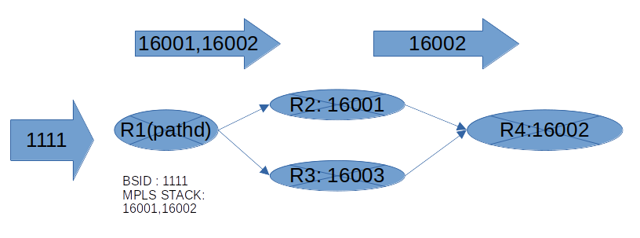
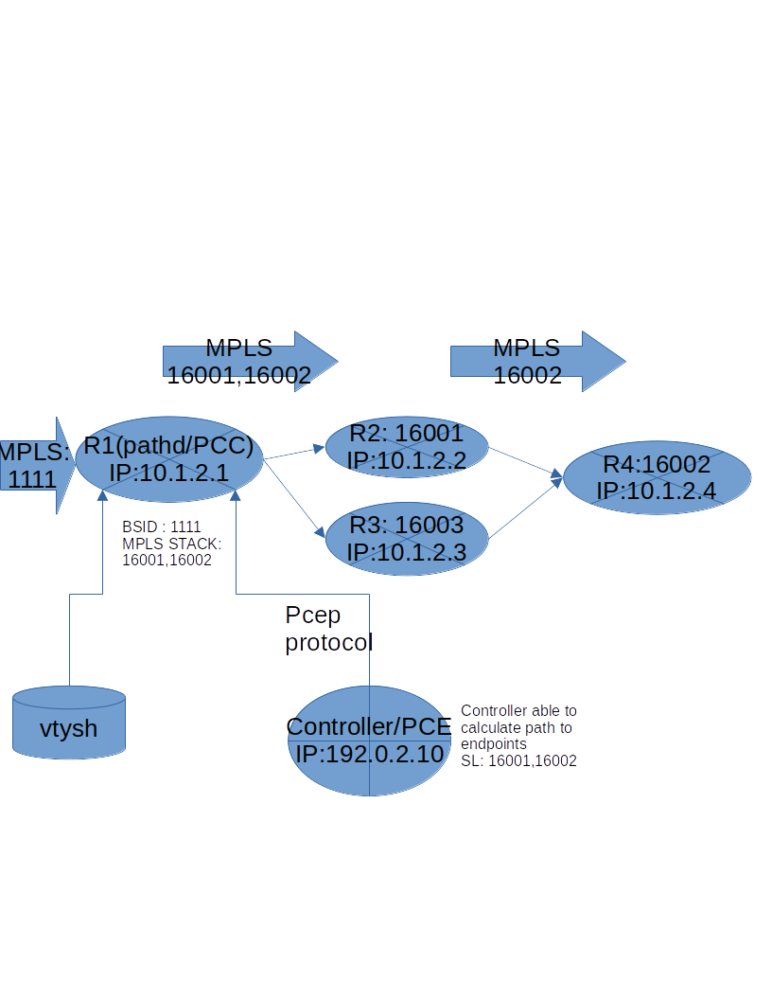
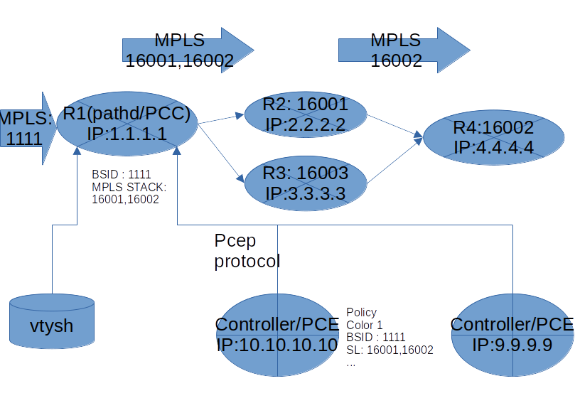

.. _path:

****
PATH
****

:abbr:`PATH` is a daemon that handles the installation and deletion
of Segment Routing (SR) Policies.
Based on MPLS (This means that your OS of choice must support MPLS),
SR add a stack of MPLS labels to ingress packets so these
packets are egress through the desired path.

The SR policies and Segment Lists can be configured either locally by means
of vtysh or centralized based on a SDN controller (ODL, Cisco, ...)
communicating using the PCEP protocol (:rfc:`5440`).

.. _starting-path:

Configuration
=============

Explicit Segment Lists
----------------------

This is the simplest way of configuration, no remote PCE is necessary.
In order to create a config that match the graphics used in this documentation,
we will create a segment list (SL) called SL1 with an element for each hop and
that element will be assigned a MPLS label.
Then the SL1 will be used in the policy ``example1``, please note also the
preference as in the case of multiple segment list it will be used with the
criteria of bigger number more preference.
Let see now the final configuration that match the graphics shown above.

.. code-block:: frr

   segment-routing
    traffic-eng
     segment-list SL1
      index 10  mpls label 16001
      index 20  mpls label 16002
     !
     policy color 1 endpoint 192.0.2.4
      name example1
      binding-sid 1111
      candidate-path preference 100 name CP1 explicit segment-list SL1

Explicit Segment Lists and Traffic Engineering Database (TED)
-------------------------------------------------------------

Sometimes is difficult to know the values of MPLS labels
(adjacency changes,...).
Based on the support of IS-IS or OSPF we can activate TED support what will
allow pathd to resolve MPLS based in different types of segments
(:rfc: `draft-ietf-spring-segment-routing-policy-07`). The supported types are
Type C (prefix and local interface), Type E (prefix and algorithm),
Type F (a pair of IP's).
So the configuration would change to this

.. code-block:: frr

   segment-routing
    traffic-eng
     mpls-te on
     mpls-te import ospfv2
     segment-list SL1
      index 10  nai prefix 10.1.2.1/32 iface 1
      index 20  nai adjacency 10.1.20.1 10.1.20.2
     !
     policy color 1 endpoint 192.0.2.4
      name example1
      binding-sid 1111
      candidate-path preference 100 name CP1 explicit segment-list SL1

In this case no MPLS are provided but the pathd TED support will resolve the
configuration provided to corresponding MPLS labels.

.. note::
	Please note the ``mpls-te`` configuration added that activate the TED
	support and points to ``ospfv2`` so
	the ospfv2 (:ref:`ospf-traffic-engineering`) daemon must be also
	running and configure to export TED information.

.. note::
	It would be the same for isis (:ref:`isis-traffic-engineering`) but in the
	moment of writting it's not fully tested.

Dynamic Segment Lists
---------------------

One of the useful options to configure is the creation of policies with
the dynamic option. In this case based on a given endpoint the SL will be
,first calculated, and then sended by means of PCEP protocol by the configured
PCE.

.. code-block:: frr

   traffic-eng
    !
    pcep
     !
     pce PCE1
      address ip 192.0.2.10
     !
     pcc
      peer PCE1 precedence 10
    !
    policy color 1 endpoint 192.0.2.4
     name example
     binding-sid 1111
     candidate-path preference 100 name CP2 dynamic

.. note::
	Please note the configuration for the remote pce which allows pathd to
	connect to the given PCE and act as a PCC (PCEP Client)

.. note::
	If the TED support feature is active, the data obtained from PCE will
	be validated, so in a SL from PCEP/PCE the IP and MPLS will be checked
	against local TED obtained and built from the igp configured in that
	case.

Pce Initiated
-------------

We can step forward in the use of our controller not only by asking to
calculate paths to an endpoint but also to create the whole policies in the
controller and obtain those by means of the PCEP protocol.

.. code-block:: frr

   traffic-eng
    !
    pcep
     !
     pce PCE1
      address ip 192.0.2.10
      pce-initiated
     !
     pce PCE2
      address ip 192.0.2.9
      pce-initiated
     !
     pcc
      peer PCE1 precedence 10
      peer PCE2 precedence 20
    !

.. note::
	Now there is no locally created policies in the config as they will
	be obtain from the configured pce.
	Please check command :clicmd:`show sr-te policy` in ``vtysh`` to see
	the obtained policies.

.. note::
	Another interesting command is :clicmd:`show mpls table`
	to check the installed mpls configuration based in those obtained
	policies.

.. note::
	SR Policies could be a mix of local, remote obtained from PCE and
	delegated to a PCE (but while testing Pce Initiated with Cisco PCE,
	happens that controller sends PCE initiated delete commands to delete
	the locally created configuration related to that PCE).

Starting
========

Default configuration file for *pathd* is :file:`pathd.conf`.  The typical
location of :file:`pathd.conf` is |INSTALL_PREFIX_ETC|/pathd.conf.

If the user is using integrated config, then :file:`pathd.conf` need not be
present and the :file:`frr.conf` is read instead.

.. program:: pathd

:abbr:`PATH` supports all the common FRR daemon start options which are
documented elsewhere.

PCEP Support
============

A pceplib is included in the frr source tree and build by default.

To start pathd with pcep support the extra parameter `-M pathd_pcep` should be
passed to the pathd daemon.

An example of command line with pcep module could be this

.. code-block:: frr

  pathd -u root -g root -f pathd.conf -z /tmp/zebra-demo1.sock --vty_socket=/var/run/demo1.vty -i /tmp/pathd-demo1.pid -M frr/modules/pathd_pcep.so --log file:/tmp/kk.txt

Pathd Configuration
===================

Example:

.. code-block:: frr

   debug pathd pcep basic
   segment-routing
    traffic-eng
     mpls-te on
     mpls-te import ospfv2
     segment-list SL1
      index 10 mpls label 16010
      index 20 mpls label 16030
     !
     segment-list SL2
      index 10  nai prefix 10.1.2.1/32 iface 1
      index 20  nai adjacency 10.1.20.1 10.1.20.2
      index 30  nai prefix 10.10.10.5/32 algorithm 0
      index 40  mpls label 18001
     !
     policy color 1 endpoint 192.0.2.1
      name default
      binding-sid 4000
      candidate-path preference 100 name CP1 explicit segment-list SL1
      candidate-path preference 200 name CP2 dynamic
       affinity include-any 0x000000FF
       bandwidth 100000
       metric bound msd 16 required
       metric te 10
       objective-function mcp required
     !
     pcep
      pce-config GROUP1
       source-address 192.0.2.1
       tcp-md5-auth secret
       timer keep-alive 30
      !
      pce PCE1
       config GROUP1
       address ip 192.0.2.10
      !
      pce PCE2
       config GROUP1
       address ip 192.0.2.9
      !
      pcc
       peer PCE1 precedence 10
       peer PCE2 precedence 20
      !
     !
    !
   !

.. _path-commands:

Configuration Commands
----------------------

.. clicmd:: segment-routing

   Configure segment routing.

.. clicmd:: traffic-eng

   Configure segment routing traffic engineering.

.. clicmd:: mpls-te <on|off>

   Activate/Deactivate use of internal Traffic Engineering Database

.. clicmd:: mpls-te import <ospfv2|ospfv3|isis>

   Load data from the selected igp

.. clicmd:: segment-list NAME

   Delete or start a segment list definition.

.. clicmd:: index INDEX mpls label LABEL
.. clicmd:: index INDEX nai adjacency A.B.C.D A.B.C.D
.. clicmd:: index INDEX nai prefix A.B.C.D/M algorithm <0|1>
.. clicmd:: index INDEX nai prefix A.B.C.D/M iface (0-65535)

   Delete or specify a segment in a segment list definition.

.. clicmd:: policy color COLOR endpoint ENDPOINT

   Delete or start a policy definition.

.. clicmd:: name NAME

   Specify the policy name.

.. clicmd:: binding-sid LABEL

   Specify the policy SID.

.. clicmd:: candidate-path preference PREFERENCE name NAME explicit segment-list SEGMENT-LIST-NAME

   Delete or define an explicit candidate path.

.. clicmd:: candidate-path preference PREFERENCE name NAME dynamic

   Delete or start a dynamic candidate path definition.

.. clicmd:: affinity <exclude-any|include-any|include-all> BITPATTERN

   Delete or specify an affinity constraint for a dynamic candidate path.

.. clicmd:: bandwidth BANDWIDTH [required]

   Delete or specify a bandwidth constraint for a dynamic candidate path.

.. clicmd:: metric [bound] METRIC VALUE [required] [computed]

   Delete or specify a metric constraint for a dynamic candidate path.

   The possible metrics are:
    - igp: IGP metric
    - te: TE metric
    - hc: Hop Counts
    - abc: Aggregate bandwidth consumption
    - mll: Load of the most loaded link
    - igp: Cumulative IGP cost
    - cte: Cumulative TE cost
    - igp: P2MP IGP metric
    - pte: P2MP TE metric
    - phc: P2MP hop count metric
    - msd: Segment-ID (SID) Depth
    - pd: Path Delay metric
    - pdv: Path Delay Variation metric
    - pl: Path Loss metric
    - ppd: P2MP Path Delay metric
    - pdv: P2MP Path Delay variation metric
    - ppl: P2MP Path Loss metric
    - nap: Number of adaptations on a path
    - nlp: Number of layers on a path
    - dc: Domain Count metric
    - bnc: Border Node Count metric

.. clicmd:: objective-function OBJFUN1 [required]

   Delete or specify a PCEP objective function constraint for a dynamic
   candidate path.

   The possible functions are:
     - mcp: Minimum Cost Path [RFC5541]
     - mlp: Minimum Load Path [RFC5541]
     - mbp: Maximum residual Bandwidth Path [RFC5541]
     - mbc: Minimize aggregate Bandwidth Consumption [RFC5541]
     - mll: Minimize the Load of the most loaded Link [RFC5541]
     - mcc: Minimize the Cumulative Cost of a set of paths [RFC5541]
     - spt: Shortest Path Tree [RFC8306]
     - mct: Minimum Cost Tree [RFC8306]
     - mplp: Minimum Packet Loss Path [RFC8233]
     - mup: Maximum Under-Utilized Path [RFC8233]
     - mrup: Maximum Reserved Under-Utilized Path [RFC8233]
     - mtd: Minimize the number of Transit Domains [RFC8685]
     - mbn: Minimize the number of Border Nodes [RFC8685]
     - mctd: Minimize the number of Common Transit Domains [RFC8685]
     - msl: Minimize the number of Shared Links [RFC8800]
     - mss: Minimize the number of Shared SRLGs [RFC8800]
     - msn: Minimize the number of Shared Nodes [RFC8800]

.. clicmd:: debug pathd pcep [basic|path|message|pceplib]

   Enable or disable debugging for the pcep module:

     - basic: Enable basic PCEP logging
     - path: Log the path structures
     - message: Log the PCEP messages
     - pceplib: Enable pceplib logging

.. clicmd:: pcep

   Configure PCEP support.

.. clicmd:: pce-config NAME

   Define a shared PCE configuration that can be used in multiple PCE
   declarations.

.. clicmd:: pce NAME

   Define or delete a PCE definition.

.. clicmd:: config WORD

   Select a shared configuration. If not defined, the default
   configuration will be used.

.. clicmd:: address <ip A.B.C.D | ipv6 X:X::X:X> [port (1024-65535)]

   Define the address and port of the PCE.

   If not specified, the port is the standard PCEP port 4189.

   This should be specified in the PCC peer definition.

.. clicmd:: source-address [ip A.B.C.D | ipv6 X:X::X:X] [port PORT]

   Define the address and/or port of the PCC as seen by the PCE.
   This can be used in a configuration group or a PCC peer declaration.

   If not specified, the source address will be the router identifier selected
   by zebra, and the port will be the standard PCEP port 4189.

   This can be specified in either the PCC peer definition or in a
   configuration group.

.. clicmd:: tcp-md5-auth WORD

   Enable TCP MD5 security with the given secret.

   This can be specified in either the PCC peer definition or in a
   configuration group.

.. clicmd:: sr-draft07

   Specify if a PCE only support segment routing draft 7, this flag will limit
   the PCC behavior to this draft.

   This can be specified in either the PCC peer definition or in a
   configuration group.

.. clicmd:: pce-initiated

   Specify if PCE-initiated LSP should be allowed for this PCE.

   This can be specified in either the PCC peer definition or in a
   configuration group.

.. clicmd:: timer [keep-alive (1-63)] [min-peer-keep-alive (1-255)] [max-peer-keep-alive (1-255)] [dead-timer (4-255)] [min-peer-dead-timer (4-255)] [max-peer-dead-timer (4-255)] [pcep-request (1-120)] [session-timeout-interval (1-120)] [delegation-timeout (1-60)]

   Specify the PCEP timers.

   This can be specified in either the PCC peer definition or in a
   configuration group.

.. clicmd:: pcc

   Disable or start the definition of a PCC.

.. clicmd:: msd (1-32)

   Specify the maximum SID depth in a PCC definition.

.. clicmd:: no msd [(1-32)]

   Default the maximum SID depth to 4.

.. clicmd:: peer WORD [precedence (1-255)]

   Specify a peer and its precedence in a PCC definition.

Debugging
---------

.. clicmd:: debug pathd policy

   Enable or disable Pathd policy information.

Introspection Commands
----------------------

.. clicmd:: show sr-te policy [detail]

   Display the segment routing policies.

.. code-block:: frr

  router# show sr-te policy

   Endpoint  Color  Name     BSID  Status
   ------------------------------------------
   192.0.2.1   1      default  4000  Active

.. code-block:: frr

  router# show sr-te policy detail

  Endpoint: 192.0.2.1  Color: 1  Name: LOW_DELAY  BSID: 4000  Status: Active
      Preference: 100  Name: cand1  Type: explicit  Segment-List: sl1  Protocol-Origin: Local
    * Preference: 200  Name: cand1  Type: dynamic  Segment-List: 32453452  Protocol-Origin: PCEP

The asterisk (*) marks the best, e.g. active, candidate path. Note that for segment-lists which are
retrieved via PCEP a random number based name is generated.

.. clicmd:: show sr-te pcep counters

   Display the counters from pceplib.

.. clicmd:: show sr-te pcep pce-config [NAME]

   Display a shared configuration. if no name is specified, the default
   configuration will be displayed.

.. clicmd:: show sr-te pcep pcc

   Display PCC information.

.. clicmd:: show sr-te pcep session [NAME] [json]

   Display the information of a PCEP session, if not name is specified all the
   sessions will be displayed.

Utility Commands
----------------

.. clicmd:: clear sr-te pcep session [NAME]

   Reset the pcep session by disconnecting from the PCE and performing the
   normal reconnection process. No configuration is changed.

Usage with BGP route-maps
=========================

It is possible to steer traffic 'into' a segment routing policy for routes
learned through BGP using route-maps:

.. code-block:: frr

  route-map SET_SR_POLICY permit 10
   set sr-te color 1
  !
  router bgp 1
   bgp router-id 192.0.2.2
   neighbor 192.0.2.1 remote-as 1
   neighbor 192.0.2.1 update-source lo
   !
   address-family ipv4 unicast
    neighbor 192.0.2.1 next-hop-self
    neighbor 192.0.2.1 route-map SET_SR_POLICY in
    redistribute static
   exit-address-family
   !
  !

In this case, the SR Policy with color `1` and endpoint `192.0.2.1` is selected.

Sample configuration
====================

.. code-block:: frr

   ! Default pathd configuration sample
   !
   password frr
   log stdout

   segment-routing
    traffic-eng
     segment-list test1
      index 10 mpls label 123
      index 20 mpls label 456
     !
     segment-list test2
      index 10 mpls label 321
      index 20 mpls label 654
     !
     policy color 1 endpoint 192.0.2.1
      name one
      binding-sid 100
      candidate-path preference 100 name test1 explicit segment-list test1
      candidate-path preference 200 name test2 explicit segment-list test2
     !
     policy color 2 endpoint 192.0.2.2
      name two
      binding-sid 101
      candidate-path preference 100 name def explicit segment-list test2
      candidate-path preference 200 name dyn dynamic
       bandwidth 12345
       metric bound abc 16 required
       metric te 10
      !
     !
     pcep
      pcc-peer PCE1
       address ip 127.0.0.1
       sr-draft07
      !
      pcc
       peer PCE1
      !
    !
   !

