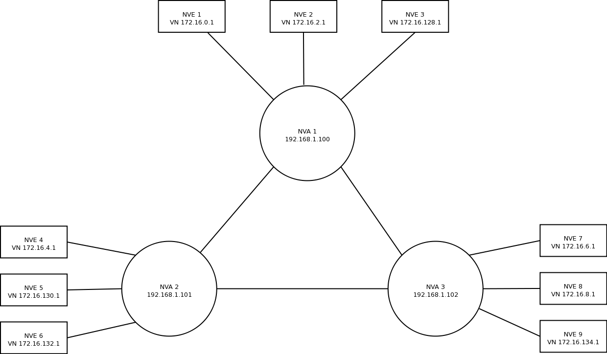
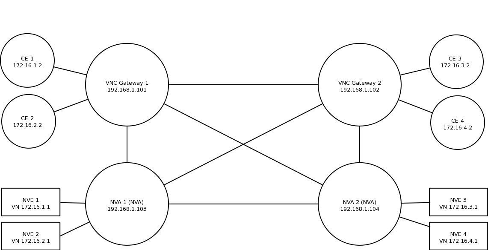
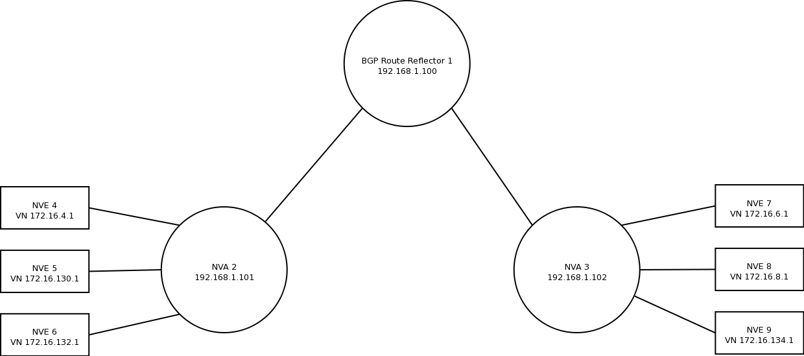
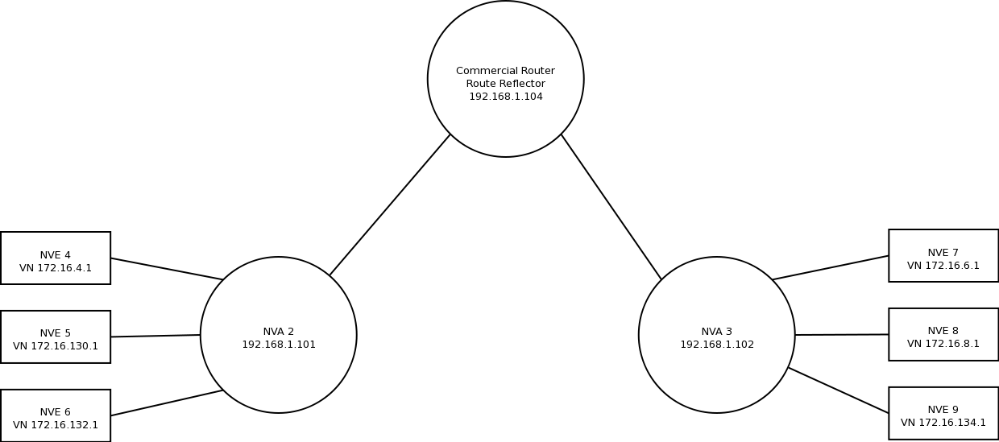
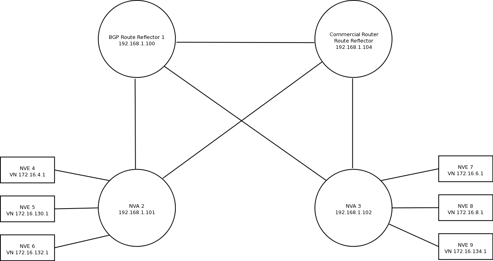

.. _vnc-and-vnc-gw:

**************
VNC and VNC-GW
**************

This chapter describes how to use :abbr:`VNC (Virtual Network Control)`
services, including :abbr:`NVA (Network Virtualization Authority)` and
:abbr:`VNC-GW (VNC Gateway)` functions. Background information on NVAs,
:abbr:`NVE (Network Virtualization Edge)` s, :abbr:`UN (Underlay Network)` s,
and :abbr:`VN (Virtual Network)` is available from the
`IETF <https://datatracker.ietf.org/wg/nvo3>`_. :abbr:`VNC-GW (VNC Gateway)` s
support the import/export of routing information between VNC and :abbr:`CE
(customer edge)` routers operating within a VN.  Both IP/Layer 3 (L3) VNs, and
IP with Ethernet/Layer 2 (L2) VNs are supported.

BGP, with IP VPNs and Tunnel Encapsulation, is used to distribute VN
information between NVAs. BGP based IP VPN support is defined in :rfc:`4364`,
and :rfc:`4659`. Encapsulation information is provided via the Tunnel
Encapsulation Attribute, :rfc:`5512`.

The protocol that is used to communicate routing and Ethernet / Layer 2 (L2)
forwarding information between NVAs and NVEs is referred to as the Remote
Forwarder Protocol (RFP). `OpenFlow` is an example RFP. Specific RFP
implementations may choose to implement either a `hard-state` or `soft-state`
prefix and address registration model. To support a `soft-state` refresh model,
a `lifetime` in seconds is associated with all registrations and responses.

The chapter also provides sample configurations for basic example scenarios.

.. _configuring-vnc:

Configuring VNC
===============

Virtual Network Control (:abbr:`VNC`) service configuration commands appear in
the `router bgp` section of the BGPD configuration file
(:ref:`bgp-configuration-examples`). The commands are broken down into the
following areas:

- :dfn:`General VNC` configuration applies to general VNC operation and is
  primarily used to control the method used to advertise tunnel information.

- :dfn:`Remote Forwarder Protocol (RFP)` configuration relates to the protocol
  used between NVAs and NVEs.

- :dfn:`VNC Defaults` provides default parameters for registered NVEs.

- :dfn:`VNC NVE Group` provides for configuration of a specific set of
  registered NVEs and overrides default parameters.

- :dfn:`Redistribution` and :dfn:`Export` control VNC-GW operation, i.e., the
  import/export of routing information between VNC and customer edge routers
  (:abbr:`CE` s) operating within a VN.

.. _general-vnc-configuration:

General VNC Configuration
-------------------------

.. _rfp-related-configuration:

RFP Related Configuration
-------------------------

The protocol that is used to communicate routing and Ethernet / L2 forwarding
information between NVAs and NVEs is referred to as the Remote Forwarder
Protocol (RFP). Currently, only a simple example RFP is included in FRR.
Developers may use this example as a starting point to integrate FRR with an
RFP of their choosing, e.g., `OpenFlow`. The example code includes the
following sample configuration:

.. clicmd:: rfp example-config-value VALUE

This is a simple example configuration parameter included as part of the RFP
example code. VALUE must be in the range of 0 to 4294967295.

.. _vnc-defaults-configuration:

VNC Defaults Configuration
--------------------------

The VNC Defaults section allows the user to specify default values for
configuration parameters for all registered NVEs.
Default values are overridden by :ref:`vnc-nve-group-configuration`.

.. clicmd:: vnc defaults

Enter VNC configuration mode for specifying VNC default behaviors. Use
`exit-vnc` to leave VNC configuration mode. `vnc defaults` is optional.

.. code-block:: frr

   vnc defaults
   ... various VNC defaults
   exit-vnc

These are the statements that can appear between ``vnc defaults`` and
``exit-vnc``. Documentation for these statements is given in
:ref:`vnc-nve-group-configuration`.

- :clicmd:`rt import RT-LIST`
- :clicmd:`rt export RT-LIST`
- :clicmd:`rt both RT-LIST`
- :clicmd:`rd ROUTE-DISTINGUISHER`
- :clicmd:`l2rd NVE-ID-VALUE`
- :clicmd:`response-lifetime LIFETIME|infinite`
- :clicmd:`export bgp|zebra route-map MAP-NAME`
- :clicmd:`export bgp|zebra no route-map`

.. index:: exit-vnc
.. clicmd:: exit-vnc

   Exit VNC configuration mode.

.. _vnc-nve-group-configuration:

VNC NVE Group Configuration
---------------------------

A NVE Group corresponds to a specific set of NVEs. A Client NVE is
assigned to an NVE Group based on whether there is a match for either
its virtual or underlay network address against the VN and/or UN address
prefixes specified in the NVE Group definition. When an NVE Group
definition specifies both VN and UN address prefixes, then an NVE must
match both prefixes in order to be assigned to the NVE Group. In the
event that multiple NVE Groups match based on VN and/or UN addresses,
the NVE is assigned to the first NVE Group listed in the configuration.
If an NVE is not assigned to an NVE Group, its messages will be ignored.

Configuration values specified for an NVE group apply to all
member NVEs and override configuration values specified in the VNC
Defaults section.

**At least one `nve-group` is mandatory for useful VNC operation.**

.. index:: vnc nve-group NAME
.. clicmd:: vnc nve-group NAME

  Enter VNC configuration mode for defining the NVE group `name`.
  Use `exit` or `exit-vnc` to exit group configuration mode.

  .. code-block:: frr

     vnc nve-group group1
     ... configuration commands
     exit-vnc

.. index:: no vnc nve-group NAME
.. clicmd:: no vnc nve-group NAME

   Delete the NVE group named `name`.

   The following statements are valid in an NVE group definition:

.. index:: l2rd NVE-ID-VALUE
.. clicmd:: l2rd NVE-ID-VALUE

   Set the value used to distinguish NVEs connected to the same physical
   Ethernet segment (i.e., at the same location) [#]_.

   The nve-id subfield may be specified as either a literal value in the range
   1-255, or it may be specified as `auto:vn`, which means to use the
   least-significant octet of the originating NVE's VN address.

.. index:: prefix vn|un A.B.C.D/M|X:X::X:X/M
.. clicmd:: prefix vn|un A.B.C.D/M|X:X::X:X/M

   Specify the matching prefix for this NVE group by either virtual-network
   address (`vn`) or underlay-network address (`un`). Either or both
   virtual-network and underlay-network prefixes may be specified. Subsequent
   virtual-network or underlay-network values within a `vnc nve-group`
   `exit-vnc` block override their respective previous values.

   These prefixes are used only for determining assignments of NVEs to NVE
   Groups.

.. index:: rd ROUTE-DISTINGUISHER
.. clicmd:: rd ROUTE-DISTINGUISHER

   Specify the route distinguisher for routes advertised via BGP
   VPNs. The route distinguisher must be in one of these forms:

   - ``IPv4-address:two-byte-integer``
   - ``four-byte-autonomous-system-number:two-byte-integer``
   - ``two-byte-autonomous-system-number:four-byte-integer``
   - ``auto:vn:two-byte-integer``

   Routes originated by NVEs in the NVE group will use the group's specified
   `route-distinguisher` when they are advertised via BGP.  If the `auto` form
   is specified, it means that a matching NVE has its RD set to
   ``rd_type=IP=1:IPv4-address=VN-address:two-byte-integer``, for IPv4 VN
   addresses and
   ``rd_type=IP=1:IPv4-address=Last-four-bytes-of-VN-address:two-byte-integer``,
   for IPv6 VN addresses.

   If the NVE group definition does not specify a `route-distinguisher`, then
   the default `route-distinguisher` is used.  If neither a group nor a default
   `route-distinguisher` is configured, then the advertised RD is set to
   ``two-byte-autonomous-system-number=0:four-byte-integer=0``.

.. index:: response-lifetime LIFETIME|infinite
.. clicmd:: response-lifetime LIFETIME|infinite

   Specify the response lifetime, in seconds, to be included in RFP response
   messages sent to NVEs. If the value 'infinite' is given, an infinite
   lifetime will be used.

   Note that this parameter is not the same as the lifetime supplied by NVEs in
   RFP registration messages. This parameter does not affect the lifetime value
   attached to routes sent by this server via BGP.

   If the NVE group definition does not specify a `response-lifetime`, the
   default `response-lifetime` will be used.  If neither a group nor a default
   `response-lifetime` is configured, the value 3600 will be used. The maximum
   response lifetime is 2147483647.

.. index:: rt export RT-LIST
.. clicmd:: rt export RT-LIST

.. index:: rt import RT-LIST
.. clicmd:: rt import RT-LIST

.. index:: rt both RT-LIST
.. clicmd:: rt both RT-LIST

   Specify route target import and export lists. `rt-list` is a
   space-separated list of route targets, each element of which is
   in one of the following forms:

   - ``IPv4-address:two-byte-integer``
   - ``four-byte-autonomous-system-number:two-byte-integer``
   - ``two-byte-autonomous-system-number:four-byte-integer``

   The first form, `rt export`, specifies an `export rt-list`.  The `export
   rt-list` will be attached to routes originated by NVEs in the NVE group
   when they are advertised via BGP.  If the NVE group definition does not
   specify an `export rt-list`, then the default `export rt-list` is used.
   If neither a group nor a default `export rt-list` is configured, then no
   RT list will be sent; in turn, these routes will probably not be
   processed by receiving NVAs.

   The second form, `rt import` specifies an `import rt-list`, which is a
   filter for incoming routes.  In order to be made available to NVEs in the
   group, incoming BGP VPN routes must have RT lists that have at least one
   route target in common with the group's `import rt-list`.

   If the NVE group definition does not specify an import filter, then the
   default `import rt-list` is used.  If neither a group nor a default
   `import rt-list` is configured, there can be no RT intersections when
   receiving BGP routes and therefore no incoming BGP routes will be
   processed for the group.

   The third, `rt both`, is a shorthand way of specifying both lists
   simultaneously, and is equivalent to `rt export `rt-list`` followed by
   `rt import `rt-list``.

.. index:: export bgp|zebra route-map MAP-NAME
.. clicmd:: export bgp|zebra route-map MAP-NAME

   Specify that the named route-map should be applied to routes being exported
   to bgp or zebra.  This parameter is used in conjunction with
   :ref:`configuring-export-of-routes-to-other-routing-protocols`.  This item
   is optional.

.. index:: export bgp|zebra no route-map
.. clicmd:: export bgp|zebra no route-map

   Specify that no route-map should be applied to routes being exported to bgp
   or zebra.  This parameter is used in conjunction with
   :ref:`configuring-export-of-routes-to-other-routing-protocols`.  This item
   is optional.

.. index:: export bgp|zebra ipv4|ipv6 prefix-list LIST-NAME
.. clicmd:: export bgp|zebra ipv4|ipv6 prefix-list LIST-NAME

   Specify that the named prefix-list filter should be applied to routes being
   exported to bgp or zebra. Prefix-lists for ipv4 and ipv6 are independent of
   each other. This parameter is used in conjunction with
   :ref:`configuring-export-of-routes-to-other-routing-protocols`.  This item
   is optional.

.. index:: export bgp|zebra no ipv4|ipv6 prefix-list
.. clicmd:: export bgp|zebra no ipv4|ipv6 prefix-list

   Specify that no prefix-list filter should be applied to routes being
   exported to bgp or zebra. This parameter is used in conjunction with
   :ref:`configuring-export-of-routes-to-other-routing-protocols`.  This item
   is optional.

.. _vnc-l2-group-configuration:

VNC L2 Group Configuration
--------------------------

The route targets advertised with prefixes and addresses registered by an NVE
are determined based on the NVE's associated VNC NVE Group Configuration,
:ref:`vnc-nve-group-configuration`. Layer 2 (L2) Groups are used to override
the route targets for an NVE's Ethernet registrations based on the Logical
Network Identifier and label value.  A Logical Network Identifier is used to
uniquely identify a logical Ethernet segment and is conceptually similar to the
Ethernet Segment Identifier defined in :rfc:`7432`. Both the Logical Network
Identifier and Label are passed to VNC via RFP prefix and address registration.

Note that a corresponding NVE group configuration must be present, and that
other NVE associated configuration information, notably RD, is not impacted by
L2 Group Configuration.

.. index:: vnc l2-group NAME
.. clicmd:: vnc l2-group NAME

   Enter VNC configuration mode for defining the L2 group `name`.
   Use `exit` or `exit-vnc` to exit group configuration mode.

   .. code-block:: frr

       vnc l2-group group1
         ... configuration commands
       exit-vnc

.. index:: no vnc l2-group NAME
.. clicmd:: no vnc l2-group NAME

   Delete the L2 group named `name`.

The following statements are valid in a L2 group definition:

.. index:: logical-network-id VALUE
.. clicmd:: logical-network-id VALUE

   Define the Logical Network Identifier with a value in the range of
   0-4294967295 that identifies the logical Ethernet segment.

.. index:: labels LABEL-LIST
.. clicmd:: labels LABEL-LIST

.. index:: no labels LABEL-LIST
.. clicmd:: no labels LABEL-LIST

   Add or remove labels associated with the group. `label-list` is a
   space separated list of label values in the range of 0-1048575.

.. index:: rt import RT-TARGET
.. clicmd:: rt import RT-TARGET

.. index:: rt export RT-TARGET
.. clicmd:: rt export RT-TARGET

.. index:: rt both RT-TARGET
.. clicmd:: rt both RT-TARGET

   Specify the route target import and export value associated with the group.
   A complete definition of these parameters is given above,
   :ref:`vnc-nve-group-configuration`.

.. _configuring-redistribution-of-routes-from-other-routing-protocols:

Configuring Redistribution of Routes from Other Routing Protocols
-----------------------------------------------------------------

Routes from other protocols (including BGP) can be provided to VNC (both for
RFP and for redistribution via BGP) from three sources: the zebra kernel
routing process; directly from the main (default) unicast BGP RIB; or directly
from a designated BGP unicast exterior routing RIB instance.

The protocol named in the `vnc redistribute` command indicates the route
source: `bgp-direct` routes come directly from the main (default) unicast BGP
RIB and are available for RFP and are redistributed via BGP;
`bgp-direct-to-nve-groups` routes come directly from a designated BGP unicast
routing RIB and are made available only to RFP; and routes from other protocols
come from the zebra kernel routing process.
Note that the zebra process does not need to be active if
only `bgp-direct` or `bgp-direct-to-nve-groups` routes are used.

zebra routes
^^^^^^^^^^^^

Routes originating from protocols other than BGP must be obtained
via the zebra routing process.
Redistribution of these routes into VNC does not support policy mechanisms
such as prefix-lists or route-maps.

bgp-direct routes
^^^^^^^^^^^^^^^^^

`bgp-direct` redistribution supports policy via
prefix lists and route-maps. This policy is applied to incoming
original unicast routes before the redistribution translations
(described below) are performed.

Redistribution of `bgp-direct` routes is performed in one of three
possible modes: `plain`, `nve-group`, or `resolve-nve`.
The default mode is `plain`.
These modes indicate the kind of translations applied to routes before
they are added to the VNC RIB.

In `plain` mode, the route's next hop is unchanged and the RD is set
based on the next hop.
For `bgp-direct` redistribution, the following translations are performed:

- The VN address is set to the original unicast route's next hop address.
- The UN address is NOT set. (VN->UN mapping will occur via
  ENCAP route or attribute, based on `vnc advertise-un-method`
  setting, generated by the RFP registration of the actual NVE)
- The RD is set to as if auto:vn:0 were specified (i.e.,
  `rd_type=IP=1`:`IPv4-address=VN-address`:`two-byte-integer=0`)
- The RT list is included in the extended community list copied from the
  original unicast route (i.e., it must be set in the original unicast route).

In `nve-group` mode, routes are registered with VNC as if they came from an NVE
in the nve-group designated in the `vnc redistribute nve-group` command. The
following translations are performed:

- The next hop/VN address is set to the VN prefix configured for the
  redistribute nve-group.
- The UN address is set to the UN prefix configured for the redistribute
  nve-group.
- The RD is set to the RD configured for the redistribute nve-group.
- The RT list is set to the RT list configured for the redistribute nve-group.
  If `bgp-direct` routes are being redistributed, any extended communities
  present in the original unicast route will also be included.

In `resolve-nve` mode, the next hop of the original BGP route is typically the
address of an NVE connected router (CE) connected by one or more NVEs.
Each of the connected NVEs will register, via RFP, a VNC host route to the CE.
This mode may be though of as a mechanism to proxy RFP registrations of BGP
unicast routes on behalf of registering NVEs.

Multiple copies of the BGP route, one per matching NVE host route, will be
added to VNC.  In other words, for a given BGP unicast route, each instance of
a RFP-registered host route to the unicast route's next hop will result in an
instance of an imported VNC route.  Each such imported VNC route will have a
prefix equal to the original BGP unicast route's prefix, and a next hop equal
to the next hop of the matching RFP-registered host route.  If there is no
RFP-registered host route to the next hop of the BGP unicast route, no
corresponding VNC route will be imported.

The following translations are applied:

- The Next Hop is set to the next hop of the NVE route (i.e., the
  VN address of the NVE).

- The extended community list in the new route is set to the
  union of:

- Any extended communities in the original BGP route

  - Any extended communities in the NVE route
  - An added route-origin extended community with the next hop of the
    original BGP route
    is added to the new route.
    The value of the local administrator field defaults 5226 but may
    be configured by the user via the `roo-ec-local-admin` parameter.

- The Tunnel Encapsulation attribute is set to the value of the Tunnel
  Encapsulation attribute of the NVE route, if any.

bgp-direct-to-nve-groups routes
^^^^^^^^^^^^^^^^^^^^^^^^^^^^^^^

Unicast routes from the main or a designated instance of BGP may be
redistributed to VNC as bgp-direct-to-nve-groups routes. These routes are NOT
announced via BGP, but they are made available for local RFP lookup in response
to queries from NVEs.

A non-main/default BGP instance is configured using the `bgp multiple-instance`
and `router bgp AS view NAME` commands as described elsewhere in this document.

In order for a route in the unicast BGP RIB to be made available to a querying
NVE, there must already be, available to that NVE, an (interior) VNC route
matching the next hop address of the unicast route.  When the unicast route is
provided to the NVE, its next hop is replaced by the next hop of the
corresponding NVE. If there are multiple longest-prefix-match VNC routes, the
unicast route will be replicated for each.

There is currently no policy (prefix-list or route-map) support for
`bgp-direct-to-nve-groups` routes.

Redistribution Command Syntax
^^^^^^^^^^^^^^^^^^^^^^^^^^^^^

.. index:: vnc redistribute ipv4|ipv6 bgp|bgp-direct|ipv6 bgp-direct-to-nve-groups|connected|kernel|ospf|rip|static
.. clicmd:: vnc redistribute ipv4|ipv6 bgp|bgp-direct|ipv6 bgp-direct-to-nve-groups|connected|kernel|ospf|rip|static

.. index:: vnc redistribute ipv4|ipv6 bgp-direct-to-nve-groups view VIEWNAME
.. clicmd:: vnc redistribute ipv4|ipv6 bgp-direct-to-nve-groups view VIEWNAME

.. index:: no vnc redistribute ipv4|ipv6 bgp|bgp-direct|bgp-direct-to-nve-groups|connected|kernel|ospf|rip|static
.. clicmd:: no vnc redistribute ipv4|ipv6 bgp|bgp-direct|bgp-direct-to-nve-groups|connected|kernel|ospf|rip|static

   Import (or do not import) prefixes from another routing protocols. Specify
   both the address family to import (`ipv4` or `ipv6`) and the protocol
   (`bgp`, `bgp-direct`, `bgp-direct-to-nve-groups`, `connected`, `kernel`,
   `ospf`, `rip`, or `static`). Repeat this statement as needed for each
   combination of address family and routing protocol.  Prefixes from protocol
   `bgp-direct` are imported from unicast BGP in the same bgpd process.
   Prefixes from all other protocols (including `bgp`) are imported via the
   `zebra` kernel routing process.

.. index:: vnc redistribute mode plain|nve-group|resolve-nve
.. clicmd:: vnc redistribute mode plain|nve-group|resolve-nve

   Redistribute routes from other protocols into VNC using the specified mode.
   Not all combinations of modes and protocols are supported.

.. index:: vnc redistribute nve-group GROUP-NAME
.. clicmd:: vnc redistribute nve-group GROUP-NAME

.. index:: no vnc redistribute nve-group GROUP-NAME
.. clicmd:: no vnc redistribute nve-group GROUP-NAME

   When using `nve-group` mode, assign (or do not assign) the NVE group
   `group-name` to routes redistributed from another routing protocol.
   `group-name` must be configured using `vnc nve-group`.

   The VN and UN prefixes of the nve-group must both be configured, and each
   prefix must be specified as a full-length (/32 for IPv4, /128 for IPv6)
   prefix.

.. index:: vnc redistribute lifetime LIFETIME|infinite
.. clicmd:: vnc redistribute lifetime LIFETIME|infinite

   Assign a registration lifetime, either `lifetime` seconds or `infinite`, to
   prefixes redistributed from other routing protocols as if they had been
   received via RFP registration messages from an NVE. `lifetime` can be any
   integer between 1 and 4294967295, inclusive.

.. index:: vnc redistribute resolve-nve roo-ec-local-admin 0-65536
.. clicmd:: vnc redistribute resolve-nve roo-ec-local-admin 0-65536

   Assign a value to the local-administrator subfield used in the
   Route Origin extended community that is assigned to routes exported
   under the `resolve-nve` mode. The default value is `5226`.

The following four `prefix-list` and `route-map` commands may be specified
in the context of an nve-group or not.  If they are specified in the context
of an nve-group, they apply only if the redistribution mode is `nve-group`,
and then only for routes being redistributed from `bgp-direct`.  If they are
specified outside the context of an nve-group, then they apply only for
redistribution modes `plain` and `resolve-nve`, and then only for routes
being redistributed from `bgp-direct`.

.. index:: vnc redistribute bgp-direct (ipv4|ipv6) prefix-list LIST-NAME
.. clicmd:: vnc redistribute bgp-direct (ipv4|ipv6) prefix-list LIST-NAME

   When redistributing `bgp-direct` routes,
   specifies that the named prefix-list should be applied.

.. index:: vnc redistribute bgp-direct no (ipv4|ipv6) prefix-list
.. clicmd:: vnc redistribute bgp-direct no (ipv4|ipv6) prefix-list

   When redistributing `bgp-direct` routes,
   specifies that no prefix-list should be applied.

.. index:: vnc redistribute bgp-direct route-map  MAP-NAME
.. clicmd:: vnc redistribute bgp-direct route-map  MAP-NAME

   When redistributing `bgp-direct` routes,
   specifies that the named route-map should be applied.

.. index:: vnc redistribute bgp-direct no route-map
.. clicmd:: vnc redistribute bgp-direct no route-map

   When redistributing `bgp-direct` routes,
   specifies that no route-map should be applied.

.. _configuring-export-of-routes-to-other-routing-protocols:

Configuring Export of Routes to Other Routing Protocols
-------------------------------------------------------

Routes from VNC (both for RFP and for redistribution via BGP) can be provided
to other protocols, either via zebra or directly to BGP.

It is important to note that when exporting routes to other protocols, the
downstream protocol must also be configured to import the routes.  For example,
when VNC routes are exported to unicast BGP, the BGP configuration must include
a corresponding `redistribute vnc-direct` statement.

.. index:: export bgp|zebra mode none|group-nve|registering-nve|ce
.. clicmd:: export bgp|zebra mode none|group-nve|registering-nve|ce

   Specify how routes should be exported to bgp or zebra.  If the mode is
   `none`, routes are not exported.  If the mode is `group-nve`, routes are
   exported according to nve-group or vrf-policy group configuration
   (:ref:`vnc-nve-group-configuration`): if a group is configured to allow
   export, then each prefix visible to the group is exported with next hops set
   to the currently-registered NVEs.  If the mode is `registering-nve`, then all
   VNC routes are exported with their original next hops.  If the mode is `ce`,
   only VNC routes that have an NVE connected CE Router encoded in a Route
   Origin Extended Community are exported.  This extended community must have an
   administrative value that matches the configured `roo-ec-local-admin` value.
   The next hop of the exported route is set to the encoded NVE connected CE
   Router.

   The default for both bgp and zebra is mode `none`.

.. index:: vnc export bgp|zebra group-nve group GROUP-NAME
.. clicmd:: vnc export bgp|zebra group-nve group GROUP-NAME

.. index:: vnc export bgp|zebra group-nve no group GROUP-NAME
.. clicmd:: vnc export bgp|zebra group-nve no group GROUP-NAME

   When export mode is `group-nve`, export (or do not export) prefixes from the
   specified nve-group or vrf-policy group to unicast BGP or to zebra.  Repeat
   this statement as needed for each nve-group to be exported.  Each VNC prefix
   that is exported will result in N exported routes to the prefix, each with a
   next hop corresponding to one of the N NVEs currently associated with the
   nve-group.

Some commands have a special meaning under certain export modes.

:clicmd:`export bgp|zebra ipv4|ipv6 prefix-list LIST-NAME`
   When export mode is `ce` or `registering-nve`,
   specifies that the named prefix-list should be applied to routes
   being exported to bgp or zebra.
   Prefix-lists for ipv4 and ipv6 are independent of each other.

:clicmd:`export bgp|zebra no ipv4|ipv6 prefix-list`
   When export mode is `ce` or `registering-nve`,
   specifies that no prefix-list should be applied to routes
   being exported to bgp or zebra.

:clicmd:`export bgp|zebra route-map MAP-NAME`
   When export mode is `ce` or `registering-nve`, specifies that the named
   route-map should be applied to routes being exported to bgp or zebra.

:clicmd:`export bgp|zebra no route-map`
   When export mode is `ce` or `registering-nve`, specifies that no route-map
   should be applied to routes being exported to bgp or zebra.

   When the export mode is `group-nve`, policy for exported routes is specified
   per-NVE-group or vrf-policy group inside a `nve-group` `RFG-NAME` block via
   the following commands(:ref:`vnc-nve-group-configuration`):

:clicmd:`export bgp|zebra route-map MAP-NAME`
   This command is valid inside a `nve-group` `RFG-NAME` block.  It specifies
   that the named route-map should be applied to routes being exported to bgp
   or zebra.

:clicmd:`export bgp|zebra no route-map`
   This command is valid inside a `nve-group` `RFG-NAME` block.  It specifies
   that no route-map should be applied to routes being exported to bgp or
   zebra.

:clicmd:`export bgp|zebra ipv4|ipv6 prefix-list LIST-NAME`
   This command is valid inside a `nve-group` `RFG-NAME` block.  It specifies
   that the named prefix-list filter should be applied to routes being exported
   to bgp or zebra.  Prefix-lists for ipv4 and ipv6 are independent of each
   other.

:clicmd:`export bgp|zebra no ipv4|ipv6 prefix-list`
   This command is valid inside a `nve-group` `RFG-NAME` block.  It specifies
   that no prefix-list filter should be applied to routes being exported to
   bgp or zebra.

.. _manual-address-control:

Manual Address Control
======================

The commands in this section can be used to augment normal dynamic VNC.  The
`add vnc` commands can be used to manually add IP prefix or Ethernet MAC
address forwarding information. The `clear vnc` commands can be used to remove
manually and dynamically added information.

.. clicmd:: add vnc prefix (A.B.C.D/M|X:X::X:X/M) vn (A.B.C.D|X:X::X:X) un (A.B.C.D|X:X::X:X) [cost (0-255)] [lifetime (infinite|(1-4294967295))] [local-next-hop (A.B.C.D|X:X::X:X) [local-cost (0-255)]]

   Register an IP prefix on behalf of the NVE identified by the VN and UN
   addresses. The `cost` parameter provides the administrative preference of
   the forwarding information for remote advertisement. If omitted, it defaults
   to 255 (lowest preference). The `lifetime` parameter identifies the period,
   in seconds, that the information remains valid. If omitted, it defaults to
   `infinite`. The optional `local-next-hop` parameter is used to configure a
   nexthop to be used by an NVE to reach the prefix via a locally connected CE
   router. This information remains local to the NVA, i.e., not passed to other
   NVAs, and is only passed to registered NVEs. When specified, it is also
   possible to provide a `local-cost` parameter to provide a forwarding
   preference. If omitted, it defaults to 255 (lowest preference).

.. clicmd:: add vnc mac xx:xx:xx:xx:xx:xx virtual-network-identifier (1-4294967295) vn (A.B.C.D|X:X::X:X) un (A.B.C.D|X:X::X:X) [prefix (A.B.C.D/M|X:X::X:X/M)] [cost (0-255)] [lifetime (infinite|(1-4294967295))]

   Register a MAC address for a logical Ethernet (L2VPN) on behalf of the NVE
   identified by the VN and UN addresses. The optional `prefix` parameter is to
   support enable IP address mediation for the given prefix. The `cost`
   parameter provides the administrative preference of the forwarding
   information. If omitted, it defaults to 255. The `lifetime` parameter
   identifies the period, in seconds, that the information remains valid. If
   omitted, it defaults to `infinite`.

.. clicmd:: clear vnc prefix (\*|A.B.C.D/M|X:X::X:X/M) (\*|[(vn|un) (A.B.C.D|X:X::X:X|\*) [(un|vn) (A.B.C.D|X:X::X:X|\*)] [mac xx:xx:xx:xx:xx:xx] [local-next-hop (A.B.C.D|X:X::X:X)])

   Delete the information identified by prefix, VN address, and UN address.
   Any or all of these parameters may be wildcarded to (potentially) match more
   than one registration. The optional `mac` parameter specifies a layer-2 MAC
   address that must match the registration(s) to be deleted. The optional
   `local-next-hop` parameter is used to delete specific local nexthop
   information.

.. index:: clear vnc mac (\\*|xx:xx:xx:xx:xx:xx) virtual-network-identifier (\\*|(1-4294967295)) (\\*|[(vn|un) (A.B.C.D|X:X::X:X|\\*) [(un|vn) (A.B.C.D|X:X::X:X|\*)] [prefix (\\*|A.B.C.D/M|X:X::X:X/M)])
.. clicmd:: clear vnc mac (\*|xx:xx:xx:xx:xx:xx) virtual-network-identifier (\*|(1-4294967295)) (\*|[(vn|un) (A.B.C.D|X:X::X:X|\*) [(un|vn) (A.B.C.D|X:X::X:X|\*)] [prefix (\*|A.B.C.D/M|X:X::X:X/M)])

   Delete mac forwarding information. Any or all of these parameters may be
   wildcarded to (potentially) match more than one registration. The default
   value for the `prefix` parameter is the wildcard value `*`.

.. index:: clear vnc nve (\*|((vn|un) (A.B.C.D|X:X::X:X) [(un|vn) (A.B.C.D|X:X::X:X)]))
.. clicmd:: clear vnc nve (\*|((vn|un) (A.B.C.D|X:X::X:X) [(un|vn) (A.B.C.D|X:X::X:X)]))

   Delete prefixes associated with the NVE specified by the given VN and UN
   addresses. It is permissible to specify only one of VN or UN, in which case
   any matching registration will be deleted. It is also permissible to specify
   `*` in lieu of any VN or UN address, in which case all registrations will
   match.

.. _other-vnc-related-commands:

Other VNC-Related Commands
==========================

Note: VNC-Related configuration can be obtained via the `show
running-configuration` command when in `enable` mode.

The following commands are used to clear and display Virtual Network Control
related information:

.. index:: clear vnc counters
.. clicmd:: clear vnc counters

   Reset the counter values stored by the NVA. Counter
   values can be seen using the `show vnc` commands listed above. This
   command is only available in `enable` mode.

.. index:: show vnc summary
.. clicmd:: show vnc summary

   Print counter values and other general information
   about the NVA. Counter values can be reset
   using the `clear vnc counters` command listed below.

.. index:: show vnc nves
.. clicmd:: show vnc nves

.. index:: show vnc nves vn|un ADDRESS
.. clicmd:: show vnc nves vn|un ADDRESS

   Display the NVA's current clients. Specifying `address` limits the output to
   the NVEs whose addresses match `address`. The time since the NVA last
   communicated with the NVE, per-NVE summary counters and each NVE's addresses
   will be displayed.

.. index:: show vnc queries
.. clicmd:: show vnc queries

.. index:: show vnc queries PREFIX
.. clicmd:: show vnc queries PREFIX

   Display active Query information. Queries remain valid for the default
   Response Lifetime (:ref:`vnc-defaults-configuration`) or NVE-group Response
   Lifetime (:ref:`vnc-nve-group-configuration`). Specifying `prefix` limits
   the output to Query Targets that fall within `prefix`.

   Query information is provided for each querying NVE, and includes the Query
   Target and the time remaining before the information is removed.

.. index:: show vnc registrations [all|local|remote|holddown|imported]
.. clicmd:: show vnc registrations [all|local|remote|holddown|imported]

.. index:: show vnc registrations [all|local|remote|holddown|imported] PREFIX
.. clicmd:: show vnc registrations [all|local|remote|holddown|imported] PREFIX

   Display local, remote, holddown, and/or imported registration information.
   Local registrations are routes received via RFP, which are present in the
   NVA Registrations Cache. Remote registrations are routes received via BGP
   (VPN SAFIs), which are present in the NVE-group import tables. Holddown
   registrations are local and remote routes that have been withdrawn but whose
   holddown timeouts have not yet elapsed. Imported information represents
   routes that are imported into NVA and are made available to querying NVEs.
   Depending on configuration, imported routes may also be advertised via BGP.
   Specifying `prefix` limits the output to the registered prefixes that fall
   within `prefix`.

   Registration information includes the registered prefix, the registering NVE
   addresses, the registered administrative cost, the registration lifetime and
   the time since the information was registered or, in the case of Holddown
   registrations, the amount of time remaining before the information is
   removed.

.. index:: show vnc responses [active|removed]
.. clicmd:: show vnc responses [active|removed]

.. index:: show vnc responses [active|removed] PREFIX
.. clicmd:: show vnc responses [active|removed] PREFIX

   Display all, active and/or removed response information which are
   present in the NVA Responses Cache. Responses remain valid for the
   default Response Lifetime (:ref:`vnc-defaults-configuration`) or
   NVE-group Response Lifetime (:ref:`vnc-nve-group-configuration`.)
   When Removal Responses are enabled (:ref:`general-vnc-configuration`),
   such responses are listed for the Response Lifetime. Specifying
   `prefix` limits the output to the addresses that fall within
   `prefix`.

   Response information is provided for each querying NVE, and includes
   the response prefix, the prefix-associated registering NVE addresses,
   the administrative cost, the provided response lifetime and the time
   remaining before the information is to be removed or will become inactive.

.. index:: show memory vnc
.. clicmd:: show memory vnc

   Print the number of memory items allocated by the NVA.

.. _example-vnc-and-vnc-gw-configurations:

Example VNC and VNC-GW Configurations
=====================================

.. _vnc-mesh-nva-config:

Mesh NVA Configuration
----------------------

This example includes three NVAs, nine NVEs, and two NVE groups. Note that
while not shown, a single physical device may support multiple logical NVEs.
:ref:`vnc-fig-vnc-mesh` shows ``code NVA-1`` (192.168.1.100), ``NVA 2``
(192.168.1.101), and ``NVA 3`` (192.168.1.102), which are connected in a full
mesh. Each is a member of the autonomous system 64512. Each NVA provides VNC
services to three NVE clients in the 172.16.0.0/16 virtual-network address
range. The 172.16.0.0/16 address range is partitioned into two NVE groups,
``group1`` (172.16.0.0/17) and ``group2`` (172.16.128.0/17).

Each NVE belongs to either NVE group ``group1`` or NVE group ``group2``.  The
NVEs ``NVE 1``, ``NVE 2``, ``NVE 4``, ``NVE 7``, and ``NVE 8`` are members of
the NVE group ``group1``.  The NVEs ``NVE 3``, ``NVE 5``, ``NVE 6``, and ``NVE
9`` are members of the NVE group ``group2``.

Each NVA advertises NVE underlay-network IP addresses using the
Tunnel Encapsulation Attribute.

.. _vnc-fig-vnc-mesh:

   A three-way full mesh with three NVEs per NVA.

:file:`bgpd.conf` for ``NVA 1`` (192.168.1.100):

.. code-block:: frr

   router bgp 64512

       bgp router-id 192.168.1.100

       neighbor 192.168.1.101  remote-as 64512
       neighbor 192.168.1.102  remote-as 64512

       address-family ipv4 vpn
           neighbor 192.168.1.101 activate
           neighbor 192.168.1.102 activate
       exit-address-family

       vnc defaults
           rd 64512:1
           response-lifetime 200
           rt both 1000:1 1000:2
       exit-vnc

       vnc nve-group group1
           prefix vn 172.16.0.0/17
           rt both 1000:1
       exit-vnc

       vnc nve-group group2
           prefix vn 172.16.128.0/17
           rt both 1000:2
       exit-vnc

   exit

:file:`bgpd.conf` for ``NVA 2`` (192.168.1.101):

.. code-block:: frr

   router bgp 64512

       bgp router-id 192.168.1.101

       neighbor 192.168.1.100  remote-as 64512
       neighbor 192.168.1.102  remote-as 64512

       address-family ipv4 vpn
           neighbor 192.168.1.100 activate
           neighbor 192.168.1.102 activate
       exit-address-family

       vnc nve-group group1
           prefix vn 172.16.0.0/17
           rd 64512:1
           response-lifetime 200
           rt both 1000:1 1000:2
       exit-vnc
   exit

:file:`bgpd.conf` for ``NVA 3`` (192.168.1.102):

.. code-block:: frr

   router bgp 64512

       bgp router-id 192.168.1.102

       neighbor 192.168.1.101  remote-as 64512
       neighbor 192.168.1.102  remote-as 64512

       address-family ipv4 vpn
           neighbor 192.168.1.100 activate
           neighbor 192.168.1.101 activate
       exit-address-family

       vnc defaults
           rd 64512:1
           response-lifetime 200
           rt both 1000:1 1000:2
       exit-vnc

       vnc nve-group group1
           prefix vn 172.16.128.0/17
       exit-vnc
   exit

Mesh NVA and VNC-GW Configuration
---------------------------------

This example includes two NVAs, each with two associated NVEs, and two VNC-GWs,
each supporting two CE routers physically attached to the four NVEs. Note that
this example is showing a more complex configuration where VNC-GW is separated
from normal NVA functions; it is equally possible to simplify the configuration
and combine NVA and VNC-GW functions in a single FRR instance.

.. _vnc-fig-vnc-gw:

   Meshed NVEs and VNC-GWs

As shown in :ref:`vnc-fig-vnc-gw`, NVAs and VNC-GWs are connected in a full iBGP
mesh. The VNC-GWs each have two CEs configured as route-reflector clients.
Each client provides BGP updates with unicast routes that the VNC-GW reflects
to the other client. The VNC-GW also imports these unicast routes into VPN
routes to be shared with the other VNC-GW and the two NVAs. This route
importation is controlled with the ``vnc redistribute`` statements shown in the
configuration. Similarly, registrations sent by NVEs via RFP to the NVAs are
exported by the VNC-GWs to the route-reflector clients as unicast routes. RFP
registrations exported this way have a next-hop address of the CE behind the
connected (registering) NVE. Exporting VNC routes as IPv4 unicast is enabled
with the ``vnc export`` command below.

The configuration for ``VNC-GW 1`` is shown below.

.. code-block:: frr

   router bgp 64512
    bgp router-id 192.168.1.101
    bgp cluster-id 1.2.3.4
    neighbor 192.168.1.102 remote-as 64512
    neighbor 192.168.1.103 remote-as 64512
    neighbor 192.168.1.104 remote-as 64512
    neighbor 172.16.1.2 remote-as 64512
    neighbor 172.16.2.2 remote-as 64512
    !
    address-family ipv4 unicast
     redistribute vnc-direct
     no neighbor 192.168.1.102 activate
     no neighbor 192.168.1.103 activate
     no neighbor 192.168.1.104 activate
     neighbor 172.16.1.2 route-reflector-client
     neighbor 172.16.2.2 route-reflector-client
    exit-address-family
    !
    address-family ipv4 vpn
      neighbor 192.168.1.102 activate
      neighbor 192.168.1.103 activate
      neighbor 192.168.1.104 activate
    exit-address-family
    vnc export bgp mode ce
    vnc redistribute mode resolve-nve
    vnc redistribute ipv4 bgp-direct
    exit

Note that in the VNC-GW configuration, the neighboring VNC-GW and NVAs each
have a statement disabling the IPv4 unicast address family. IPv4 unicast is on
by default and this prevents the other VNC-GW and NVAs from learning unicast
routes advertised by the route-reflector clients.

Configuration for ``NVA 2``:

.. code-block:: frr

   router bgp 64512
    bgp router-id 192.168.1.104
    neighbor 192.168.1.101 remote-as 64512
    neighbor 192.168.1.102 remote-as 64512
    neighbor 192.168.1.103 remote-as 64512
    !
    address-family ipv4 unicast
     no neighbor 192.168.1.101 activate
     no neighbor 192.168.1.102 activate
     no neighbor 192.168.1.103 activate
    exit-address-family
    !
    address-family ipv4 vpn
      neighbor 192.168.1.101 activate
      neighbor 192.168.1.102 activate
      neighbor 192.168.1.103 activate
    exit-address-family
    !
    vnc defaults
     response-lifetime 3600
     exit-vnc
    vnc nve-group nve1
     prefix vn 172.16.1.1/32
     response-lifetime 3600
     rt both 1000:1 1000:2
     exit-vnc
    vnc nve-group nve2
     prefix vn 172.16.2.1/32
     response-lifetime 3600
     rt both 1000:1 1000:2
     exit-vnc
    exit

.. TBD make this its own example:
..
.. @float Figure,fig:fig-vnc-gw-rr
.. @center @image{fig-vnc-gw-rr,400pt,,FRR VNC Gateway with RR}
.. @end float
.. An NVA can also import unicast routes from BGP without advertising the
.. imported routes as VPN routes.  Such imported routes, while not
.. distributed to other NVAs or VNC-GWs, are are available to NVEs via
.. RFP query messages sent to the NVA. @ref{fig:fig-vnc-gw-rr}
.. shows an example topology where unicast routes are imported into NVAs
.. from a Route Reflector.  (@pxref{Route Reflector} for route reflector
.. configuration details.)  The following three lines can be added to the
.. ``NVA 1`` and ``NVA 2`` configurations to import routes into VNC
.. for local VNC use:
..
.. @verbatim
..  neighbor 192.168.1.105 remote-as 64512
..  vnc redistribute mode plain
..  vnc redistribute ipv4 bgp-direct-to-nve-groups
.. @end verbatim

.. _vnc-with-frr-route-reflector-config:

VNC with FRR Route Reflector Configuration
------------------------------------------

A route reflector eliminates the need for a fully meshed NVA network by acting
as the hub between NVAs. :ref:`vnc-fig-vnc-frr-route-reflector` shows BGP
route reflector ``BGP Route Reflector 1`` (192.168.1.100) as a route reflector
for NVAs ``NVA 2``(192.168.1.101) and ``NVA 3`` (192.168.1.102).

.. _vnc-fig-vnc-frr-route-reflector:

   Two NVAs and a BGP Route Reflector

``NVA 2`` and ``NVA 3`` advertise NVE underlay-network IP addresses using the
Tunnel Encapsulation Attribute. ``BGP Route Reflector 1`` ``reflects''
advertisements from ``NVA 2`` to ``NVA 3`` and vice versa.

As in the example of :ref:`vnc-mesh-nva-config`, there are two NVE groups.  The
172.16.0.0/16 address range is partitioned into two NVE groups, ``group1``
(172.16.0.0/17) and ``group2`` (172.16.128.0/17).  The NVE ``NVE 4``, ``NVE
7``, and ``NVE 8`` are members of the NVE group ``group1``.  The NVEs ``NVE
5``, ``NVE 6``, and ``NVE 9`` are members of the NVE group ``group2``.

:file:`bgpd.conf` for ``BGP Route Reflector 1`` on 192.168.1.100:

.. code-block:: frr

   router bgp 64512

       bgp router-id 192.168.1.100

       neighbor 192.168.1.101 remote-as 64512
       neighbor 192.168.1.101 port 7179
       neighbor 192.168.1.101 description iBGP-client-192-168-1-101

       neighbor 192.168.1.102 remote-as 64512
       neighbor 192.168.1.102 port 7179
       neighbor 192.168.1.102 description iBGP-client-192-168-1-102

       address-family ipv4 unicast
           neighbor 192.168.1.101 route-reflector-client
           neighbor 192.168.1.102 route-reflector-client
       exit-address-family

       address-family ipv4 vpn
           neighbor 192.168.1.101 activate
           neighbor 192.168.1.102 activate

           neighbor 192.168.1.101 route-reflector-client
           neighbor 192.168.1.102 route-reflector-client
       exit-address-family

   exit

:file:`bgpd.conf` for ``NVA 2`` on 192.168.1.101:

.. code-block:: frr

   router bgp 64512

       bgp router-id 192.168.1.101

       neighbor 192.168.1.100  remote-as 64512

       address-family ipv4 vpn
           neighbor 192.168.1.100 activate
       exit-address-family

       vnc nve-group group1
           prefix vn 172.16.0.0/17
           rd 64512:1
           response-lifetime 200
           rt both 1000:1 1000:2
       exit-vnc
   exit

:file:`bgpd.conf` for ``NVA 2`` on 192.168.1.102:

.. code-block:: frr

   router bgp 64512

       bgp router-id 192.168.1.102

       neighbor 192.168.1.100  remote-as 64512

       address-family ipv4 vpn
           neighbor 192.168.1.100 activate
       exit-address-family

       vnc defaults
           rd 64512:1
           response-lifetime 200
           rt both 1000:1 1000:2
       exit-vnc

       vnc nve-group group1
           prefix vn 172.16.128.0/17
       exit-vnc
   exit

While not shown, an NVA can also be configured as a route reflector.

.. _vnc-with-commercial-route-reflector-config:

VNC with Commercial Route Reflector Configuration
-------------------------------------------------

This example is identical to :ref:`vnc-with-frr-route-reflector-config`
with the exception that the route reflector is a commercial router. Only the
VNC-relevant configuration is provided.

   Two NVAs with a commercial route reflector

:file:`bgpd.conf` for BGP route reflector ``Commercial Router`` on 192.168.1.104:::

   version 8.5R1.13;
   routing-options {
       rib inet.0 {
           static {
               route 172.16.0.0/16 next-hop 192.168.1.104;
           }
       }
       autonomous-system 64512;
       resolution {
           rib inet.3 {
               resolution-ribs inet.0;
           }
           rib bgp.l3vpn.0 {
               resolution-ribs inet.0;
           }
       }
   }
   protocols {
       bgp {
           advertise-inactive;
           family inet {
               labeled-unicast;
           }
          group 1 {
               type internal;
               advertise-inactive;
               advertise-peer-as;
               import h;
               family inet {
                   unicast;
               }
               family inet-vpn {
                   unicast;
               }
               cluster 192.168.1.104;
               neighbor 192.168.1.101;
               neighbor 192.168.1.102;
           }
       }
   }
   policy-options {
       policy-statement h {
           from protocol bgp;
           then {
               as-path-prepend 64512;
               accept;
           }
       }
   }

:file:`bgpd.conf` for ``NVA 2`` on 192.168.1.101:

.. code-block:: frr

   router bgp 64512

       bgp router-id 192.168.1.101

       neighbor 192.168.1.100  remote-as 64512

       address-family ipv4 vpn
           neighbor 192.168.1.100 activate
       exit-address-family

       vnc nve-group group1
           prefix vn 172.16.0.0/17
           rd 64512:1
           response-lifetime 200
           rt both 1000:1 1000:2
       exit-vnc
   exit

:file:`bgpd.conf` for ``NVA 3`` on 192.168.1.102:

.. code-block:: frr

   router bgp 64512

       bgp router-id 192.168.1.102

       neighbor 192.168.1.100  remote-as 64512

       address-family ipv4 vpn
           neighbor 192.168.1.100 activate
       exit-address-family

       vnc defaults
           rd 64512:1
           response-lifetime 200
           rt both 1000:1 1000:2
       exit-vnc

       vnc nve-group group1
           prefix vn 172.16.128.0/17
       exit-vnc
   exit

VNC with Redundant Route Reflectors Configuration
-------------------------------------------------

This example combines the previous two
(:ref:`vnc-with-frr-route-reflector-config` and
:ref:`vnc-with-commercial-route-reflector-config`) into a redundant route
reflector configuration.  BGP route reflectors ``BGP Route Reflector 1`` and
``Commercial Router`` are the route reflectors for NVAs ``NVA 2`` and ``NVA
3``.  The two NVAs have connections to both route reflectors.

   FRR-based NVA with redundant route reflectors

:file:`bgpd.conf` for ``BPGD Route Reflector 1`` on 192.168.1.100:

.. code-block:: frr

   router bgp 64512

    bgp router-id 192.168.1.100
    bgp cluster-id 192.168.1.100

    neighbor 192.168.1.104 remote-as 64512

    neighbor 192.168.1.101 remote-as 64512
    neighbor 192.168.1.101 description iBGP-client-192-168-1-101
    neighbor 192.168.1.101 route-reflector-client

    neighbor 192.168.1.102 remote-as 64512
    neighbor 192.168.1.102 description iBGP-client-192-168-1-102
    neighbor 192.168.1.102 route-reflector-client

    address-family ipv4 vpn
     neighbor 192.168.1.101 activate
     neighbor 192.168.1.102 activate
     neighbor 192.168.1.104 activate

     neighbor 192.168.1.101 route-reflector-client
     neighbor 192.168.1.102 route-reflector-client
    exit-address-family
   exit

:file:`bgpd.conf` for ``NVA 2`` on 192.168.1.101:

.. code-block:: frr

   router bgp 64512

    bgp router-id 192.168.1.101

    neighbor 192.168.1.100  remote-as 64512
    neighbor 192.168.1.104  remote-as 64512

    address-family ipv4 vpn
     neighbor 192.168.1.100 activate
     neighbor 192.168.1.104 activate
    exit-address-family

    vnc nve-group group1
     prefix vn 172.16.0.0/17
     rd 64512:1
     response-lifetime 200
     rt both 1000:1 1000:2
    exit-vnc
   exit

:file:`bgpd.conf` for ``NVA 3`` on 192.168.1.102:

.. code-block:: frr

   router bgp 64512

    bgp router-id 192.168.1.102

    neighbor 192.168.1.100  remote-as 64512
    neighbor 192.168.1.104  remote-as 64512

    address-family ipv4 vpn
     neighbor 192.168.1.100 activate
     neighbor 192.168.1.104 activate
    exit-address-family

    vnc defaults
     rd 64512:1
     response-lifetime 200
     rt both 1000:1 1000:2
    exit-vnc

    vnc nve-group group1
     prefix vn 172.16.128.0/17
    exit-vnc
   exit

:file:`bgpd.conf` for the Commercial Router route reflector on 192.168.1.104:::

   routing-options {
       rib inet.0 {
           static {
               route 172.16.0.0/16 next-hop 192.168.1.104;
           }
       }
       autonomous-system 64512;
       resolution {
           rib inet.3 {
               resolution-ribs inet.0;
           }
           rib bgp.l3vpn.0 {
               resolution-ribs inet.0;
           }
       }
   }
   protocols {
       bgp {
           advertise-inactive;
           family inet {
               labeled-unicast;
           }
          group 1 {
               type internal;
               advertise-inactive;
               advertise-peer-as;
               import h;
               family inet {
                   unicast;
               }
               family inet-vpn {
                   unicast;
               }
               cluster 192.168.1.104;
               neighbor 192.168.1.101;
               neighbor 192.168.1.102;
           }

          group 2 {
               type internal;
               advertise-inactive;
               advertise-peer-as;
               import h;
               family inet {
                   unicast;
               }
               family inet-vpn {
                   unicast;
               }
               neighbor 192.168.1.100;
           }

       }
   }
   policy-options {
       policy-statement h {
           from protocol bgp;
           then {
               as-path-prepend 64512;
               accept;
           }
       }
   }

.. [#] The nve-id is carried in the route distinguisher. It is the second octet
       of the eight-octet route distinguisher generated for Ethernet / L2
       advertisements. The first octet is a constant 0xFF, and the third
       through eighth octets are set to the L2
       ethernet address being advertised.

