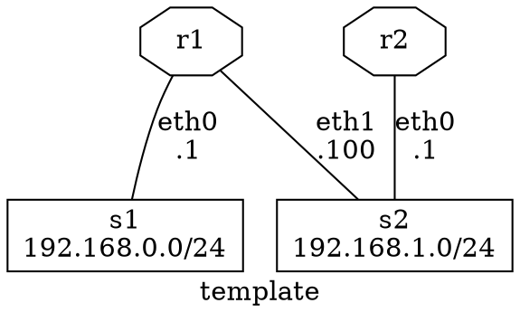

# Guidelines

This document describes how to use the topotests testing framework.


## Executing Tests

To run the whole suite of tests the following commands must be executed at the
top level directory of topotest:

```shell
$ # Change to the top level directory of topotests.
$ cd path/to/topotests
$ # Tests must be run as root, since Mininet requires it.
$ sudo pytest
```

In order to run a specific test, you can use the following command:

```shell
$ sudo pytest ospf-topo1/test_ospf_topo1.py
$ # or inside the test folder
$ cd ospf-topo1
$ sudo pytest # to run all tests inside the directory
$ sudo pytest ospf-topo1/test_ospf_topo1.py # to run a specific one
```

The output of the tested daemons will be avaiable at the temporary folder of
your machine:

```shell
$ ls /tmp
...
router1-zebra.err # zebra stderr output
router1-zebra.log # zebra log file
router1-zebra.out # zebra stdout output
...
```

You can also run memory leak tests to get reports:

```shell
$ sudo env TOPOTESTS_CHECK_MEMLEAK="/tmp/memleak_report_" pytest ospf-topo1/test_ospf_topo1.py
...
$ ls /tmp/memleak_report_*
memleak_report_test_ospf_topo1.txt
```


## Writing a New Test

This section will guide you in all recommended steps to produce a standard
topology test.

This is the recommended test writing routine:

* Write a topology (Graphviz recommended)
* Obtain configuration files
* Write the test itself
* Create a Pull Request

### Topotest File Hierarchy

Before starting to write any tests one must know the file hierarchy. The
repository hierarchy looks like this:

```shell
$ cd path/to/topotest
$ find ./*
...
./README.md # repository read me
./GUIDELINES.md # this file
./conftest.py # test hooks - pytest related functions
./example-test # example test folder
./example-test/__init__.py # python package marker - must always exist.
./example-test/test_template.jpg # generated topology picture - see next section
./example-test/test_template.dot # Graphviz dot file
./example-test/test_template.py # the topology plus the test
...
./ospf-topo1 # the ospf topology test
./ospf-topo1/router1 # router 1 configuration files
./ospf-topo1/router1/zebra.conf # zebra configuration file
./ospf-topo1/router1/ospfd.conf # ospf configuration file
./ospf-topo1/router1/ospfroute.txt # 'show ip ospf' output reference file
# removed other for shortness sake
...
./lib # shared test/topology functions
./lib/topogen.py # topogen implementation
./lib/topotest.py # topotest implementation
```

Guidelines for creating/editing topotest:

* New topologies that don't fit the existing directories should create its own
* Always remember to add the __init__.py to new folders, this makes the life of
  developers easier, auto complete engines and pylint happy
* Router (Quagga/FRR) specific code should go on topotest.py
* Generic/repeated router actions should have an abstraction in
  topogen.TopoRouter.
* Generic/repeated non-router code should go to topotest.py
* pytest related code should go to conftest.py (e.g. specialized asserts)


### Defining the Topology

The first step to write a new test is to define the topology. This step can be
done in many ways, but the recommended is to use Graphviz to generate a drawing
of the Topology. It allows us to see the topology graphically and to see the
names of equipments, links and addresses.

Here is an example of Graphviz dot file that generates the
[template topology](example-test/test_template.dot) (the inlined code might get
outdated, please see the linked file):



Here is the produced graph:


### Generating / Obtaining Configuration Files

In order to get the configuration files or command output for each router we
need to run the topology and execute commands in vtysh. The quickest way to
achieve that is writing the topology building code and running the topology.

To bootstrap your test topology, do the following steps:

* Copy the template test

```shell
$ mkdir new-topo/
$ touch new-topo/__init__.py
$ cp example-test/test_template.py new-topo/test_new_topo.py
```

* Modify the template according to your dot file
* Run the topology

Topogen allows us to run the topology without running any tests, you can do that
using the following example commands:

```shell
$ # Running your bootstraped topology
$ sudo pytest -s --topology-only new-topo/test_new_topo.py
$ # Running the test_template.py topology
$ sudo pytest -s --topology-only example-test/test_template.py
$ # Running the ospf_topo1.py topology
$ sudo pytest -s --topology-only ospf-topo1/test_ospf_topo1.py
```

Parameters explanation:

* -s: actives input/output capture. This is required by mininet in order to show
  the interactive shell.
* --topology-only: don't run anytest, just build the topology.

After executing the commands above you should get the following terminal output:

```shell
============================================================================================================ test session starts =============================================================================================================
platform linux2 -- Python 2.7.12, pytest-3.1.2, py-1.4.34, pluggy-0.4.0
rootdir: /media/sf_src/topotests, inifile: pytest.ini
collected 3 items

ospf-topo1/test_ospf_topo1.py *** Starting controller

*** Starting 6 switches
switch1 switch2 switch3 switch4 switch5 switch6 ...
router2: frr zebra started
router2: frr ospfd started
router3: frr zebra started
router3: frr ospfd started
router1: frr zebra started
router1: frr ospfd started
router4: frr zebra started
router4: frr ospfd started
*** Starting CLI:
mininet>
```

The last line shows us that we are now using the Mininet CLI (Command Line
Interface), from here you can call your router vtysh or even bash.

Here are some commands example:

```shell
mininet> router1 ping 10.0.3.1
PING 10.0.3.1 (10.0.3.1) 56(84) bytes of data.
64 bytes from 10.0.3.1: icmp_seq=1 ttl=64 time=0.576 ms
64 bytes from 10.0.3.1: icmp_seq=2 ttl=64 time=0.083 ms
64 bytes from 10.0.3.1: icmp_seq=3 ttl=64 time=0.088 ms
^C
--- 10.0.3.1 ping statistics ---
3 packets transmitted, 3 received, 0% packet loss, time 1998ms
rtt min/avg/max/mdev = 0.083/0.249/0.576/0.231 ms


mininet> router1 ping 10.0.3.3
PING 10.0.3.3 (10.0.3.3) 56(84) bytes of data.
64 bytes from 10.0.3.3: icmp_seq=1 ttl=64 time=2.87 ms
64 bytes from 10.0.3.3: icmp_seq=2 ttl=64 time=0.080 ms
64 bytes from 10.0.3.3: icmp_seq=3 ttl=64 time=0.091 ms
^C
--- 10.0.3.3 ping statistics ---
3 packets transmitted, 3 received, 0% packet loss, time 2003ms
rtt min/avg/max/mdev = 0.080/1.014/2.872/1.313 ms


mininet> router3 vtysh

Hello, this is FRRouting (version 3.1-devrzalamena-build).
Copyright 1996-2005 Kunihiro Ishiguro, et al.

frr-1# show running-config
Building configuration...

Current configuration:
!
frr version 3.1-devrzalamena-build
frr defaults traditional
hostname router3
no service integrated-vtysh-config
!
log file /tmp/router3-zebra.log
!
log file /tmp/router3-ospfd.log
!
interface router3-eth0
 ip address 10.0.3.1/24
!
interface router3-eth1
 ip address 10.0.10.1/24
!
interface router3-eth2
 ip address 172.16.0.2/24
!
router ospf
 ospf router-id 10.0.255.3
 redistribute kernel
 redistribute connected
 redistribute static
 network 10.0.3.0/24 area 0
 network 10.0.10.0/24 area 0
 network 172.16.0.0/24 area 1
!
line vty
!
end
frr-1#
```

After you successfully configured your topology you can obtain the
configuration files (per-daemon) using the following command:

```shell
mininet> router3 vtysh -d ospfd

Hello, this is FRRouting (version 3.1-devrzalamena-build).
Copyright 1996-2005 Kunihiro Ishiguro, et al.

frr-1# show running-config
Building configuration...

Current configuration:
!
frr version 3.1-devrzalamena-build
frr defaults traditional
no service integrated-vtysh-config
!
log file /tmp/router3-ospfd.log
!
router ospf
 ospf router-id 10.0.255.3
 redistribute kernel
 redistribute connected
 redistribute static
 network 10.0.3.0/24 area 0
 network 10.0.10.0/24 area 0
 network 172.16.0.0/24 area 1
!
line vty
!
end
frr-1#
```


### Writing Tests

**TODO**


### Debugging Execution

**TODO**

```shell
>>>>>>>>>>>>>>>>>>>>>>>>>>>>>>>>>>>>>>>>>>>>>>>>>>>>>>>>>>>>>>>>>>>>>>>>>>>>>>>>>>>>>>>>>>>>>>>>>> PDB set_trace (IO-capturing turned off) >>>>>>>>>>>>>>>>>>>>>>>>>>>>>>>>>>>>>>>>>>>>>>>>>>>>>>>>>>>>>>>>>>>>>>>>>>>>>>>>>>>>>>>>>>>>>>>>>>>
> /media/sf_src/topotests/ospf-topo1/test_ospf_topo1.py(121)test_ospf_convergence()
-> for rnum in range(1, 5):
(Pdb) l
116  
117     def test_ospf_convergence():
118         "Test OSPF daemon convergence"
119         import pdb
120         pdb.set_trace()
121  ->     for rnum in range(1, 5):
122             router = 'router{}'.format(rnum)
123  
124             # Load expected results from the command
125             reffile = os.path.join(CWD, '{}/ospfroute.txt'.format(router))
126             expected = open(reffile).read()
(Pdb) tgen = get_topogen()
(Pdb) pp tgen.gears['router1']
<lib.topogen.TopoRouter object at 0x7f2349c98c50>
(Pdb) pp str(tgen.gears['router1'])
'TopoGear<name="router1",links=["router1-eth0"<->"switch1-eth0","router1-eth1"<->"switch3-eth0"]> TopoRouter<>'
```
