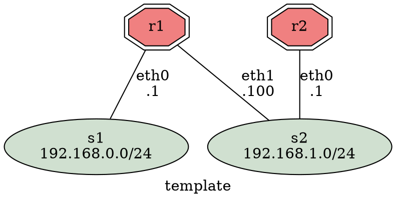
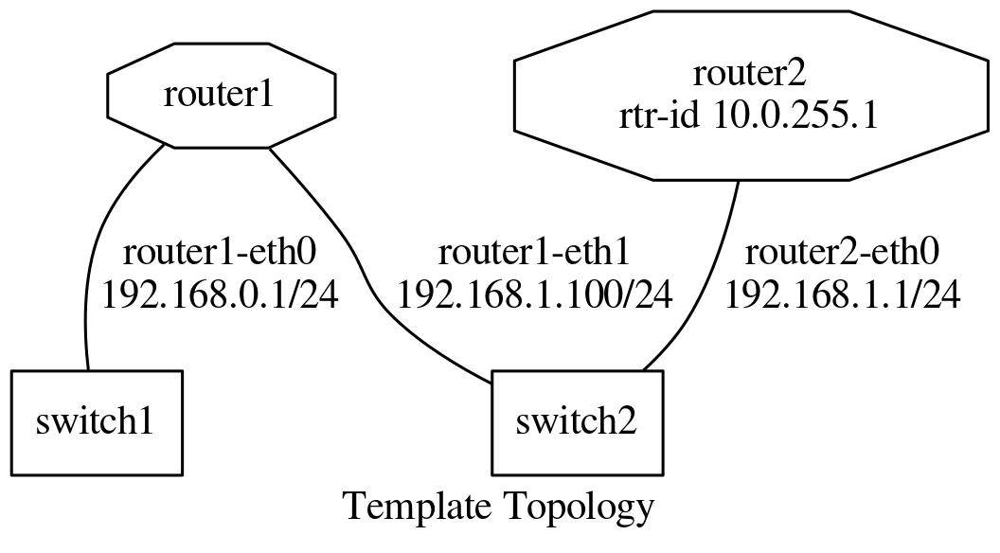

# Guidelines

This document describes how to use the topotests testing framework.


## Executing Tests

To run the whole suite of tests the following commands must be executed at the
top level directory of topotest:

```shell
$ # Change to the top level directory of topotests.
$ cd path/to/topotests
$ # Tests must be run as root, since Mininet requires it.
$ sudo pytest
```

In order to run a specific test, you can use the following command:

```shell
$ # running a specific topology
$ sudo pytest ospf-topo1/
$ # or inside the test folder
$ cd ospf-topo1
$ sudo pytest # to run all tests inside the directory
$ sudo pytest test_ospf_topo1.py # to run a specific test
$ # or outside the test folder
$ cd ..
$ sudo pytest ospf-topo1/test_ospf_topo1.py # to run a specific one
```

The output of the tested daemons will be available at the temporary folder of
your machine:

```shell
$ ls /tmp/topotest/ospf-topo1.test_ospf-topo1/r1
...
zebra.err # zebra stderr output
zebra.log # zebra log file
zebra.out # zebra stdout output
...
```

You can also run memory leak tests to get reports:

```shell
$ # Set the environment variable to apply to a specific test...
$ sudo env TOPOTESTS_CHECK_MEMLEAK="/tmp/memleak_report_" pytest ospf-topo1/test_ospf_topo1.py
$ # ...or apply to all tests adding this line to the configuration file
$ echo 'memleak_path = /tmp/memleak_report_' >> pytest.ini
$ # You can also use your editor
$ $EDITOR pytest.ini
$ # After running tests you should see your files:
$ ls /tmp/memleak_report_*
memleak_report_test_ospf_topo1.txt
```


## Writing a New Test

This section will guide you in all recommended steps to produce a standard
topology test.

This is the recommended test writing routine:

* Write a topology (Graphviz recommended)
* Obtain configuration files
* Write the test itself
* Create a Pull Request


### Topotest File Hierarchy

Before starting to write any tests one must know the file hierarchy. The
repository hierarchy looks like this:

```shell
$ cd path/to/topotest
$ find ./*
...
./README.md # repository read me
./GUIDELINES.md # this file
./conftest.py # test hooks - pytest related functions
./example-test # example test folder
./example-test/__init__.py # python package marker - must always exist.
./example-test/test_template.jpg # generated topology picture - see next section
./example-test/test_template.dot # Graphviz dot file
./example-test/test_template.py # the topology plus the test
...
./ospf-topo1 # the ospf topology test
./ospf-topo1/r1 # router 1 configuration files
./ospf-topo1/r1/zebra.conf # zebra configuration file
./ospf-topo1/r1/ospfd.conf # ospf configuration file
./ospf-topo1/r1/ospfroute.txt # 'show ip ospf' output reference file
# removed other for shortness sake
...
./lib # shared test/topology functions
./lib/topogen.py # topogen implementation
./lib/topotest.py # topotest implementation
```

Guidelines for creating/editing topotest:

* New topologies that don't fit the existing directories should create its own
* Always remember to add the `__init__.py` to new folders, this makes auto
  complete engines and pylint happy
* Router (Quagga/FRR) specific code should go on topotest.py
* Generic/repeated router actions should have an abstraction in
  topogen.TopoRouter.
* Generic/repeated non-router code should go to topotest.py
* pytest related code should go to conftest.py (e.g. specialized asserts)


### Defining the Topology

The first step to write a new test is to define the topology. This step can be
done in many ways, but the recommended is to use Graphviz to generate a drawing
of the Topology. It allows us to see the topology graphically and to see the
names of equipments, links and addresses.

Here is an example of Graphviz dot file that generates the
[template topology](example-test/test_template.dot) (the inlined code might get
outdated, please see the linked file):



Here is the produced graph:




### Generating / Obtaining Configuration Files

In order to get the configuration files or command output for each router, we
need to run the topology and execute commands in vtysh. The quickest way to
achieve that is writing the topology building code and running the topology.

To bootstrap your test topology, do the following steps:

* Copy the template test

```shell
$ mkdir new-topo/
$ touch new-topo/__init__.py
$ cp example-test/test_template.py new-topo/test_new_topo.py
```

* Modify the template according to your dot file

Here is the template topology described in the previous section in python code:

```py
class TemplateTopo(Topo):
    "Test topology builder"
    def build(self, *_args, **_opts):
        "Build function"
        tgen = get_topogen(self)

        # Create 2 routers
        for routern in range(1, 3):
            tgen.add_router('r{}'.format(routern))

        # Create a switch with just one router connected to it to simulate a
        # empty network.
        switch = tgen.add_switch('s1')
        switch.add_link(tgen.gears['r1'])

        # Create a connection between r1 and r2
        switch = tgen.add_switch('s2')
        switch.add_link(tgen.gears['r1'])
        switch.add_link(tgen.gears['r2'])
```

* Run the topology

Topogen allows us to run the topology without running any tests, you can do that
using the following example commands:

```shell
$ # Running your bootstraped topology
$ sudo pytest -s --topology-only new-topo/test_new_topo.py
$ # Running the test_template.py topology
$ sudo pytest -s --topology-only example-test/test_template.py
$ # Running the ospf_topo1.py topology
$ sudo pytest -s --topology-only ospf-topo1/test_ospf_topo1.py
```

Parameters explanation:

* `-s`: actives input/output capture. This is required by mininet in order to show
  the interactive shell.
* `--topology-only`: don't run any tests, just build the topology.

After executing the commands above, you should get the following terminal
output:

```shell
=== test session starts ===
platform linux2 -- Python 2.7.12, pytest-3.1.2, py-1.4.34, pluggy-0.4.0
rootdir: /media/sf_src/topotests, inifile: pytest.ini
collected 3 items

ospf-topo1/test_ospf_topo1.py *** Starting controller

*** Starting 6 switches
switch1 switch2 switch3 switch4 switch5 switch6 ...
r2: frr zebra started
r2: frr ospfd started
r3: frr zebra started
r3: frr ospfd started
r1: frr zebra started
r1: frr ospfd started
r4: frr zebra started
r4: frr ospfd started
*** Starting CLI:
mininet>
```

The last line shows us that we are now using the Mininet CLI (Command Line
Interface), from here you can call your router vtysh or even bash.

Here are some commands example:

```shell
mininet> r1 ping 10.0.3.1
PING 10.0.3.1 (10.0.3.1) 56(84) bytes of data.
64 bytes from 10.0.3.1: icmp_seq=1 ttl=64 time=0.576 ms
64 bytes from 10.0.3.1: icmp_seq=2 ttl=64 time=0.083 ms
64 bytes from 10.0.3.1: icmp_seq=3 ttl=64 time=0.088 ms
^C
--- 10.0.3.1 ping statistics ---
3 packets transmitted, 3 received, 0% packet loss, time 1998ms
rtt min/avg/max/mdev = 0.083/0.249/0.576/0.231 ms


mininet> r1 ping 10.0.3.3
PING 10.0.3.3 (10.0.3.3) 56(84) bytes of data.
64 bytes from 10.0.3.3: icmp_seq=1 ttl=64 time=2.87 ms
64 bytes from 10.0.3.3: icmp_seq=2 ttl=64 time=0.080 ms
64 bytes from 10.0.3.3: icmp_seq=3 ttl=64 time=0.091 ms
^C
--- 10.0.3.3 ping statistics ---
3 packets transmitted, 3 received, 0% packet loss, time 2003ms
rtt min/avg/max/mdev = 0.080/1.014/2.872/1.313 ms


mininet> r3 vtysh

Hello, this is FRRouting (version 3.1-devrzalamena-build).
Copyright 1996-2005 Kunihiro Ishiguro, et al.

frr-1# show running-config
Building configuration...

Current configuration:
!
frr version 3.1-devrzalamena-build
frr defaults traditional
hostname r3
no service integrated-vtysh-config
!
log file zebra.log
!
log file ospfd.log
!
interface r3-eth0
 ip address 10.0.3.1/24
!
interface r3-eth1
 ip address 10.0.10.1/24
!
interface r3-eth2
 ip address 172.16.0.2/24
!
router ospf
 ospf router-id 10.0.255.3
 redistribute kernel
 redistribute connected
 redistribute static
 network 10.0.3.0/24 area 0
 network 10.0.10.0/24 area 0
 network 172.16.0.0/24 area 1
!
line vty
!
end
frr-1#
```

After you successfully configured your topology, you can obtain the
configuration files (per-daemon) using the following commands:

```shell
mininet> r3 vtysh -d ospfd

Hello, this is FRRouting (version 3.1-devrzalamena-build).
Copyright 1996-2005 Kunihiro Ishiguro, et al.

frr-1# show running-config
Building configuration...

Current configuration:
!
frr version 3.1-devrzalamena-build
frr defaults traditional
no service integrated-vtysh-config
!
log file ospfd.log
!
router ospf
 ospf router-id 10.0.255.3
 redistribute kernel
 redistribute connected
 redistribute static
 network 10.0.3.0/24 area 0
 network 10.0.10.0/24 area 0
 network 172.16.0.0/24 area 1
!
line vty
!
end
frr-1#
```


### Writing Tests

Test topologies should always be bootstrapped from the
[example-test/test_template.py](example-test/test_template.py),
because it contains important boilerplate code that can't be avoided, like:

* imports: os, sys, pytest, topotest/topogen and mininet topology class
* The global variable CWD (Current Working directory): which is most likely
  going to be used to reference the routers configuration file location

  Example:

```py
# For all registered routers, load the zebra configuration file
for rname, router in router_list.iteritems():
    router.load_config(
        TopoRouter.RD_ZEBRA,
        os.path.join(CWD, '{}/zebra.conf'.format(rname))
    )
    # os.path.join() joins the CWD string with arguments adding the necessary
    # slashes ('/'). Arguments must not begin with '/'.
```

* The topology class that inherits from Mininet Topo class

```py
class TemplateTopo(Topo):
  def build(self, *_args, **_opts):
    tgen = get_topogen(self)
    # topology build code
```

* pytest `setup_module()` and `teardown_module()` to start the topology

```py
def setup_module(_m):
    tgen = Topogen(TemplateTopo)
    tgen.start_topology('debug')

def teardown_module(_m):
    tgen = get_topogen()
    tgen.stop_topology()
```

* `__main__` initialization code (to support running the script directly)

```py
if __name__ == '__main__':
    sys.exit(pytest.main(["-s"]))
```

Requirements:

* Test code should always be declared inside functions that begin with the
  `test_` prefix. Functions beginning with different prefixes will not be run by
  pytest.
* Configuration files and long output commands should go into separated files
  inside folders named after the equipment.
* Tests must be able to run without any interaction. To make sure your test
  conforms with this, run it without the `-s` parameter.

Tips:

* Keep results in stack variables, so people inspecting code with `pdb` can
  easily print their values.

  Don't do this:

  ```py
  assert foobar(router1, router2)
  ```

  Do this instead:

  ```py
  result = foobar(router1, router2)
  assert result
  ```

* Use `assert` messages to indicate where the test failed.

  Example:

  ```py
  for router in router_list:
      # ...
      assert condition, 'Router "{}" condition failed'.format(router.name)
  ```


### Debugging Execution

The most effective ways to inspect topology tests are:

* Run pytest with `--pdb` option. This option will cause a pdb shell to appear
  when an assertion fails

  Example: `pytest -s --pdb ospf-topo1/test_ospf_topo1.py`

* Set a breakpoint in the test code with `pdb`

  Example:

```py
# Add the pdb import at the beginning of the file
import pdb
# ...

# Add a breakpoint where you think the problem is
def test_bla():
  # ...
  pdb.set_trace()
  # ...
```

The [Python Debugger](https://docs.python.org/2.7/library/pdb.html) (pdb) shell
allows us to run many useful operations like:

* Setting breaking point on file/function/conditions (e.g. `break`, `condition`)
* Inspecting variables (e.g. `p` (print), `pp` (pretty print))
* Running python code

TIP: The TopoGear (equipment abstraction class) implements the `__str__` method
that allows the user to inspect equipment information.

Example of pdb usage:

```shell
> /media/sf_src/topotests/ospf-topo1/test_ospf_topo1.py(121)test_ospf_convergence()
-> for rnum in range(1, 5):
(Pdb) help
Documented commands (type help <topic>):
========================================
EOF    bt         cont      enable  jump  pp       run      unt
a      c          continue  exit    l     q        s        until
alias  cl         d         h       list  quit     step     up
args   clear      debug     help    n     r        tbreak   w
b      commands   disable   ignore  next  restart  u        whatis
break  condition  down      j       p     return   unalias  where

Miscellaneous help topics:
==========================
exec  pdb

Undocumented commands:
======================
retval  rv

(Pdb) list
116                                   title2="Expected output")
117
118     def test_ospf_convergence():
119         "Test OSPF daemon convergence"
120         pdb.set_trace()
121  ->     for rnum in range(1, 5):
122             router = 'r{}'.format(rnum)
123  
124             # Load expected results from the command
125             reffile = os.path.join(CWD, '{}/ospfroute.txt'.format(router))
126             expected = open(reffile).read()
(Pdb) step
> /media/sf_src/topotests/ospf-topo1/test_ospf_topo1.py(122)test_ospf_convergence()
-> router = 'r{}'.format(rnum)
(Pdb) step
> /media/sf_src/topotests/ospf-topo1/test_ospf_topo1.py(125)test_ospf_convergence()
-> reffile = os.path.join(CWD, '{}/ospfroute.txt'.format(router))
(Pdb) print rnum
1
(Pdb) print router
r1
(Pdb) tgen = get_topogen()
(Pdb) pp tgen.gears[router]
<lib.topogen.TopoRouter object at 0x7f74e06c9850>
(Pdb) pp str(tgen.gears[router])
'TopoGear<name="r1",links=["r1-eth0"<->"s1-eth0","r1-eth1"<->"s3-eth0"]> TopoRouter<>'
(Pdb) l 125
120         pdb.set_trace()
121         for rnum in range(1, 5):
122             router = 'r{}'.format(rnum)
123
124             # Load expected results from the command
125  ->         reffile = os.path.join(CWD, '{}/ospfroute.txt'.format(router))
126             expected = open(reffile).read()
127
128             # Run test function until we get an result. Wait at most 60 seconds.
129             test_func = partial(compare_show_ip_ospf, router, expected)
130             result, diff = topotest.run_and_expect(test_func, '',
(Pdb) router1 = tgen.gears[router]
(Pdb) router1.vtysh_cmd('show ip ospf route')
'============ OSPF network routing table ============\r\nN    10.0.1.0/24           [10] area: 0.0.0.0\r\n                           directly attached to r1-eth0\r\nN    10.0.2.0/24           [20] area: 0.0.0.0\r\n                           via 10.0.3.3, r1-eth1\r\nN    10.0.3.0/24           [10] area: 0.0.0.0\r\n                           directly attached to r1-eth1\r\nN    10.0.10.0/24          [20] area: 0.0.0.0\r\n                           via 10.0.3.1, r1-eth1\r\nN IA 172.16.0.0/24         [20] area: 0.0.0.0\r\n                           via 10.0.3.1, r1-eth1\r\nN IA 172.16.1.0/24         [30] area: 0.0.0.0\r\n                           via 10.0.3.1, r1-eth1\r\n\r\n============ OSPF router routing table =============\r\nR    10.0.255.2            [10] area: 0.0.0.0, ASBR\r\n                           via 10.0.3.3, r1-eth1\r\nR    10.0.255.3            [10] area: 0.0.0.0, ABR, ASBR\r\n                           via 10.0.3.1, r1-eth1\r\nR    10.0.255.4         IA [20] area: 0.0.0.0, ASBR\r\n                           via 10.0.3.1, r1-eth1\r\n\r\n============ OSPF external routing table ===========\r\n\r\n\r\n'
(Pdb) tgen.mininet_cli()
*** Starting CLI:
mininet>
```

To enable more debug messages in other Topogen subsystems (like Mininet), more
logging messages can be displayed by modifying the test configuration file
`pytest.ini`:

```ini
[topogen]
# Change the default verbosity line from 'info'...
#verbosity = info
# ...to 'debug'
verbosity = debug
```
